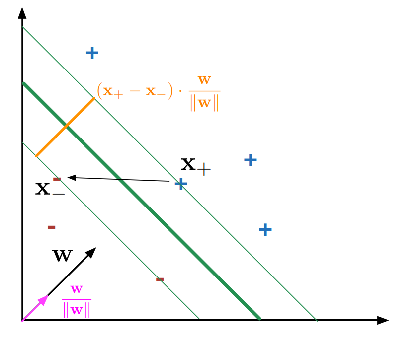

\newpage
# Modelli Lineari

## Least Squares (Metodo dei minimi quadrati)
* Caso: Problema di regressione in cui si vuole ottenere un'approssimazione
  lineare di $n$ punti
* Si vuole trovare l'approssimazione che minimizzi l'errore
* Formalizzazione del problema con esempio in 2 dimensioni:
    * Dati $n$ punti $(x, y)$ rappresentati in formato matriciale
    * Vogliamo trovare i parametri $(C, D)$ del modello lineare $Cx + D = y$ che
      approssimi meglio i dati
    * Il modello e' semplicemente una combinazione lineare dei coefficienti
      $\sum^n_{i = 0} x_i \cdot w_i = y_i$ dove $w$ e' il vettore delle
      variabili.
* Idealmente quello che si vuole ottenere e' che il modello non abbia errori
  sui dati di train. Formalmente parlando, si vuole per ogni punto dato $(x_i,
  y_i)$ valga la relazione $Cx_i + D = y_i$ (ne risulta un sistema a $n$ righe)
* (*Recall da metodi numerici*) Ogni sistema puo' essere rappresentato in forma
  matriciale $Ax = b$, in questo caso si ottiene $Xw = y$, dove $X$ e' la
  matrice composta da colonne degli $x$ compresa di una  colonna addizionale
  composta da soli $1$, $w$ il vettore colonna composto dalle variabili (in
  questo caso $C$ e $D$) e $y$ il vettore colonna dei valori $y$.
* Il ***caso ideale*** per la soluzione di questa equazione lineare, e' quello in cui
  la matrice $X$ ha rango pieno (tutte le colonne sono linearmente indipendenti
  tra loro), per cui esiste l'inversa $X^{-1}$. La soluzione e' ottenibile
  moltiplicando ambo i membri per l'inversa ottenendo la soluzione $w = X^{-1} \cdot y$
* Ovviamente questo caso e' possibile solo quandoo il numero di osservazioni
  ($n$) coincide con il numero di features. Quasi sempre questo non succede,
  rendendo quindi la matrice *non invertibile*.
* Possiamo pero' riformulare il problema:
    * Ricordati che lo spazio generato da una matrice (*span*) $C(X)$ e'
      generato dalla combinazione lineare dei vettori colonna $x_i$ appartenenti
      alla matrice
    * Variando i valori di $\hat{w}$ (vettore colonna con tanti componenti
      quante features), si puo' ottenere un qualsiasi vettore all'interno di
      $C(X)$. Questo perche' ogni vettore nello spazio e' esprimibile come
      combinazione lineare delle colonne di $X$ nel modo seguente
      $$
      \vec{p} = \sum^m_{j = 0} \hat{w_j} \vec{x_j} = X \cdot \hat{w}
      $$
    * $Dim[C(X)] = n$ cioe' il numero di esempi
    * Dal punto di vista geometrico, $y$ non giace nello spazio $C(X)$. Dato che
      se no $X$ sarebbe invertibile. Un altro modo in cui possiamo vederlo e'
      che lo spazio generabile da ogni combinazione delle colonne ha dimensioni
      pari a $m$, mentre il vettore $y$ giace in uno spazio a $n$ dimensioni.
      Quasi sempre $n > m$, per cui vogliamo trovare un'approssimazione nello
      spazio delle colonne che si avvicini il piu' possibile a $y$.
    * $y$ pero' e' sempre un vettore di $n$ componenti, per cui possiamo
      calcolarne la distanza normata tra un qualsiasi vettore $p \in C(X)$.
      $$
      ||e||_2 = ||y - p||_2 = \sqrt{\sum_i (y_i - p_i)^2}
      $$
    * Dato che la norma e' una quantita' sempre positiva per definzione, possiamo
      anche considerarne i quadrati ($||e||_2^2$), che corrisponde a minimizzare la
      quantita' $\sum_i (y_i - p_i)^2$
    * Siccome per definizione $p = X\hat{w}$, dove $\hat{w}$ e', possiamo
      dare una formalizzazione finale del problema:

> Il metodo dei minimi quadrati consiste nel trovare il vettore $\hat{w}$ che
minimizzzi la norma al quadrato della distanza tra $p$ e $y$
$$
\hat{w} = \arg \min_{w} ||X w - y||_2^2
$$

* (*Stiamo parlando in termini dell'esempio sulle slides ovviamente*)
  Intuitivamente parlando si vuole trovare un vettore $\hat{w}$ tale che generi
  un vettore $e = y - p$ che sia perpendicolare al piano $C(X)$
* La condizione di perprendicolarita' dal punto di vista algebrico e' semplice:
  Siano $a$ e $b$ due vettori. Essi sono considerati perpendicolari quando $a
  \cdot b = 0$. Possiamo utilizzare questa definizione per trovare la soluzione
  nel nostro caso.
* Dal momento che il piano $C(X)$ e' generato dalle colonne di $X$, quello che
  vogliamo e' che il vettore $e$ sia perpendicolare ad ogni vettore colonna
  $x_i$ della matrice $X$. Per far cio' quindi basta imporre $X^T e =
  \vec{0}$.
* L'ultimo passaggio e' esplicitare $e$ e $p$ nella relazione precedente,
  ottenendo:
  $$
  \begin{split}
  X^T e &= 0 \\
  X^T (y - X \hat{w}) &= 0 \\
  X^T X \hat{w} &= X^T y \\
  \hat{w} &= (X^T X)^{-1} X^T y
  \end{split}
  $$
* Risolvere il problema dei minimi quadrati consiste quindi essenzialmente nel
  risolvere l'ultima relazione

### Regolarizzazione
* Uno dei problemi dei minimi quadrati, e' che e' molto sensibile agli
  *outliers* causando overfitting. Siccome la misura dell'errore su un singolo
  esempio e' elevata al quadrato, gli *outliers* pesano tantissimo sulla
  quantita' complessiva di errore. Per compensare questa situazione, la curva di
  classificazione cerchera' di avvicinarsi di piu' a questo punto piu' distante,
  sacrificando della precisione negli altri punti.

> Outliers: Punti che sono stati campionati da una distribuzione diversa da
quella originale. Corrispondono a degli errori nella misurazione.

* Attenuare questo problema e' possibile mediante una **regolarizzazione** della
  soluzione. L'idea e' quella di aggiungere dei vincoli sulla soluzione cercata.
  (nel nostro caso, sulla "*forma*" dei pesi $w_i \in \hat{w}$).
* Una versione normalizzata del problema dei minimi quadrati e' detta ***ridge
  regresssion*** e consiste semplicemente nell'aggiungere un termine $\lambda
  ||w||^2$ per far si che il vettore non cresca troppo in dimensioni e che
  rimanga in norma "abbastanza piccolo":
  $$
  \begin{split}
  \hat{w} &= \arg \min_{w} ||y - Xw||^2_2 + \lambda ||w||_2^2 \\
    &= \arg \min_{w} (y - Xw)^T (y - Xw) + \lambda ||w||_2^2 \\
  \end{split}
  $$
  (la seconda formulazione e' solo un modo diverso per scrivere $||y -
  Xw||^2_2$)
* La stessa relazione e' riscrivibile in forma chiusa
  $$
  \hat{w} = (X^T X + \lambda I)^{-1} X^T y
  $$
  (Il fatto di aggiungere la matrice diagonale $\lambda I$ a $X X^T$ e' un
  trucchetto molto noto che serve ad aumentare la stabilita' numerica per
  l'inversione della matrice)
* Un'altra forma di regolarizzazione e' data dal **lasso** (*Least Absolute
  Shrinkage and Selection Operator*). La differenza e' semplicemente quella che
  al posto di considerare $\lambda ||w||_2^2$, si usa $\lambda ||w||_1$.
* Perche' minimizzare la norma di $w$ porta a risultati migliori?
    * Supponiamo che la matrice delle osservazioni $X$ sia affetta da degli
      errori $\delta$, cioe' $(X + \delta)$.
    * Quando si moltiplica per $w$, otteniamo $(X + \delta)w = Xw + \delta w$
    * In questo senso, minimizzare $w$ minimizza anche l'errore su $X$
    * Un'altra ragione e' che dal momento che i $w$ devono essere piccoli,
      corrisponde a scegliere dei pesi piu' semplici. (*rasoio di Occam*)
    * Un'altro modo per vedere questo e' pensare alla regolarizzazione come un
      bias induttivo che viene inserito per ridurre l'errore di varianza del
      least square

### Classificazione con LSE
* Fin'ora abbiamo visto il metodo dei minimi quadrati per minimizzare l'errore e
  quindi per fare essenzialmente *regressione*, ma e' possibile adattare il
  modello per fare *classificazione*
* Ad esempio nel caso binario, se rappresentiamo le classi positive e negative
  come $1$ e $-1$:
  $$
  \hat{c}(x) =
  \begin{cases}
  1  \; & \text{if} \; x^T \hat{w} - t > 0 \\
  0  \; & \text{if} \; x^T \hat{w} - t = 0 \\
  -1 \; & \text{if} \; x^T \hat{w} - t < 0
  \end{cases}
  $$
  dove $t$ rappresenta l'*intercetta*, cioe' il termine in piu' che era incluso
  implicitamente in precedenza in $\hat{w}$ che veniva catturato dalla colonna
  composta da soli $1$ di $X$.
* L'idea e' pensare ad un classificatore come un iperpiano divisore dei punti.
  Se tali punti sono sopra all'intersezione con il piano allora saranno
  classificati positivi, negativi altrimenti (=0 invece astengo al voto).
  Parlando in caso di 2D che e' piu' semplice: si vuole trovare una retta per
  cui tutti i punti che sono a destra della sua intersezione con l'asse $x$
  vengono classificati positivi, negativi altrimenti.
* Posso quindi utilizzare le tecniche utilizzate fin'ora per la regressione, ma
  utilizzando una $y$ con valori possibili $-1$ o $1$.

## Support Vector Machines
* Idea: Invece di lasciare al caso la scelta di quale sia la linea migliore che
  separi i punti, do un'indicazione precisa, indicando esplicitamente che si
  vuole la linea di separazione che passa piu' in centro possibile tra gli
  esempi positivi e negativi.
* Piu' formalmente, l'obiettivo delle SVM e' quello di trovare l'iperpiano che
  massimizza il *minimo margine*, cioe' la distanza tra i punti e l'iperpiano
  che separa le classi.
* Massimizzare il *minimo margine* significa che si vogliono massimizzare i
  punti piu' vicini all'iperpiano
* Inoltre, si vogliono considerare tra tutte le scelte dei modelli, solo quelli
  che separano correttamente tutti gli esempi, per questo e' necessario imporre
  un'ipotesi di fondo

> L'ipotesi di fondo delle *SVM* e' che i dati siano linearmente separabili.
Cioe' che esiste una retta che separa perfettamente positivi e negativi.

* Possiamo quindi distinguere tra due tipi di margine:
    * Funzionale: da un'indicazione sulla correttezza della classificazione del
      modello
    * Geometrico: indica la distanza dei punti piu' vicini all'iperpiano che
      separa gli esempi

### Margine Funzionale
* Vogliamo trovare una funzione lineare che separi gli esempi
  $$
  f(x_i) = w \cdot x_i - t
  $$
  in cui $x_i$ e' un esempio, $w$ e' il vettore dei pesi che si vuole trovare, e
  $x_i - t$ e' una coordinata non omogenea.
* Utilizziamo $+1$ e $-1$ per classificare un esempio come positivo e negativo
* Come detto in precedenza, per discriminare se un esempio e' positivo o
  negativo si puo' usare la regola $f(x_i) \geq 0$. Che corrisponde a trovare il
  punto di operativita' del modello.
* Il *margine funzionale* dell'esempio $x_i$ rispetto all'iperpiano determinato
  da $w$ e $t$ e' definito come
  $$
  \mu(x_i) = y_i(w \cdot x_i - t) = y_i f(x_i)
  $$
  in cui $y_i$ e' il valore target (che puo' essere $+1$ o $-1$) moltiplicato
  per la funzione che separa gli esempi.

> $\mu(x_i)$ e' positivo se e solo se l'esempio $x_i$ e' correttamente
  classificato.

* Misura **quanto e' confidente** il modello rispetto alla classificazione di un
  esempio arbitrario. Siccome gli esempi in cui bisogna essere piu' cauti sono
  quelli vicino al punto di operativita' del modello ($f(x_i) = 0$)
* Come primo vincolo si vuole che il margine funzionale sia
  strettamente positivo per ogni esempio
  $$
  y_i (w \cdot x_i - t) > 0
  $$
  cioe' che il classificatore classifichi correttamente tutti gli esempi
* Notiamo che esiste un'infinita' di rette che soddisfano questa equazione, che
  sono determinate sul grado di liberta' dato da $w$ e $t$. Abbiamo quindi
  bisogno di un vincolo piu' stringente.

> Asserire che $y_i (w \cdot x_i - t) > 0$ e' equivalente ad asserire che $y_i
  (w \cdot x_i - t) \geq c$, dove $c$ e' una costante arbitraria

* Secondo questa ipotesi e' possibile modificare il vincolo precedentemente
  imposto e richiedere che per ogni esempio $x_i$ valga
  $$
  y_i (w \cdot x_i - t) \geq 1
  $$
  Inoltre imponiamo un ulteriore vincolo: sugli esempi di **frontiera** deve
  valere la relazione seguente
  $$
  y_i (w \cdot x_i - t) = 1
  $$

> Gli esempi sulla frontiera sono chiamati ***Support Vectors*** (siccome gli
  esempi sono rappresentati come dei vettori)

### Margine Geometrico

{ width=50% }

* La figura precedente, mostra graficamente il margine geometrico.
  Esso e' rappresentato dalla distanza tra i due outliers $x_+, x_-$.
    * Dal momento che vogliamo la loro distanza, vogliamo calcolare $x_+ - x_-$,
      e successivamente proiettarlo per renderlo ortogonale alla retta.
    * Sappiamo inoltre che $w$ ha la proprieta' di essere un vettore ortogonale
      alla retta $y_i (w \cdot x_i - t)$ per definizione.
    * Sfruttando questa proprieta' possiamo definire il vettore proiezione come
      $(x_+ - x_-) \cdot \frac{w}{||w||}$, che coincide con la definizione di
      margine geometrico.
* Possiamo riscrivere la definizione nel modo seguente
  $$
  \begin{split}
  \mu &= (x_+ - x_-) \cdot \frac{w}{||w||} \\
    &= \frac{w_+ \cdot w}{||w||} - \frac{w_- \cdot w}{||w||}
  \end{split}
  $$
  Sappiamo inoltre che $x_+$ e $x_-$ sono esempi nella frontiera, per cui
  soddisfano il vincolo precedente
  $$
  \begin{split}
  (+1)(x_+ \cdot w - t) = 1 \rightarrow x_+ \cdot w &= 1 + t \\
  (-1)(x_- \cdot w - t) = 1 \rightarrow x_- \cdot w &= t - 1
  \end{split}
  $$
  infine, sostituendo alla definizione ottenuta si ottiene
  $$
  \mu = \frac{1 + t}{||w||} - \frac{t - 1}{||w||} = \frac{2}{||w||}
  $$
  che e' la definizione finale di *margine geometrico*.

* Infine e' possibile definire il problema delle SVM nel modo seguente

> $$
    \begin{split}
    &\underset{w, t}{minimize} \quad \frac{1}{2} ||w||^2 \\
    &\text{subject to} \quad y_i(w \cdot x_i -t) \geq 1; \quad 0 \leq i \leq n
    \end{split}
  $$

* Trovare una soluzione diretta a questo problema non e' possibile. Si
  utilizzano dei solver (cioe' degli algoritmi di ottimizzazione).
* Per diverse ragioni si preferisce una forma *duale* (diversa ma equivalente)
  del problema di ottimizzazione delle SVM

### Formulazioni Duali

