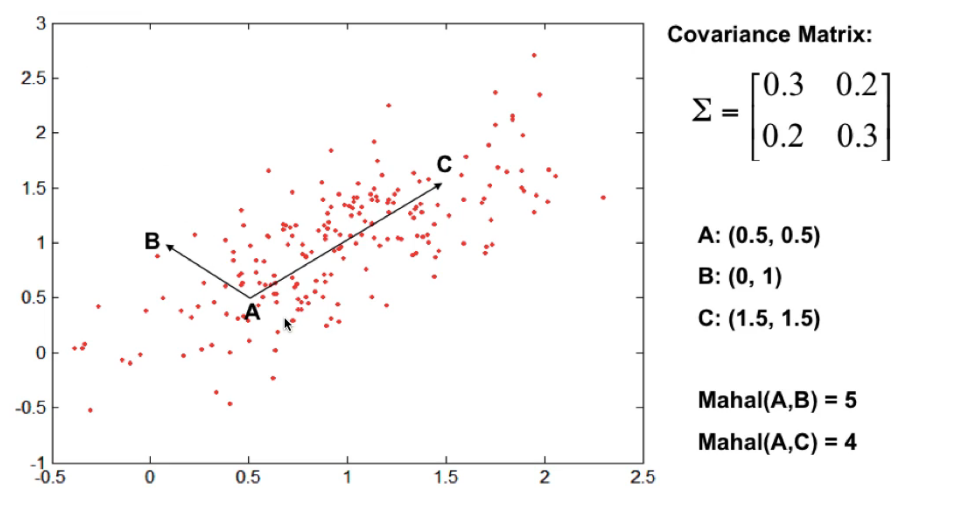

\newpage
# Modelli basati sulla distanza
* I modelli per la classificazione sfruttano le similarita' tra i dati di
  training per generalizzare a dati mai visti. Ad esempio, gli alberi di
  decisione segmentano lo spazio degli esempi in segmenti simili in qualche modo
  tra di loro.
* I modelli che vedremo utilizzano una forma piu' graduata di similarita'

* Notiamo che in uno spazio degli esempi, la scelta piu' banale come misura di
  dissimilarita' potrebbe essere la **distanza** tra due esempi
* In generale esistono pero' molte funzioni di distanza che si basano su altri
  principi rispetto a quelli di "*senso comune*"

## Distanze di Minkowski
> Se $\mathscr{X} = \mathbb{R}^d$ e' lo spazio degli esempi, la ***distanza di
  Minkowski*** di ordine $p > 0$ e' definita come
  $$
  Dis_p(x, y) = \left(  \sum^d_{j=1} | x_j - y_j |^p \right)^{1/p} = \|x - y \|_p
  $$
  dove $x, y \in \mathscr{X}$. In altri termini, e' semplicemente la norma
  *p-esima* della differenza tra gli esempi.

* $Dis_0$ misura la distanza contando quanti elementi sono diversi da 0
  all'interno di un vettore. Possiamo vederla come $Dis_0(x, y) = \sum^d_{j=1}
  I[x_j \neq y_i]$.
    * Se tutte le features di $x$ e $y$ sono binarie, allora si parla di
      ***distanza di Hamming***
    * Se tutte le features di $x$ e $y$ non sono binarie e non hanno la stessa
      lunghezza, si parla invece di ***distanza di Levenshtein***
* $Dis_2$ misura la ***distanza euclidea***, che indica la distanza piu' corta tra due
  punti connessi da una linea retta (*a volo d'uccello*)
* $Dis_1$ e' detta ***distanza di Manhattan*** (*cityblock distance*), che
  determina la distanza tra due punti se fossero permessi solo movimenti lungo
  gli assi delle coordinate
* Mano a mano che si fa crescere $p$, la misura della distanza sara' sempre piu'
  dominata dalla componente piu' grande in valore assoluto. All'estremo troviamo
  $Dis_{\infty} = \max_j |x_j - y_j|$, chiamata anche ***distanza di
  Chebyshev***.
* In alcuni casi in cui le features sono sparse (cioe' se alcune features sono
  assenti su alcune istanze) si utilizza di solito la ***distanza di Jaccard***,
  che tiene conto solo delle istanze che sono entrambe presenti (entrambe 1)

> Una ***metrica di distanza*** e' una funzione $Dis: \mathscr{X} \times
> \mathscr{X} \rightarrow \mathbb{R}$ tale che per ogni $x, y, x \in \mathscr{X}$
> valgono le seguenti proprieta':
>
>    * La distanza tra un punto e se stesso e' 0: $Dis(x, x) = 0$
>    * Tutte le altre distanze sono maggiori di zero: se $x \neq y$ allora
>      $Dis(x, x) > 0$
>    * La distanza e' simmetrica: $Dis(x, y) = Dis(y, x)$
>    * Percorsi alternativi non possono diminuire la distanza: $Dis(x, z) \leq
>      Dis(x, y) + Dis(y, z)$

## Distanze di tipo ellittico
* La distanza ellittica e' un modo differente di calcolare la distanza che tiene
  conto anche della direzione nello spazio in cui rappresentiamo le istanze
* Un tipo di distanza ellittico e' la distanza di Mahalanobis
    * Sia $M = \Sigma^{-1}$ la *matrice della covarianza*, allora la distanza di
      Mahalanobis e' calcolabile come
      $$
      Dis_M (x, y \;|\; \Sigma) = \sqrt{(x - y)^T \Sigma^{-1} (x - y)}
      $$
    * Utilizzare la matrice della covarianza ha l'effetto di *eliminare la
      correlazione e normalizzare* le features
    * La distanza Euclidea e' un caso specifico della distanza di Mahalanobis,
      in particolare $Dis_2(x, y) = Dis_M(x, y, \;|\; I)$

* Spieghiamo ora come si calcola la matrice delle covarianze $\Sigma$
    * Abbiamo che $X$ e' una matrice ($n \times d$) composta da $n$ oggetti
      rappresentati mediante $d$ features
    * Allora la matrice delle covarianze e' una matrice $d \times d \Sigma$, in
      cui la singola entrata $\sigma_{lj}$ e' la *covarianza* tra le feature $l$
      e $j$ su tutte le istanze nel dataset $X$
      $$
      \sigma_{lj} = \frac{1}{n} \sigma^n_{k=1} (x_{kl} - \bar{x_{*l}})(x_{kj} - \bar{x_{*j}})
      $$
    * $\sigma_{lj}$ e' una misura di quanto le features $l$ e $j$ variano
      **insieme** (da qui il nome *co-varianza*)

* In questa immagine, si puo' notare come la distanza di Mahalanobis sia in
  disaccordo con la distanza Euclidea. Si puo' notare come sia piu' piccola tra
  $A$ e $C$ rispetto a $A$ e $B$. Questo accade principalmente perche' la
  direzione del vettore differenza $C - A$ segue la direzione dei dati.

## Centroidi e Medoidi
* Gli esemplari sono delle istanze nello spazio degli esempi che rappresentano
  (sono rappresentative) delle classi

> **Teorema**: La media aritmetica $\mu$ di un set di esemplari $D$ e' il punto
> univoco che *minimizza la somma totale* delle distanze Euclidee al quadrato
> tra tutte le istanze del set $D$ e $\mu$
>
> **Dimostrazione**: Bisogna dimostrare che $\arg \min \sum \|x-y\|^2_2 = \mu$,
> imponendo che il *gradiente* della somma rispetto a $y$ ($\nabla_y$) sia 0
> $$
  \nabla_y \sum_{x \in D} \| x - y\|^2_2 = \\
  -2 \sum_{x \in D} (x - y) =
  -2 \sum_{x \in D} x +2 |D| y = \\
  y = \frac{1}{|D|} \sum_{x \in D} x = \mu
> $$

* In alcune situazioni non si vuole avere un *baricentro* ideale (in questo caso
  rappresentato da $\mu$, che pero' non e' descritto in termini di features) ma
  si vuole un'istanza che renda minime le distanze tra tutti gli altri. In
  questo caso parliamo di ***medoide*** se l'esempio e' ristretto a far parte
  esclusivamente del dataset, mentre ***centroide*** quando puo' anche non
  appartenere per forza al dataset.
* **Centroide**: Centro della massa ideale di una classe (puo' anche non
  appartenere al dataset)
* **Medoide**: Istanza localizzato piu' al centro della classe (piu' vicina al
  centroide)
* Rispetto al calcolo del centroide, il medoide richiede di calcolare le
  distanze tra tutte le coppie di punti, per cui ha complessita' $O(n^2)$

## Distance Based Classification
* Sappiamo che un classificatore lineare di base costruisce una linea di
  decisione dividendo i positivi e i negativi
* E' possibile ottenere la stessa cosa ma basandosi sul concetto di distanza:
    * Siano $\mu^{\ominus}, \mu^{\oplus}$ i centroidi delle rispettive classi
      negative e positive
    * Quando una nuova istanza $x$ deve essere classificata, si controlla
        - Se e' piu' vicina a $\mu^{\oplus}$ allora e' un esempio **positivo**
        - Altrimenti e' un esempio **negativo**
    * In altri termini, classifica un'istanza con la classe del piu' vicino
      *esemplare*
* In caso usassimo la distanza Euclidea, allora si otterrebbe lo stesso ed
  identico decision boundary ottenuto dal classificatore lineare

> Creare un classificatore lineare puo' essere interpretato da un punto di vista
di distanza come trovare gli *esemplari* che minimizzino la distanza euclidea al
quadrato di ogni classe, per poi applicare una regola di decisione basata
sull'esemplare piu' vicino.

* Questo cambio di prospettiva permette di estendere la classificazione a piu'
  di due classi molto facilmente.
* All'aumentare di esemplari (conseguentemente ad un aumento delle classi)
  alcune regioni dello spazio degli esempi diventano delle regioni convesse
  chiuse (delimitate dai decision boundaries), dando luogo a quella che si
  chiama ***tassellazione di Voronoi***.

### Nearest Neighbour Classifier
* Nella sua forma originale, il classificatore che si basa sui k-vicini piu'
  prossimi, prende un *voto di classe* per ognuno dei $k$ esemplari piu' vicini
  e ne predice la classe maggioritaria

> Scegliere un $k$ dispari e' preferibile in modo da evitare *pareggi* nei voti

* `kNN` memorizza (infatti si chiamano anche modelli basati sulla memoria) tutti
  gli esempi del dataset e ad ogni esempio di test va a cercare le $k$ istanze
  piu' vicine nel dataset memorizzato, per poi farne la votazione di classe.
* Per questa ragione, sia la *classificazione di una singola istanza* che il
  *training del modello* ha complessita' $O(|D|)$
* Il classificatore 1NN separa perfettamente i positivi e i negativi, per cui ha
  un **basso bias** e un'**elevata varianza** (molto suscettibile a overfitting
  in casi in cui il dataset e' poco significativo o poco grande)
* D'altra parte, all'aumentare di $k$ **diminuiamo la varianza** e **aumentiamo
  il bias** del modello.
* Relazione col *bias-variance dilemma*:
    * Con valori bassi di $k$, abbiamo una varianza alta e un basso bias
    * Con valori alti di $k$, abbiamo una bassa varianza e un alto bias
* **Pro**: Facilmente adattabile a valori di target reali per cui si puo'
  estendere facilmente a task di regressione, o alla stima di probabilita'
  quando $k > 1$
* **Contro**: E' affetto dalla maledizione della dimensionalita', cioe' che in
  spazi con dimensionalita' molto alta gli esempi sono molto distanti tra di
  loro per cui la distanza e' poco informativa (?)

> Non esiste una regola precisa per trovare il valore di $k$ ottimale per un
dato dataset

* Una modifica che si puo' fare a kNN e' quella di **pesare il voto** di un
  certo vicino per il reciproco della distanza tra il vicino e l'istanza di
  test. In questo modo, piu' e' grande la distanza minore sara' il voto, il che
  coincide con l'intuizione dal momento che piu' distante e' l'istanza, meno
  affidabile sara' la sua classe

## Distance Based Clustering
### DBSCAN
* DBSCAN e' un algoritmo basato sulla *densita'*, definita come il numero di
  punti all'interno di un raggio specificato $\epsilon$
* Un punto e' detto:
    * **Core point** se ha piu' di un certo numero `MinPts` all'interno del
      raggio specificato $\epsilon$ (punto interno al *cluster*)
    * **Border point** se ha meno di `MinPts` punti all'interno del raggio
      $\epsilon$, ma e' un *vicino* di un *core point*
    * **Noise point** se non e' nessuno dei due
* Sfruttando queste definizioni si puo' definire lo speudoodice di DBSCAN:

\begin{algorithm}[H]
\DontPrintSemicolon
\SetAlgoLined
\SetKwInOut{Input}{Input}\SetKwInOut{Output}{Output}
\Input{Dataset $D$}
\Output{Labelled Dataset $D$}
\BlankLine
{$\forall x \in D$ label $x$ as a core, border or noise point \;}
{Eliminate every noise point \;}
{Put an edge between all core point that are within $\epsilon$ of each other \;}
{Make each group of connected core points into a separate cluster \;}
{Assign each border point to one of the clusters of its associated core points \;}
\caption{DBSCAN}
\end{algorithm}

* In generale DBSCAN riesce a rappresentare bene clusters di qualsiasi forma e
  dimensione, posto che le densita' siano particolarmente omogenee e che formino
  zone contigue. Ad esempio, se si dovessero riconoscere le figure all'interno
  di una immagine in grayscale.
* DBSCAN si comporta particolarmente male in casi in cui ci sono datasets che
  presentano delle densita' molto differenti tra loro, per cui risulterebbe
  difficile far riconoscere i clusters giusti all'algoritmo.
* Inoltre anche DBSCAN soffre della maledizione dell'alta dimensionalita', per
  cui si comporta male anche in datasets caratterizzati da dati a dimensioni
  elevate. (questo perche' anch'esso si basa su un concetto di distanza)
* Una difficolta' di DBSCAN e' quella dell'inizializzazione dei parametri
  `MinPts` e `Eps` ($\epsilon$).
    * Cio' che si puo' fare per risolvere questo problema e' analizzare il
      ***Reachability Plot***, che si ottiene plottando la densita' di punti in
      base alla loro distanza dai $k$ vicini fissati
    * Sull'asse delle $y$ si mette la *distanza* che puo' variare
    * Sull'asse delle $x$ si mette la *densita'* di punti
    * Un punto $(x, y)$ rappresenta l'$x$ numero di punti che hanno almeno $k$
      vicini con quella distanza $y$
    * Se si ordinano i punti per densita' e si plottano, si ottiene una curva
      che ha con valori crescenti di $x$ un *gomito*.
    * I punti nella prossimita' del gomito indicano dei valori ottimali da
      impostare per la distanza $\epsilon$

### K-Means
* **Nota**: Qui ho skippato una parte sulle misure dei clusters che e' stata gia' spiegata
  nella parte dei clusters ad albero
* Possiamo notare che la $SSE$ di un dataset $D$ e' costante e puo' essere
  scomposta in due sottoparti $SSE = WSS + BSS$
* Al variare del numero $K$ di clusters (non utilizzeremo piu' $k$ per indicare
  i vicini come fin'ora, ma per indicare il numero di clusters), le quantita'
  $WSS$ e $BSS$ cambieranno ma la loro somma rimane sempre la stessa costante
* Il problema *k-means* consiste nel trovare $K$ clusters in un dataset $D$ tali
  che minimizzino la quantita' $WSS$ (o che massimizzino $BSS$), cioe' che i
  clusters siano ben coesi
* In altri termini, si tratta di minimizzare la funzione obiettivo $WSS$
* Identificare $K$ clusters si puo' anche vedere come trovare $k$ centroidi
  (siccome ogni centroide individua un cluster), per cui da qui e' preso il nome
  *K-means*
* Questo problema e' *NP-Completo*, cioe' non esiste una soluzione analitica
  chiusa, per cui si ricorre (come gia' fatto in precedenza) ad algoritmi che
  utilizzano euristiche per trovare un'approssimazione del minimo/massimo
  globale
* Un algoritmo molto noto che risolve il problema e' l'***algoritmo di Lloyd***:
    * Essenzialmente itera tra due fasi:
        * Partiziona i dati utilizzando la regola del centroide piu' vicino
        * Ricalcola di conseguenza il centroide di ogni partizione
    * E' un algoritmo molto efficiente che converge molto velocemente ad un
      punto stazionario, ma non si ha la garanzia che la soluzione sia
      effettivamente un minimo/massimo globale
    * Per questa ragione l'algoritmo viene eseguito piu' volte per poi scegliere
      la migliore tra tutte le soluzioni

\begin{algorithm}[H]
\DontPrintSemicolon
\SetAlgoLined
\SetKwInOut{Input}{Input}\SetKwInOut{Output}{Output}
\Input{Dataset $D$, number of clusters $K$}
\Output{$K$ cluster means $\mu_1, \dots, \mu_K \in \mathbb{R}^d$}
\BlankLine
{randomly initialize $K$ vectors $\mu_1, \dots, \mu_K \in \mathbb{R}^d$ \;}
\Repeat{no change in $\mu_1, \dots, \mu_K$} {
    {assign each $x \in D$ to $\arg \min_j Dis_2(x, \mu_j)$\;}
    \For{$j = 1$ to $K$} {
        {$D_j \leftarrow \; \{ x \in D \; | \; x \text{ assigned to cluster } j\}$ \;}
        {$\mu_j = \frac{1}{|D_j|} \sum_{x \in D_j} x$ \;}
    }
}
\Return{$\mu_1, \dots, \mu_K$}
\caption{KMeans(D, K) - K-means clustering using Euclidean distance $Dis_2$}
\end{algorithm}

* K-Means ha uno svantaggio particolare: e' sensibile ai clusters che hanno
  grandezza e forma non globulare per cui tende a dividerle in modo errato.
  Questo perche' il metodo ottimizza i centroidi del cluster, generando una
  tassellazione di Voronoi nello spazio delle istanze.
* Per attenuare il problema si suggerisce una normalizzazione delle features
  nello stesso range in modo che le features abbiano tutte lo stesso impatto
  sulla distanza
* Una variante dell'algoritmo *K-Means* e' *K-Medoids*, che al posto di cercare
  i **centroidi** cerca i **medoidi** all'interno del dataset per rappresentare
  i clusters.

\begin{algorithm}[H]
\DontPrintSemicolon
\SetAlgoLined
\SetKwInOut{Input}{Input}\SetKwInOut{Output}{Output}
\Input{Dataset $D$, number of clusters $K$}
\Output{$K$ medoids $\mu_1, \dots, \mu_K \in D$}
\BlankLine
{randomly pick $K$ datapoints $\mu_1, \dots, \mu_K \in D$ \;}
\Repeat{no change in $\mu_1, \dots, \mu_K$} {
    {assign each $x \in D$ to $\arg \min_j Dis(x, \mu_j)$\;}
    \For{$j = 1$ to $K$} {
        {$D_j \leftarrow \; \{ x \in D \; | \; x \text{ assigned to cluster } j\}$ \;}
        {$\mu_j = \arg \min_{x \in D_j} \sum_{x' \in D_j} Dis(x, x')$ \;}
    }
}
\Return{$\mu_1, \dots, \mu_K$}
\caption{KMedoids(D, K, Dis) - K-medoids clustering using arbitrary distance metric $Dis$}
\end{algorithm}

### Silhouettes
* La **Silhouette** e' un valore di scoring per valutare la bonta' di una
  soluzione di clustering
* Denotiamo con $d(x_i, D_j)$ il valore medio delle distanze dell'istanza $x_i$
  con tutti i punti del cluster $D_j$.
* Denotiamo inoltre $j(i)$ l'*index* del cluster a cui appartiene $x_i$
* Possiamo allora definire:
    - $a(x_i) = d(x_i, D_{j(i)})$ che indica distanza media di $x_i$ con tutti i
      *punti interni al proprio cluster*
    - $b(x_i) = \min_{k \neq j(i)} d(x_i, D_k)$ che indica la distanza media
      rispetto ai *punti del cluster piu' vicino*
* La differenza $b(x_i) - a(x_i)$ puo' essere presa come misura di quanto sia
  ben clusterizzato $x_i$
    * Se $a(x_i) > b(x_i)$ allora la differenza e' negativa, per cui descrive
      una situazione in cui $x_i$ in media i membri del custer piu' vicino sono
      piu' vicini rispetto ai membri del proprio cluster
    * Se $a(x_i) < b(x_i)$ allora la differenza e' positiva, per cui indica che
      $x_i$ in media e' ben clusterizzato
* Possiamo infine definire un *clustering score* per la singola istanza $x_i$
  come
  $$
  s(x_i) = \frac{b(x_i) - a(x_i)}{\max{(a(x_i), b(x_i))}}
  $$
* $s(x_i)$; positivo = buona clusterizzazione, negativo = cattiva clusterizzazione
  (in generale piu' grande e' meglio e')
* Un plot di una **Silhouette** consiste nel calcolare i valori $s(x)$ per ogni
  istanza, ordinarli e raggrupparli per cluster

## Clustering Gerarchico
* Il risultato di un clustering gerarchico e' un *dendrogramma*, cioe' una
  struttura gerarchica ad albero
* Un vantaggio del dendrogramma e' che potrebbe rappresentare strutture che sono
  significative nel dominio di applicazione (esempio: mondo animale), per cui il
  clustering gerarchico e' molto popolare domini di applicazione biologici
* Dato un dataset $D$ un ***dendrogramma*** e' un albero binario con gli
  elementi di $D$ come sue foglie. I nodi interni dell'albero identificano un
  sottoinsieme di $D$ composto dai nodi foglia che hanno come radice quel dato
  nodo interno
* ***Funzione di Linkage***: E' una funzione $L: 2^{\mathscr{X}} \times
  2^{\mathscr{X}} \rightarrow \mathbb{R}$ che calcola la distanza tra due
  sottoinsiemi arbitrari nello spazio degli esempi, data una metrica di distanza
  $Dis: \mathscr{X} \times \mathscr{X} \rightarrow \mathbb{R}$
  Funzioni di linkage molto comuni sono:
    * **Single linkage**: definisce la distanza tra due clusters come la piu'
      piccola distanza tra gli elementi dei due clusters
      $$
      L_{single}(A, B) = \min_{x \in A, y \in B} Dis(x, y)
      $$
    * **Complete linkage**: definisce la distanza tra due clusters come la
      distanza piu' grande tra gli elementi dei due clusters
      $$
      L_{complete}(A, B) = \max_{x \in A, y \in B} Dis(x, y)
      $$
    * **Average linkage**: definisce la distranza tra due clusters come la
      distanza *media* punto-punto
      $$
      L_{average}(A, B) = \frac{\sum_{x \in A, y \in B} Dis(x, y)}{|A| \; \cdot
      \; |B|}
      $$
    * **Centroid linkage**: definisce la distanza tra due cluster come la
      distanza tra i due centroidi dei rispettivi clusters
      $$
      L_{centroid}(A, B) = Dis \left( \frac{\sum_{x \in A} x}{|A|},
      \frac{\sum_{y \in B} y}{|B|} \right)
      $$
* Tutte queste funzioni di linkage divergono per cluster molto grandi, mentre
  convergono tutte allo stesso valore per cluster singoletti (composti da un
  solo elemento)
* Un algoritmo che performa il clustering agglomerativo ipotetico e' il
  seguente:

\begin{algorithm}[H]
\DontPrintSemicolon
\SetAlgoLined
\SetKwInOut{Input}{Input}\SetKwInOut{Output}{Output}
\Input{Dataset $D$, linkage function $L$}
\Output{A dendrogram representing a descriptive clustering of $D$}
\BlankLine
{Initialize cluster to singleton data points \;}
{Create a leaf at level 0 for every singleton cluster \;}
\Repeat{all data points are in one cluster} {
    {Find the pair of clusters $X, Y$ with lowest linkage $l$, and merge \;}
    {Create a parent of $X, Y$ at level $l$ \;}
}
\Return{the constructed binary tree with linkage levels}
\caption{HAC(D,L) - Hierarchical agglomerative clustering}
\end{algorithm}

* Utilizzando la funzione di linkage, e' evidente come il focus nel clustering
  gerarchico si sposti sul $BSS$

## Dai kernels alle distanze
* Possiamo vedere un kernel come una funzione di similarita' tra due istanze
* Ricordiamo che un kernel e' una funzione $K(x_i, x_j) = \phi(x_i) \cdot
  \phi(x_j)$ che calcola il prodotto scalare senza costruire esplicitamente il
  vettore $\phi(x)$
* Ogni metodo di learning che puo' essere espresso solamente in termini di
  prodotto scalare e' *kernelizzabile*
    * Possiamo fare lo stesso con molti modelli basati sulla distanza, siccome
      la distanza Euclidea puo' essere riscritta come
      $$
      Dis_2(x, y) = \|x - y\|^2 = \sqrt{(x-y) \cdot (x-y)} = \sqrt{x\cdot x
      -2x\cdot y + y\cdot y}
      $$
    * Se sostituiamo il prodotto scalare con la funzione kernel, possiamo
      costruire la generica distanza kernelizzata
      $$
      Dis_{K}(x, y) = \sqrt{K(x, x) - 2K(x, y) + K(y, y)}
      $$
* Possiamo trasformare il prodotto scalare in distanza anche in un altro modo:
    * Dal momento che il prodotto scalare $x \cdot y = \| x \| \cdot \| y \|
      \cos{\theta}$, possiamo derivare la *similarita' del coseno* come:
      $$
      \cos{\theta} = \frac{x \cdot y}{\| x \| \cdot \| y \|} =
      \frac{x \cdot y}{\sqrt{(x \cdot x) (y \cdot y)}}
      $$
    * Anche in questo caso possiamo kernelizzarla
      $$
      \cos{\theta} = \frac{K(x, y)}{\sqrt{K(x, x) \cdot K(y, y)}}
      $$
