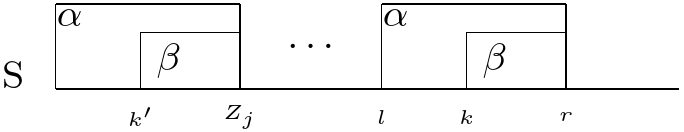
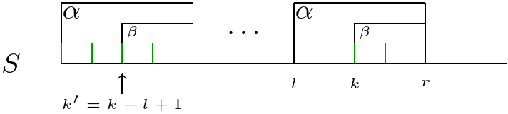
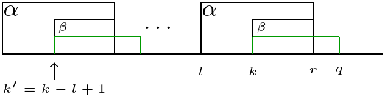

# Algoritmi di Pattern Matching

## Pattern Matching

* Stringa: Lista di caratteri contigui, l'$i$-esimo carattere si indica con $S(i)$
* Sottostringa: $S[i..j]$ - Lista dei caratteri contigui che vanno dalla posizione $i$ di $S$ alla
  posizione $j$
* Stringa vuota: $S[i..j]$ con $i>j$
* Prefisso: Sottostringa che inizia dal primo carattere di $S$
* Suffisso: Stottostring che inizia da un generico indice e termina nell'ultimo carattere di $S$
* Prefissi e suffissi si dicono propri (e viceversa non propri) quando la stringa vuota non e'
  considerata prefisso o suffisso
* Quando due caratteri sono uguali si dice che c'e' un *match*, altrimenti si dice *mismatch*
* Una sottosequenza e' un sottoinsieme dei caratteri della stringa NON contigui. Una sottostringa e'
  una sottosequenza, ma una sottosequenza non e' una sottostringa.

>**Definizione (Pattern Matching)** 
>Data una string $P$ chiamata *pattern* e una stringa piu' lunga
>$T$, trovare tuttre le occorrenze del pattern $P$ nel testo $T$. 

* Una soluzione naif a questo problema potrebbe essere quella di prendere i caratteri di $P$ con $T$
  e confrontarli da sinistra a destra, usando $P$ come *"stencil"* e confrontandone carattere per
  carattere. Successivamente si sposta a destra di un carattere rispetto a $T$ e il confronto
  ricomincia. 
* Sia $|P|=n$ e $|T|=m$, la complessita' dell'algoritmo e' $O(nm)$.
* E' possibile migliorare la tecnica andando a spostare $P$ di piu' di un carattere quando si
  presenta un mismatch, oppure riducendo i confronti saltando alcune parti del pattern dopo lo
  shift.
* Molti algoritmi di pattern matching funzionano in 2 fasi
    - Fase di preprocessing: estraggono delle informazioni sulla struttura del pattern e del testo
    - Fase di ricerca: utilizzano l'informazione ottenuta dalla prima fase per effettuare la ricerca 

* Per poter prima introdurre algoritmi di preprocessing o di pattern matching, e' necessario prima
  introdurre alcuni concetti e notazione specifica. 
* Con $Z_i(S)$ si indica la lunghezza della sottostringa piu' lunga di $S$ che inizia nella
  posizione $i$ e matcha un prefisso di $S$
    - es. $S = a\; a\; b\; c\; a\; a\; b\; x\; a\; a\;$
    - $Z_5(S)=3$, $Z_6(S) = 1$, $Z_9(S) = 2$
* ZBox: intervallo che inizia in $i$ e termina in $i + Z_i - 1$ 
* $r_i$ indica il valore massimo di $j + Z_j - 1$ per tutti i $1 < j <= i$ tali che $Z_j > 0$
* $l_i$ indica l'indice iniziale dello ZBox che termina in $r_i$
* Il tempo richiesto per calcolare tutti gli $Z_i$ e' $O(|S|^2)$
* Esiste pero' un algoritmo che sfrutta le iterazioni precedente che ha complessita' $O(|S|)$,
  chiamato Z-Algoritm
* Per poter capire come funziona a linee generali, facciamo un esempio e supponiamo che $k=121$,
  $r_{120}=130$, $l_{120}=100$. Si vuole calcolare $Z_{121}$.
 
{ width=50% }

* Come si vede nella figura \ref{figExample1}, per la definizione di Z-Box e secondo i dati dati dal
  problema, esiste una stringa $\alpha$ di lunghezza $30$, all'inizio del testo e alla posizione
  $100$. Allora la sottostringa $\beta$ lunga $10$ che inizia nella posizione $121$, deve matchare
  la sottostringa $\beta$ lunga $10$ che inizia nella posizione $22$ di *S*, percio' $Z_{22}$ puo'
  essere utile per calcolare $Z_{121}$. Se $Z_{22}$ e' per esempio $3$, allora anche $Z_{121}$ sara'
  $3$.
 
## Z-Algorithm

* Possiamo sfruttare questa caratteristica per sviluppare il cosiddetto *Z-Algorithm*:
    - All'inizio, $Z_2$ e' trovato confrontando carattere per carattere la sottostringa
      $S[1\dots|S|]$ con la sottostringa $S[2\dots|S|]$ fino a quando non si trova un mismatch,
      proprio come nel metodo Naive.
      $$
      \begin{aligned}
        \overbrace{\underset{\uparrow}{a}bcdefg}^{S[1\dots|S|]} \dots\\
        a\overbrace{\underset{\uparrow}{b}cdefg}^{S[2\dots|S|]} \dots 
      \end{aligned}
      $$
    - Se $Z_2>0$, $r=Z_2+1$ e $l=2$, altrimenti $r=l=0$ (*non esiste una Z-Box*)
    - Procediamo induttivamente a calcolare i restanti $Z$. Dati gli $Z_i$ con $2<=i<=k-1$, $l=l_{k-1}$ e
      $r=r_{k-1}$, $Z_k$ e i  nuovi valori di $l=l_k$ e $r =r_k$ sono calcolati nel modo seguente:
        + Se $k>r$, vuol dire che la *Z-box* tra $l$ ed $r$ e' stata *"superata"*, per cui bisogna
          per forza utilizzare il metodo naive: $Z_k$ viene calcolato confrontando i caratteri dalla
          posizione $k$ con quelli che iniziano nella posizione $1$ di $S$ finche' non si trova un
          mismatch. Una volta trovato, se $Z_k>0$, aggiorna i valori $r=k+Z_k-1$ e $l=k$.
        + Altrimenti ($k \leq r$), denotiamo $Z_k'$ la *Z-Box* corrispondente al prefisso, cioe'
          $k'=l-k+1$, la situazione e' quella raffigurata in figura \ref{figZalg1}. 
 
{ width=50% }

Possiamo ora distinguere due casi differenti:

  - Se $Z_{k'} < \beta$, allora imposta $Z_k = Z_{k'}$ e lascia $l$ ed $r$ invariati 
  - Se $Z_{k'} \geq \beta$, allora utilizza il metodo naive a partire dalla posizione $r+1$ e
    $|\beta|+1$ fino a quando non trovi un mismatch. Posto che il mismatch avvenga in una posizione
    $q \geq r + 1$, allora setta $Z_k=q-k$, $r=q-1$ ed $l=k$ 
 
{ width=50% }\ { width=50% }
\begin{figure}[!h]
\begin{subfigure}[t]{0.6\textwidth}
\caption{Situazione in cui $Z_{k'} \geq \beta$ }
\end{subfigure}
\hfill
\begin{subfigure}[t]{0.4\textwidth}
\caption{Situazione in cui $Z_{k'} < \beta$ }
\end{subfigure}
\end{figure}

Lo *Z-Algorithm* puo' essere utilizzato per cercare un pattern nel testo andando a imporre che la
stringa $S$ sia la concatenazione di $S=P\gamma T$ dove $\gamma$ e' un carattere che non occorre ne'
in $P$ ne' in $T$.

## Algoritmo di Boyer-Moore

* Come nell'algoritmo naive, l'algoritmo di Boyer-Moore allinea successivamente $P$ con $T$ e
  verifica il match carattere per carattere, ma differisce dal metodo naive per 3 caratteristiche.
    - La scansione del pattern avviene da destra a sinistra quando si confrontano i caratteri
    - Regola di shift del "*bad character*"
    - Regola di shift del "*good suffix*"
* Queste idee portano a un metodo che di solito esamina meno di $m+n$ caratteri e ha complessita' in
  tempo lineare in caso peggiore, proprio come nello *Z_algorithm*.
* **Bad character shift rule:**
    * Sia $i$ il punto in cui in $P$ si presenta il mismatch, mentre gli $n-i$ caratteri precedenti
      sono uguali ai corrispondenti in $T$ (ne siamo sicuri dal momento che il confronto avviene da
      destra a sinistra)
    * Sia $T(k)$ il carattere allineato con $P(i)$.
    * Sia $R(x)$ la posizione dell'occorrenza piu' a destra del carattere $x$ in $P$ ($R(x) = 0$ se
      $x$ non occorre in $P$).
    * Allora, sposta $P$ a destra di $N$ posizioni, con $N = max\{1, i-R(T(k)) \}$. Se in $P$
      l'occorrenza piu' a destra di $T(k)$ e' in posizione $j < i$, sposta $P$ in modo che il
      carattere $j$ di $P$ sia allineato con il carattere $k$ di $T$, altrimenti sposta $P$ di una
      posizione.
* La bad character shift rule, non ha effetto se il carattere di $T$ con in quale si trova il
  mismatch, si trova in $P$ a destra del punto in cui e' stato trovato il mismatch.
* **Bad character shift rule estesa:** Quando si presenta un mismatch nella posizione $i$ di $P$ e
  il carattere in $T$ e' $x$, sposta $P$ a destra in modo che il carattere $x$ a sinistra piu'
  vicino alla posizione $i$ in $P$ sia allineato con $x$ in $T$.
    * Questa regola ha bisogno di una fase di preprocessing per calcolare le posizioni delle
      occorrenze piu' vicine a $i$ a sinistra, la quale, per ogni posizione $i$ in $P$ e per
      ogni carattere $x$, calcola la posizione dell'occorrenza di $x$ piu' vicina a $i$ alla sua
      sinistra.
    * Si puo' utilizzare un array bidimensionale $n \times | \Sigma |$ per memorizzare queste
      informazioni.
    * Scandendo $P$ da destra a siniistra si possono memorizzare per ognii carattere le posizioni in
      cui occorre. Ogni lista e' in ordine decrescente, e la loro costruzione richiede sia tempo
      che spazio $O(n)$.

