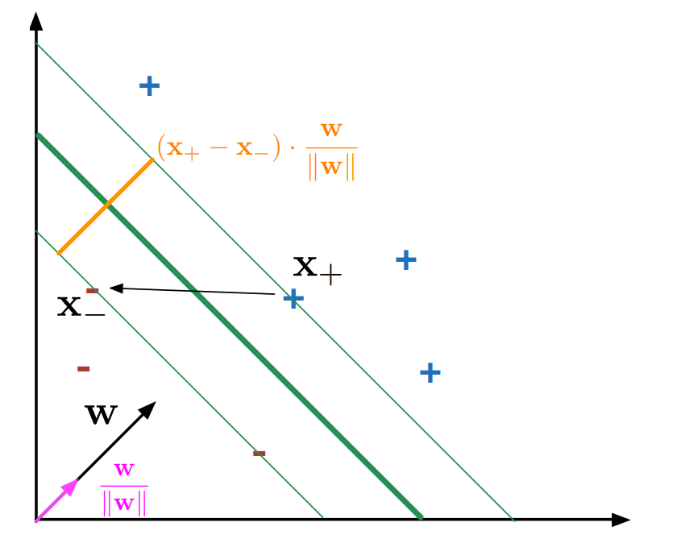

\newpage
# Modelli Lineari

## Least Squares (Metodo dei minimi quadrati)
* Caso: Problema di regressione in cui si vuole ottenere un'approssimazione
  lineare di $n$ punti
* Si vuole trovare l'approssimazione che minimizzi l'errore
* Formalizzazione del problema con esempio in 2 dimensioni:
    * Dati $n$ punti $(x, y)$ rappresentati in formato matriciale
    * Vogliamo trovare i parametri $(C, D)$ del modello lineare $Cx + D = y$ che
      approssimi meglio i dati
    * Il modello e' semplicemente una combinazione lineare dei coefficienti
      $\sum^n_{i = 0} x_i \cdot w_i = y_i$ dove $w$ e' il vettore delle
      variabili.
* Idealmente quello che si vuole ottenere e' che il modello non abbia errori
  sui dati di train. Formalmente parlando, si vuole per ogni punto dato $(x_i,
  y_i)$ valga la relazione $Cx_i + D = y_i$ (ne risulta un sistema a $n$ righe)
* (*Recall da metodi numerici*) Ogni sistema puo' essere rappresentato in forma
  matriciale $Ax = b$, in questo caso si ottiene $Xw = y$, dove $X$ e' la
  matrice composta da colonne degli $x$ compresa di una  colonna addizionale
  composta da soli $1$, $w$ il vettore colonna composto dalle variabili (in
  questo caso $C$ e $D$) e $y$ il vettore colonna dei valori $y$.
* Il ***caso ideale*** per la soluzione di questa equazione lineare, e' quello in cui
  la matrice $X$ ha rango pieno (tutte le colonne sono linearmente indipendenti
  tra loro), per cui esiste l'inversa $X^{-1}$. La soluzione e' ottenibile
  moltiplicando ambo i membri per l'inversa ottenendo la soluzione $w = X^{-1} \cdot y$
* Ovviamente questo caso e' possibile solo quandoo il numero di osservazioni
  ($n$) coincide con il numero di features. Quasi sempre questo non succede,
  rendendo quindi la matrice *non invertibile*.
* Possiamo pero' riformulare il problema:
    * Ricordati che lo spazio generato da una matrice (*span*) $C(X)$ e'
      generato dalla combinazione lineare dei vettori colonna $x_i$ appartenenti
      alla matrice
    * Variando i valori di $\hat{w}$ (vettore colonna con tanti componenti
      quante features), si puo' ottenere un qualsiasi vettore all'interno di
      $C(X)$. Questo perche' ogni vettore nello spazio e' esprimibile come
      combinazione lineare delle colonne di $X$ nel modo seguente
      $$
      \vec{p} = \sum^m_{j = 0} \hat{w_j} \vec{x_j} = X \cdot \hat{w}
      $$
    * $Dim[C(X)] = n$ cioe' il numero di esempi
    * Dal punto di vista geometrico, $y$ non giace nello spazio $C(X)$. Dato che
      se no $X$ sarebbe invertibile. Un altro modo in cui possiamo vederlo e'
      che lo spazio generabile da ogni combinazione delle colonne ha dimensioni
      pari a $m$, mentre il vettore $y$ giace in uno spazio a $n$ dimensioni.
      Quasi sempre $n > m$, per cui vogliamo trovare un'approssimazione nello
      spazio delle colonne che si avvicini il piu' possibile a $y$.
    * $y$ pero' e' sempre un vettore di $n$ componenti, per cui possiamo
      calcolarne la distanza normata tra un qualsiasi vettore $p \in C(X)$.
      $$
      ||e||_2 = ||y - p||_2 = \sqrt{\sum_i (y_i - p_i)^2}
      $$
    * Dato che la norma e' una quantita' sempre positiva per definzione, possiamo
      anche considerarne i quadrati ($||e||_2^2$), che corrisponde a minimizzare la
      quantita' $\sum_i (y_i - p_i)^2$
    * Siccome per definizione $p = X\hat{w}$, dove $\hat{w}$ e', possiamo
      dare una formalizzazione finale del problema:

> Il metodo dei minimi quadrati consiste nel trovare il vettore $\hat{w}$ che
minimizzzi la norma al quadrato della distanza tra $p$ e $y$
$$
\hat{w} = \arg \min_{w} ||X w - y||_2^2
$$

* (*Stiamo parlando in termini dell'esempio sulle slides ovviamente*)
  Intuitivamente parlando si vuole trovare un vettore $\hat{w}$ tale che generi
  un vettore $e = y - p$ che sia perpendicolare al piano $C(X)$
* La condizione di perprendicolarita' dal punto di vista algebrico e' semplice:
  Siano $a$ e $b$ due vettori. Essi sono considerati perpendicolari quando $a
  \cdot b = 0$. Possiamo utilizzare questa definizione per trovare la soluzione
  nel nostro caso.
* Dal momento che il piano $C(X)$ e' generato dalle colonne di $X$, quello che
  vogliamo e' che il vettore $e$ sia perpendicolare ad ogni vettore colonna
  $x_i$ della matrice $X$. Per far cio' quindi basta imporre $X^T e =
  \vec{0}$.
* L'ultimo passaggio e' esplicitare $e$ e $p$ nella relazione precedente,
  ottenendo:
  $$
  \begin{split}
  X^T e &= 0 \\
  X^T (y - X \hat{w}) &= 0 \\
  X^T X \hat{w} &= X^T y \\
  \hat{w} &= (X^T X)^{-1} X^T y
  \end{split}
  $$
* Risolvere il problema dei minimi quadrati consiste quindi essenzialmente nel
  risolvere l'ultima relazione

### Regolarizzazione
* Uno dei problemi dei minimi quadrati, e' che e' molto sensibile agli
  *outliers* causando overfitting. Siccome la misura dell'errore su un singolo
  esempio e' elevata al quadrato, gli *outliers* pesano tantissimo sulla
  quantita' complessiva di errore. Per compensare questa situazione, la curva di
  classificazione cerchera' di avvicinarsi di piu' a questo punto piu' distante,
  sacrificando della precisione negli altri punti.

> Outliers: Punti che sono stati campionati da una distribuzione diversa da
quella originale. Corrispondono a degli errori nella misurazione.

* Attenuare questo problema e' possibile mediante una **regolarizzazione** della
  soluzione. L'idea e' quella di aggiungere dei vincoli sulla soluzione cercata.
  (nel nostro caso, sulla "*forma*" dei pesi $w_i \in \hat{w}$).
* Una versione normalizzata del problema dei minimi quadrati e' detta ***ridge
  regresssion*** e consiste semplicemente nell'aggiungere un termine $\lambda
  ||w||^2$ per far si che il vettore non cresca troppo in dimensioni e che
  rimanga in norma "abbastanza piccolo":
  $$
  \begin{split}
  \hat{w} &= \arg \min_{w} ||y - Xw||^2_2 + \lambda ||w||_2^2 \\
    &= \arg \min_{w} (y - Xw)^T (y - Xw) + \lambda ||w||_2^2 \\
  \end{split}
  $$
  (la seconda formulazione e' solo un modo diverso per scrivere $||y -
  Xw||^2_2$)
* La stessa relazione e' riscrivibile in forma chiusa
  $$
  \hat{w} = (X^T X + \lambda I)^{-1} X^T y
  $$
  (Il fatto di aggiungere la matrice diagonale $\lambda I$ a $X X^T$ e' un
  trucchetto molto noto che serve ad aumentare la stabilita' numerica per
  l'inversione della matrice)
* Un'altra forma di regolarizzazione e' data dal **lasso** (*Least Absolute
  Shrinkage and Selection Operator*). La differenza e' semplicemente quella che
  al posto di considerare $\lambda ||w||_2^2$, si usa $\lambda ||w||_1$.
* Perche' minimizzare la norma di $w$ porta a risultati migliori?
    * Supponiamo che la matrice delle osservazioni $X$ sia affetta da degli
      errori $\delta$, cioe' $(X + \delta)$.
    * Quando si moltiplica per $w$, otteniamo $(X + \delta)w = Xw + \delta w$
    * In questo senso, minimizzare $w$ minimizza anche l'errore su $X$
    * Un'altra ragione e' che dal momento che i $w$ devono essere piccoli,
      corrisponde a scegliere dei pesi piu' semplici. (*rasoio di Occam*)
    * Un'altro modo per vedere questo e' pensare alla regolarizzazione come un
      bias induttivo che viene inserito per ridurre l'errore di varianza del
      least square

### Classificazione con LSE
* Fin'ora abbiamo visto il metodo dei minimi quadrati per minimizzare l'errore e
  quindi per fare essenzialmente *regressione*, ma e' possibile adattare il
  modello per fare *classificazione*
* Ad esempio nel caso binario, se rappresentiamo le classi positive e negative
  come $1$ e $-1$:
  $$
  \hat{c}(x) =
  \begin{cases}
  1  \; & \text{if} \; x^T \hat{w} - t > 0 \\
  0  \; & \text{if} \; x^T \hat{w} - t = 0 \\
  -1 \; & \text{if} \; x^T \hat{w} - t < 0
  \end{cases}
  $$
  dove $t$ rappresenta l'*intercetta*, cioe' il termine in piu' che era incluso
  implicitamente in precedenza in $\hat{w}$ che veniva catturato dalla colonna
  composta da soli $1$ di $X$.
* L'idea e' pensare ad un classificatore come un iperpiano divisore dei punti.
  Se tali punti sono sopra all'intersezione con il piano allora saranno
  classificati positivi, negativi altrimenti (=0 invece astengo al voto).
  Parlando in caso di 2D che e' piu' semplice: si vuole trovare una retta per
  cui tutti i punti che sono a destra della sua intersezione con l'asse $x$
  vengono classificati positivi, negativi altrimenti.
* Posso quindi utilizzare le tecniche utilizzate fin'ora per la regressione, ma
  utilizzando una $y$ con valori possibili $-1$ o $1$.

## Support Vector Machines
* Idea: Invece di lasciare al caso la scelta di quale sia la linea migliore che
  separi i punti, do un'indicazione precisa, indicando esplicitamente che si
  vuole la linea di separazione che passa piu' in centro possibile tra gli
  esempi positivi e negativi.
* Piu' formalmente, l'obiettivo delle SVM e' quello di trovare l'iperpiano che
  massimizza il *minimo margine*, cioe' la distanza tra i punti e l'iperpiano
  che separa le classi.
* Massimizzare il *minimo margine* significa che si vogliono massimizzare i
  punti piu' vicini all'iperpiano
* Inoltre, si vogliono considerare tra tutte le scelte dei modelli, solo quelli
  che separano correttamente tutti gli esempi, per questo e' necessario imporre
  un'ipotesi di fondo

> L'ipotesi di fondo delle *SVM* e' che i dati siano linearmente separabili.
  Cioe' che esiste una retta che separa **perfettamente** positivi e negativi
  senza errori.

* Possiamo quindi distinguere tra due tipi di margine:
    * Funzionale: da un'indicazione sulla correttezza della classificazione del
      modello
    * Geometrico: indica la distanza dei punti piu' vicini all'iperpiano che
      separa gli esempi

### Margine Funzionale
* Vogliamo trovare una funzione lineare che separi gli esempi
  $$
  f(x_i) = w \cdot x_i - t
  $$
  in cui $x_i$ e' un esempio, $w$ e' il vettore dei pesi che si vuole trovare, e
  $x_i - t$ e' una coordinata non omogenea.
* Utilizziamo $+1$ e $-1$ per classificare un esempio come positivo e negativo
* Come detto in precedenza, per discriminare se un esempio e' positivo o
  negativo si puo' usare la regola $f(x_i) \geq 0$. Che corrisponde a trovare il
  punto di operativita' del modello.
* Il *margine funzionale* dell'esempio $x_i$ rispetto all'iperpiano determinato
  da $w$ e $t$ e' definito come
  $$
  \mu(x_i) = y_i(w \cdot x_i - t) = y_i f(x_i)
  $$
  in cui $y_i$ e' il valore target (che puo' essere $+1$ o $-1$) moltiplicato
  per la funzione che separa gli esempi.

> $\mu(x_i)$ e' positivo se e solo se l'esempio $x_i$ e' correttamente
  classificato.

* Misura **quanto e' confidente** il modello rispetto alla classificazione di un
  esempio arbitrario. Siccome gli esempi in cui bisogna essere piu' cauti sono
  quelli vicino al punto di operativita' del modello ($f(x_i) = 0$)
* Come primo vincolo si vuole che il margine funzionale sia
  strettamente positivo per ogni esempio
  $$
  y_i (w \cdot x_i - t) > 0
  $$
  cioe' che il classificatore classifichi correttamente tutti gli esempi
* Notiamo che esiste un'infinita' di rette che soddisfano questa equazione, che
  sono determinate sul grado di liberta' dato da $w$ e $t$. Abbiamo quindi
  bisogno di un vincolo piu' stringente.

> Asserire che $y_i (w \cdot x_i - t) > 0$ e' equivalente ad asserire che $y_i
  (w \cdot x_i - t) \geq c$, dove $c$ e' una costante arbitraria

* Secondo questa ipotesi e' possibile modificare il vincolo precedentemente
  imposto e richiedere che per ogni esempio $x_i$ valga
  $$
  y_i (w \cdot x_i - t) \geq 1
  $$
  Inoltre imponiamo un ulteriore vincolo: sugli esempi di **frontiera** deve
  valere la relazione seguente
  $$
  y_i (w \cdot x_i - t) = 1
  $$

> Gli esempi sulla frontiera sono chiamati ***Support Vectors*** (siccome gli
  esempi sono rappresentati come dei vettori), per cui la definizione precedente
  e' anche quella di vettore di supporto.

### Margine Geometrico

{ width=50% }

* La figura precedente, mostra graficamente il margine geometrico.
  Esso e' rappresentato dalla distanza tra i due outliers $x_+, x_-$ (freccia
  nera).
    * Dal momento che vogliamo la loro distanza, vogliamo calcolare $x_+ - x_-$,
      e successivamente proiettarlo per renderlo ortogonale alla retta.
    * Sappiamo inoltre che $w$ ha la proprieta' di essere un vettore ortogonale
      alla retta $y_i (w \cdot x_i - t)$ per definizione.
    * Sfruttando questa proprieta' possiamo definire il vettore proiezione come
      $(x_+ - x_-) \cdot \frac{w}{||w||}$, che coincide con la definizione di
      margine geometrico.
* Possiamo riscrivere la definizione nel modo seguente
  $$
  \begin{split}
  \mu &= (x_+ - x_-) \cdot \frac{w}{||w||} \\
    &= \frac{x_+ \cdot w}{||w||} - \frac{x_- \cdot w}{||w||}
  \end{split}
  $$
  Sappiamo inoltre che $x_+$ e $x_-$ sono esempi nella frontiera, per cui
  soddisfano il vincolo precedente
  $$
  \begin{split}
  (+1)(x_+ \cdot w - t) = 1 \rightarrow x_+ \cdot w &= 1 + t \\
  (-1)(x_- \cdot w - t) = 1 \rightarrow x_- \cdot w &= t - 1
  \end{split}
  $$
  infine, sostituendo alla definizione ottenuta si ottiene
  $$
  \mu = \frac{1 + t}{||w||} - \frac{t - 1}{||w||} = \frac{2}{||w||}
  $$
  che e' la definizione finale di *margine geometrico*.

### Formulazione Primale
* Avendo tutti gli ingredienti necessari, possiamo quindi definire il problema
  delle SVM nel modo seguente

>
  $$
    \begin{split}
    &\underset{w, t}{minimize} \quad \frac{1}{2} ||w||^2 \\
    &\text{subject to} \quad y_i(w \cdot x_i -t) \geq 1; \quad 0 \leq i \leq n
    \end{split}
  $$
  "Minimizza il *margine geometrico*, soggetto ai vincoli del *margine
  funzionale*"

* La forma di questo problema di ottimizzazione e' detta forma **primale**.
  Trovare una soluzione diretta a questo problema dal punto di vista matemativo
  e' un problema difficile, e non esiste una soluzione in forma chiusa, per cui
  si utilizzano dei solver per ottenere soluzioni approssimate
* I solver per la soluzione del problema delle SVM pero' non utilizzano la forma
  del problema in forma primale, ma sfruttano una forma differente ma
  equivalente chiamata *duale*

### Formulazione Duale
* Ogni problema di ottimizzazione, anche se concavo, puo' essere trasformato in
  un problema di ottimizzazione convesso equivalente.

> Dato un problema di ottimizzazione in termini di minimizzazione
  $$
  \begin{split}
  \underset{w}{minimize} \quad & f_0 (x) \\
  \text{\emph{subject to}} \quad & f_i(x) \leq 0, \quad i = 0, \dots, m \\
                          & g_i(x) = 0, \quad i = 0, \dots, p
  \end{split}
  $$
  La corrispondente ***funzione duale di Lagrange*** e' per definizione
  $$
  \begin{split}
  g(\alpha, \nu) &= \underset{x}{inf} \Lambda(x, \alpha, \nu) \\ &=
  \underset{x}{inf} \left ( f_0(x) + \sum^m_{i=1} \alpha_i f_i(x) + \sum^p_{i=1}
  \nu_i g_i(x) \right)
  \end{split}
  $$

* La funzione non e' piu' in termini della variabile originale $x$, ma in
  termini di due variabili $\alpha, \nu$ (variabili di Lagrange)
* $inf$ e' una generalizzazione del *minimo* per cui trova il valore piu'
  piccolo, anche se e' al di fuori dell'insieme originario

* Ci sono due tipi di dualita':
    * **Debole**: quando la soluzione del problema duale $d*$ e minore del problema
      primale $p*$ ($d* \leq p*$)
    * **Forte**: quando $d* = p*$
* Per avere soddisfatta la dualita' forte, devono essere soddisfatte le
  condizioni di ***Karush-Kuhn-Tucker (KKT)***:
    * **Stazionarita'**: il gradiente deve essere pari a 0 nel punto ottimale
      ($\nabla f_0(x^*), \nabla f_i(x^*), \nabla g_i(x^*) = 0$)
    * **Fattiblita' primale**: i vincoli del problema primale sono soddisfatti nel
      punto ottimale
      ($f_i(x^*) \leq 0, g_i(x^*) = 0$)
    * **Fattibilita' duale**: i vincoli del problema duale sono soddisfatti
      ($\alpha_i \geq 0, \beta_i \geq 0$)
    * ***Complementary Slackness***: il prodotto tra la variabile di Lagrange e
      il vincolo primale deve essere sempre uguale a 0 ($\alpha_i f_i(x*) = 0$
      dove $x*$ e' il punto ottimale)
* Data la definizione di dualita' di Lagrange, possiamo quindi ottenere la forma
  duale corrispondente del problema delle Support Vector Machines
  $$
  \begin{split}
  \Lambda (w, t, \alpha_1, \dots, \alpha_n) &= \frac{1}{2} ||w||^2 - \sum^n_{i =
  1} \alpha_i (y_i (w \cdot x_i - t) - 1) \\
  &= \frac{1}{2} ||w||^2 - \sum^n_{i = 1} \alpha_i y_i (w \cdot x_i) + \sum^n_{i
  = 1} \alpha_i y_i t + \sum^n_{i = 1} \alpha_i \\
  &= \frac{1}{2} w \cdot w - w \cdot \left ( \sum^n_{i = 1} \alpha_i y_i x_i
  \right ) + t \left ( \sum^n_{i = 1} \alpha_i y_i \right ) + \sum^n_{i = 1}
  \alpha_i
  \end{split}
  $$
* In sostanza si aggiunge una variabile di Lagrange ($\alpha_i$) per ogni
  vincolo nel problema originale, per cui $n$ (poiche' ci sono tanti vincoli
  quante istanze)
* Per ottenere il problema duale finale, vogliamo il minimo di $\Lambda$, per
  cui deriviamo l'intera quantita' rispetto a $t$ e $w$ e le poniamo
  successivamente a 0 (vettore di 0)
  $$
  \begin{split}
  \frac{\partial \Lambda}{\partial t} = \sum_i \alpha_i y_i & \qquad
  \frac{\partial \Lambda}{\partial w} = w - \sum_i \alpha_i y_i x_i \\
  \sum_i \alpha_i y_i = 0 & \qquad
  w = \sum_i \alpha_i y_i x_i
  \end{split}
  $$
* Sostituendo le due uguaglianze trovate possiamo infine ottenere la
  formulazione del problema duale delle support vector machines:

>
  $$
    \begin{split}
    \underset{\alpha}{maximise} \quad&  -\frac{1}{2} \sum^n_{i=1} \sum^n_{j=1}
    \alpha_i \alpha_j y_i y_j x_i x_j + \sum^n_{i=1} \alpha_i \\
    \text{subject to} \quad& \alpha_i \geq 0, \quad \leq i = 1, \dots, n\\
                      \quad& \sum_i y_i \alpha_i = 0
    \end{split}
  $$

* Guardando il problema duale, abbiamo guadagnato diversi insights sul problema:
    1. I moltiplicatori di Lagrange strettamente positivi sono sempre associati
       a vettori di supporto, per cui i moltiplicatori per gli altri esempi sono
       uguali a 0
    2. $w$ e' ottenuto come combinazione lineare dei vettori di supporto (per
       questa ragione possiamo utilizzare il kernel trick!)
    3. Sia l'apprendimento che la classificazione puo' essere fatta utilizzando
       soltanto prodotti scalari dei vettori di supporto

* La 1. segue dalle condizioni di KTT, per cui $\alpha_i (y_i(w \cdot x_i -
  t)-1) = 0$ deve valere. Ma poiche' i vincoli impongono che $\alpha_i > 0$, per
  rendere vera la condizione deve valere $(w \cdot x_i - t) = 1$ che e' appunto
  la definizione di margine funzionale (per cui $x_i$ e' un vettore di supporto)
* Perche' comunque utilizziamo una forma duale e non primale dal momento che
  entrambi sono problemi di ottimizzazione convessi e possono essere risolti con
  lo stesso algoritmo?

> La forma duale del problema delle SVM puo' essere utilizzata (mediante kernel
trick) per apprendere funzioni *non lineari* all'interno dello spazio degli
esempi. Per cui puo' anche non valere l'ipotesi iniziale della separabilita'
perfetta

### Ammettere errori nel margine
#### Forma Primale
* Il problema formulato fin'ora non ammette gli errori nel margine funzionale.
  Cio' significa che se il vincolo $y_i (w \cdot x_i - t) \geq 1$ non viene
  soddisfatto la soluzione non viene considerata
* Quello che si vuole ottenere e' un errore nel margine, dipendente da ogni
  istanza $x_i$
  $$
  y_i (w \cdot x_i) - t \geq 1 - \xi_i
  $$
  L'idea e' quindi quella di introdurre una **variabile di slack** $xi_i$ per
  ogni esempio
  $$
  \begin{split}
  \underset{w, t, \xi}{minimize} \quad& \frac{1}{2} ||w||^2 + C \sum^n_{i=1}
  \xi_i \\
  \text{subject to} \quad& y_i(w \cdot x_i -t) \geq 1 - \xi_i; \quad 1 \leq i
  \leq n \\
                      \xi_i \geq 0;\quad 1 \leq i \leq n
  \end{split}
  $$

* Tramite l'ultimo vincolo si ottiene un rilassamento del vincolo del margine
  funzionale ma il rilassamento e' penalizzato nella funzione oviettivo,
  inserendo la una costante moltiplicativa dell'errore complessivo $C$ (che e'
  un parametro definito dall'utente)
* $C$: **costante di complessita'**, ci dice quanto vogliamo penalizzare
  l'errore totale sul margine. Controlla la complessita' del sistema.

#### Forma Duale
* Anche in questo caso possiamo ottenere una fomulazione duale del problema. Per
  prima cosa calcoliamo $\Lambda$
  $$
  \begin{split}
  \Lambda (w, t, \xi_i, \alpha_i, \beta_i) &= \frac{1}{2} ||w||^2 + C \sum^n_{i
  = 1} \xi_i - \sum^n_{i=1} \alpha_i(y_i(w \cdot x_i -t) - (1 - \xi_i)) -
  \sum^n_{i=1} \beta_i \xi_i \\
  &= \frac{1}{2} ||w||^2 + \sum^n_{i = 1} C \xi_i - \sum^n_{i=1} \alpha_i(y_i(w
  \cdot x_i -t) - 1) - \sum^n_{i=1} \alpha_i \xi_i - \sum^n_{i=1} \beta_i \xi_i \\
  &= \Lambda(w, t, \alpha_i) + \sum^n_{i = 1} C \xi_i - \sum^n_{i=1} \alpha_i
  \xi_i - \sum^n_{i=1} \beta_i \xi_i \\
  &= \Lambda(w, t, \alpha_i) + \sum^n_{i = 1} \xi_i (C - \alpha_i - \beta_i) \\
  \end{split}
  $$
* Siccome le derivate rispetto a $w$ e $t$ di $\Lambda$ si conoscono gia',
  rimane da derivare $E(\xi_i) = \sum^n_{i = 1} \xi_i (C - \alpha_i - \beta_i)$
  rispetto a $\xi_i$, per cui si ottiene
  $$
  \frac{\partial E}{\partial \xi_i} = C - \alpha_i - \beta_i
  $$
  settando la derivata calcolata a 0, si ottiene che
  $$
  \Lambda(w, t, \xi_i, \alpha_i, \beta_i) = \Lambda(w, t, \alpha_i)
  $$
* Ottenendo infine tutti gli ingredienti necessari a scrivere la formulazione
  duale del problema delle SVM con i vincoli rilassati

>
$$
\begin{split}
\underset{\alpha}{maximise} \quad&  -\frac{1}{2} \sum^n_{i=1} \sum^n_{j=1}
\alpha_i \alpha_j y_i y_j x_i x_j + \sum^n_{i=1} \alpha_i \\
\text{subject to} \quad& 0 \leq \alpha_i \leq C, \quad i = 1, \dots, n\\
                  \quad& \sum_i y_i \alpha_i = 0
\end{split}
$$

* Una delle condizione KKT implica che $\beta_i \xi_i = 0$ per cui cio' ci dice
  che se $\xi_i > 0$ (ho un errore nel margine), allora segue che $\beta_i = 0$.
  Sostituendo le uguaglianze si ottiene $C - \alpha_i - \beta_i = 0 \rightarrow
  alpha_i = C$.
  Seguendo la stessa linea di ragionamento possiamo concludere che:
    * $\alpha_i = C$ sono errori del margine
    * $\alpha_i = 0$ sono esempi al di fuori del margine
    * $0 < \alpha_i < C$ sono vettori di supporto

## Kernels
* Il cosiddetto *kernel trick* e' un metodo per estendere i modelli lineari a
  problemi non lineari

> Una *funzione kernel* e' una funzione $K: \mathbb{V \times V} \rightarrow
\mathbb{R}$ che prende in input una coppia di vettori e restituisce in output un
valore reale e per cui vale la condizione che esiste una mappa $\phi(x):
\mathbb{V} \rightarrow \mathbb{F}$ per cui vale
$$
K(x, y) = < \phi(x), \phi(y) >
$$
cioe' che corrisponde al prodotto scalare dei valori mappati dentro uno *spazio
di Hilbert*. In altri termini, $K$ prende una coppia di vettori, li mappa in uno
spazio di Hilbert e ne calcola il prodotto scalare

* Una funzione $< \cdot, \cdot>$ e' un ***prodotto interno*** se soddisfa le
  seguenti proprieta':
  1. $<x, y> = <y, x>$ (*Simmetria*)
  2. $<ax + by, z> = a<x, z> + b<y, z>$ (*Linearita' sul primo argomento*)
  3. $<x, x> \geq 0; \; <x, x> = 0 \leftrightarrow x = 0$ (*Definizione
     positiva*)
* Il prodotto interno e' una generalizzazione del prodotto scalare dal momento
  che soddisfa le proprieta' del prodotto interno
* Ci sono diverse ragioni per utilizzare i kernels:
    * Rappresentazionali: si possono estendere i classificatori a problemi non
      lineari
    * Computazionali: il calcolo del prodotto interno nel nuovo spazio viene
      spesso effettuata senza dover fare la proiezione in modo esplicito, per
      cui costa meno computazionalmente
    * Teorici: i kernel hanno un sacco di proprieta' interessanti, ad esempio e'
      possibile comporli tra di loro

* Alcuni Kernel importanti sono:
    * Kernel Polinomiale di grado $d$ ($K(x, y) = (x \cdot y)^d$ oppure $= (x
      \cdot y + 1)^2$): mappa i punti in uno spazio in cui i le rette
      (classificatori) corrispondono a dei polinomi di grado $d$ nello spazio di
      origine (*come nell'esempio del video*)
        * Se $d = 1$ allora abbiamo un Kernel Lineare (identita')
        * Se $d = 2$ allora abbiamo un Kernel quadratico
    * Kenel Gaussiano ($K(x, y)=exp(-\frac{||x-y||^2}{2\sigma^2})$): impiega
      una funzione Gaussiana per determinare la similarita' di esempi. Decresce
      esponenzialmente seguendo una curva gaussiana man mano che ci si allontana
      da un esempio
* Molti altri kernel esistono e possono essere creati in base al dominio del
  problema, poiche' ci permettono di manipolare dati la cui forma non potrebbe
  essere utilizzata con le SVM.

* Intuitivamente un kernel puo' essere pensato come una *funzione di
  similarita'* nello spazio delle features
    * Infatti, vettori "simili" tra di loro, puntano nella stessa direzione, per
      cui il loro prodotto scalare sara' molto grande (molto simili)
    * Contrariamente, se sono poco simili tra di loro, punteranno i direzioni
      sempre piu' opposte, rendendo il prodotto scalare piccolo

* Sapendo che un kernel e' una funzione di dissimilarita', come fa uno a sapere
  se una data funzione di dissimilarita' e' un Kernel? Cioe', data una funzione
  $K(x, y)$, come possiamo verificare se essa rispetta le condizioni necessarie
  ad essere un kernel?
* La risposta sta nelle ***condizioni di Mercer***:

> Una funzione $K$ e' un kernel valido se e solo se per ogni insieme finito di
punti $\{ x_1, \dots, x_m \}$, la matrice $K$ (definita come $J_{i,j} = K(x_i,
x_j)$) e' ***simmetrica*** e ***positiva semi-definita***.

> Una matrice $M^{n \times n}$ e' detta semidefinita positiva se $\forall
  \vec{u} \in \mathbb{R}^n$ vale la seguente relazione
  $$
  \vec{u}^T M \vec{u} \geq 0
  $$
  Mentre una matrice $M^{n \times n}$ e' detta **simmetrica** se
  $$
  M = M^T \rightarrow M^{-1} M^T = I
  $$

* Un proprieta' molto importante dei kernel e' che si possono combinare
  facilmente:
    * $K(x, y) = K_1(x, y)K_2(x, y)$ (Approssima l'operazione di `AND`)
    * $K(x, y) = K_1(x, y) + K_2(x, y)$ (Approssima l'operazione di `OR`)
    * $K(x, y) = \alpha K_1(x, y)$ per $\alpha > 0$
    * $K(x, y) = f(x)f(y)$, per ogni funzione $f$

* Questo tipo di manipolazioni sono interessanti perche' se si ha un dataset in
  cui gli esempi sono descritti con attributi categorici molto diversi tra loro,
  e' possibile raggruppare ogni categoria con un kernel e combinarli tra loro a
  seconda dell'intuizione di come vadano combinati
