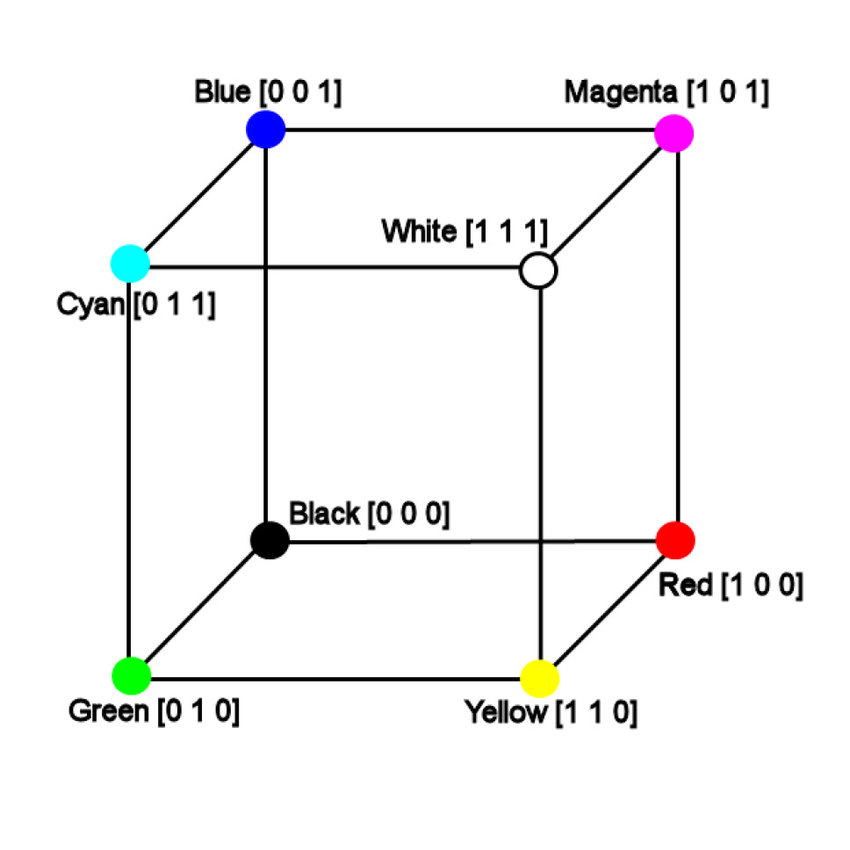
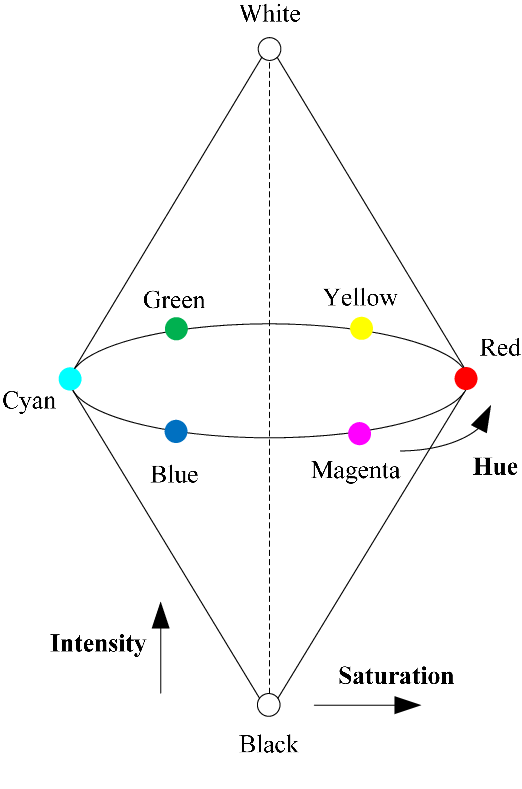
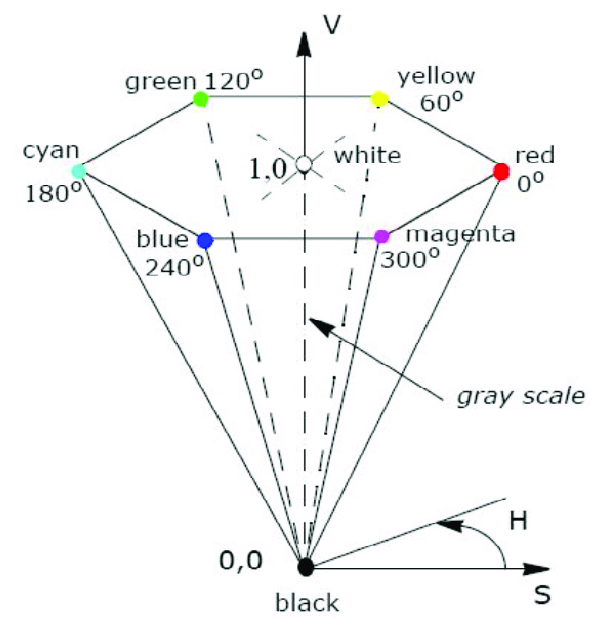
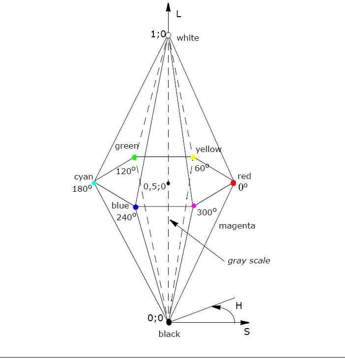

# Color Image Processing
Nonostante la sensazione del colore percepito sia un fenomeno fisiopsicologico,
dal punto di vista formale non è nient'altro che una particolare lunghezza
d'onda della luce. Il colore percepito di un oggetto è il risultato della luce
assorbita e riflessa dello stesso. Ad esempio, se percepiamo un oggetto verde,
significa che questo rifletterà lo spettro corrispondente al verde, assorbendo
invece tutto il resto.

Ci sono diverse quantità di base che vengono utilizzate per descrivere le
componenti delle luce cromatica:

* **Radianza**: quantità totale di energia *emessa* dalla sorgente luminosa
  (misurata in Watts);
* **Luminanza**: quantità di energia emessa dalla sorgente *percepita* da un
  osservatore (misurata in Lumen);
* **Luminosità**: intensità della componente *acromatica*, è soggettiva e non
  formalmente definita;
* **Lunghezza d'onda dominante** (hue): lunghezza d'onda della componente del colore
  più forte;
* **Saturazione**: rapporto tra la potenza della lunghezza d'onda dominante e
  del valore medio dello spettro (luce bianca);
* **Cromaticità** (chroma): Hue + Saturazione.

## Spazi colore
Lo scopo di un modello colore (chiamato anche spazio colore o sistema colore), è
principalmente quello di standardizzare la specifica dei colori. Un modello
colori non è nient'altro che una specifica di un *sistema di coordinate* e un
*sottospazio* all'interno di esso, in cui ogni colore è rappresentato da un
singolo punto.

### Modello RGB
Il modello più semplice è il modello RGB. Il sistema di coordinate è dato dalle
3 componenti principali del colore: rosso, verde e blu. Il sottospazio in cui
sono definiti tutti i colori è il cubo unitario in cui i colori RGB primari sono
ai 3 vertici, mentre negli altri 3 vertici ci sono il ciano, magenta e giallo.
Nei rimanenti 2 vertici, ci sono il nero (che è situato all'origine) e il
bianco (situato invece nel vertice più lontano dall'origine).
Sulla diagonale principale (dal nero al bianco) del cubo sono situate tutte le
possibili tonalità di grigio.

{width=30%}

Ogni valore all'interno del cubo è implicitamente normalizzato nel range $[0,
1]$. Il numero di bits che vengono utilizzati per rappresentare le singole
componenti di colore è detto *pixel depth*. Tipicamente, il valore di color
depth è circa 8 bit, per cui è possibile rappresentare $2^{24} = 16.777.216$
colori diversi con tale modello.

### Modello HSI
I modelli HS* sono basati sulle caratteristiche della luce che nell'occhio umano
definiscono direttamente un colore. Quando un essere umano vede un colore, lo
descrive in termini delle sue caratteristiche di:

* **Hue** (o lunghezza d'onda dominante): definisce direttamente il colore
  *puro*;
* **Saturazione**: definisce quanto puro è il colore in termini di quanto questo
  viene *diluito* dalla componente di luce bianca;
* **Luminosità**: definisce quanto è luminoso il colore.

Siccome la luminosità è definita solo soggettivamente, il modello HSI introduce
la componente acromatica di *intensità* del colore, che è invece definibile e
direttamente collegata alla sensazione di luminosità. Dal punto di vista
formale, questo modello si ottiene essenzialmente *ruotando* il cubo del modello
RGB in modo tale da rendere verticale la diagonale. In questo modo, considerando
tutti i punti ad una determinata altezza, otterremo un piano. Questo piano,
detto *piano cromatico*, conterrà quindi tutti i possibili colori all'intensità
luminosa specificata dall'altezza in cui è situato. È immediato notare che la
saturazione dei colori aumenta in base alla distanza dal centro di questo piano
(punto d'intersezione con la retta che rappresenta i valori di intensità).
D'altra parte, se considerassimo un piano "verticale" definito ad esempio dai
punti bianco, nero e ciano, su questo piano giaceranno tutti i valori di colori
con lo stesso valore di hue (ciano in questo caso). Questo perché i valori
all'interno di tale piano verticale sono ottenuti come combinazione lineare dei
valori dei vertici (i colori sono una miscela di questi tre vertici).

{width=25%}

Più nel dettaglio, dato un punto nello spazio HSI, il valore di saturazione
viene dato dalla lunghezza del vettore giacente sul piano cromatico, mentre il
valore di hue viene determinato dall'angolo tra tale vettore e l'asse del rosso
(0°: \textcolor{red}{rosso}, 60°: \textcolor{orange}{giallo}, 120°:
\textcolor{green}{verde}, 180°: \textcolor{cyan}{ciano}, 240°:
\textcolor{blue}{blu}, 300°: \textcolor{magenta}{magenta}). Il valore di hue, è
quindi compreso tra $[0;360]$. Questo tipo di modelli funziona particolarmente
bene perché divide la componente cromatica (HS) dalla componente acromatica,
luminosa (I). Grazie a questa stretta relazione tra i due modelli di colore
possiamo convertire direttamente un valore di RGB in uno HSI e viceversa.

Dal punto di vista formale:

* $I = (r_{\gamma} + g_{\gamma} + b_{\gamma}) / 3$;
* $S = 1 - min(r_{\gamma} + g_{\gamma} + b_{\gamma})/I$ [^1].

### Modello HSV
Il modello HSV (Hue, Saturation, Value) è molto simile al modello HSI. Questo
modello si ottiene trasformando gli angoli del cubo in modo tale da essere
portati allo stesso livello del bianco ($V = 1$), ottenendo così uno spazio a
forma di piramide rovesciata.

Dal punto di vista formale, siano:

* $R$: vertice del piano dell'esagono rappresentante il rosso;
* $O$: l'origine (centro) dell'esagono;
* $P$: il colore da rappresentare;
* $\gamma = (r_{\gamma}, g_{\gamma}, b_{\gamma})$.

{width=30%}

Allora, possiamo calcolare i valori:

* $hue_{360}(\gamma) = 360 \cdot \frac{RP}{6OR}$;
* $value(\gamma) = max(r_{\gamma}, g_{\gamma}, b_{\gamma})$;
* $chroma(\gamma) = max(r_{\gamma}, g_{\gamma}, b_{\gamma}) - min(r_{\gamma},
  g_{\gamma}, b_{\gamma})$;
* $saturation(\gamma) = \frac{chroma(\gamma)}{value(\gamma)}$ [^1].

[^1]: in realtà questo valore è definito come 0 in caso il denominatore sia 0
    per evitare evidenti problemi.

### Modello HSL
Anche in questo caso il modello HSL (Hue, Saturation, Lightness) è simile ai
precedenti, solamente che i vertici del cubo vengono proiettati sul piano
centrale (quello ad altezza $L = 0.5$), ottenendo di fatto una *doppia
piramide*. Il vertice superiore della piramide corrisponde ad un valore di
luminosity pari a $1$ (bianco), mentre quello superiore pari a $0$ (nero).

{width=30%}

Come già detto, i valori di $H$ e $S$ sono calcolati nello stesso modo come nel
modello HSV, mentre il valore di $L$ viene calcolato nel modo seguente:
$$
lightness(\gamma) = (max(r_{\gamma}, g_{\gamma}, b_{\gamma}) + min(r_{\gamma},
g_{\gamma}, b_{\gamma})) / 2
$$

## Metodi di Color Image Processing
Esistono diverse tecniche di processamento delle immagini che riguardano
direttamente il colore.

### Intensity Slicing 
Consiste nel trasformare un'immagine a scala di grigi in un'immagine a colori,
mappando ogni range di intensità ad un colore specifico. Il razionale
sull'impiego di questa tecnica, è che l'occhio umano è in grado di percepire e
differenziare meglio i colori che diverse intensità di grigio, per cui potrebbe
essere utile per analizzare particolari dettagli di immagini.

### False Color Transformation
Un altro tipo di trasformazione consiste invece nel mappare i valori di
rosso/verde e giallo, scambiandoli di ordine, oppure variandone le intensità.
Questa trasformazione è facilmente implementabile per mezzo di una
trasformazione lineare (moltiplicazione vettore/matrice).
