# Domande Esame RNDL
#### Domanda 1
L’algoritmo di backpropagation garantisce la convergenza verso il migliore
valore ottimo (il minimo) della funzione di loss.

* Vero
* Falso
* Alcune scelte di valori iniziali dei pesi la garantiscono

#### Domanda 2
La regola delta generalizzata serve a:

* Accelerare la convergenza dell'algoritmo di backpropagation
* Stabilizzare la convergenza dell'algoritmo di backpropagation
* Entrambi gli scopi

#### Domanda 3 
Dati $\Phi$ e $d$ rispettivamente la matrice delle funzioni radiali ed il
vettore dei target desiderati, scrivere l’espressione della soluzione $W$ per il
vettore dei pesi di una rete neurale a basi radiali (RBF) nel caso:

1. In cui ci siano tanti neuroni hidden quanti sono gli esempi di addestramento
   (caso di interpolazione)
2. In cui ci siano $M$ neuroni hidden, con $M$ minore del numero degli esempi di
   addestramento

E’ corretto affermare che nel secondo caso si eliminano i problemi legati alla
possibile non invertibilità delle matrici coinvolte nel calcolo?

#### Domanda 4
Ognuno dei 4 neuroni della porzione di rete convoluzionale rappresentata nella
figura sottostante è connesso solo a 3 neuroni del livello precedente e i pesi
sono condivisi (stesso colore, stesso peso).
Qual'e' il numero totale di pesi e connessioni in questo caso?

1. 3 connessioni e 3 pesi
2. 12 connessioni e 3 pesi
3. 12 connessioni e 12 pesi
4. 4 connessioni e 12 pesi

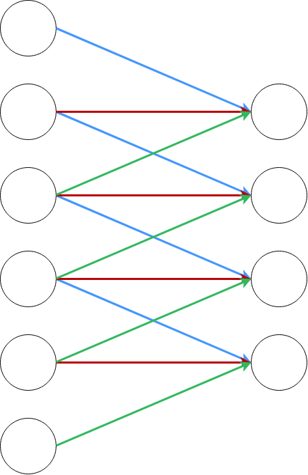{ height=150px }

#### Domanda 5
Considerando le formule che nell’algoritmo di backpropagation definiscono l’errore relativo ad un esempio $n$:
$$
\begin{aligned}
E(n) &= \frac{1}{2} \sum_{j \in \; Output} e^2_j (n)\\
e_j(n) &= d_j(n) - y_j(n)
\end{aligned}
$$
Ricavare l’espressione della correzione ad un peso $w_{ji}$ entrante in un neurone del livello di uscita, nel caso specifico in cui la funzione di attivazione del neurone sia la funzione **sinusoidale**. (e non una generica funzione $f$ o $\varphi$). 

**Suggerimento**: La correzione generica e' $\Delta w_{ji} = \eta \delta_j y_i$ dove

* $\delta_j = -\frac{\partial E(n)}{\partial v_j}$
* $v_j$ e' il campo in ingresso al neurone $j$

#### Domanda 6
Calcolare la matrice risultante dalla convoluzione della matrice data con un filtro i cui valori sono riportati in basso a destra di ogni elemento della matrice.

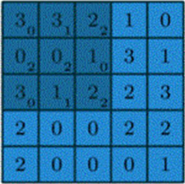{ height=150px }

#### Domanda 7
Data la figura riassuntiva seguente, relativa al calcolo della *self-attention* in un Transformer nel caso scalare, scrivere la formula relativa al calcolo della matrice $Z$ della self-attention nel caso matriciale, in cui quindi $Q$, $K$ e $V$ siano matrici e non vettori.

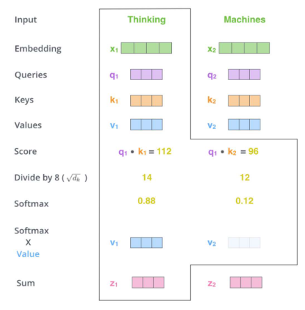{ height=150px }

#### Domanda 8
a. Disegnare una SOM

b. Cos'e' una BMU, e come e' calcolata? (Max 3 righe)

c. Qual'e' l'equazione di aggiornamento dei pesi? (Max 3 righe)

#### Domanda 9
Considerando la RBM in figura.

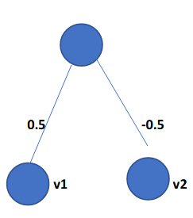{ height=150px }

1. Quando l'input $[1,1]$ e' presentato alla rete:
   a. $p(h_1 = 1) = 1$
   b. $p(h_1 = 1) = 0.5$
   c. $p(h_1 = 1) = 0.27$
   d. $p(h_1 = 1) = 0.73$

2. Se il training set contiene l’input $[1,1]$, come vengono corretti i pesi
   alla sua presentazione? (anche se di solito non è così, per l’esercizio
   assumiamo che il sampling attribuisca 1 a un’unità $u$ se $p(s_u=1)>= 0.5$).
   Si assuma $\eta=0.1$. Si indichi il nuovo valore dei pesi dopo un’iterazione
   dell’algoritmo di apprendimento.

* $w_{v_1, h_1}$ = ?
* $w_{v_2, h_1}$ = ?

#### Domanda 10

a. Disegnare una cella LSTM

b. Quali sono i gates presenti? E quali sono le loro funzioni?

#### Domanda 11
Qual è la tesi dell’articolo *Assessing the Ability of LSTMs to Learn
Syntax-Sensitive Dependencies di Linzen, Dupoux, Goldberg*?

#### Domanda 12
1. Spiegare in 5 righe massimo l'algoritmo di backpropagation (scendendo nel dettaglio solo eventualmente per l'ultimo livello hidden output)

2. L’algoritmo di backpropagation garantisce la convergenza verso il valore ottimo (il minimo) della funzione di errore?
    * Si
    * No

#### Domanda 13
1. Fare un esempio di un modo possibile con cui un percettrone (con un solo livello e senza livelli nascosti) potrebbe imparare a classificare il problema (nel training set punti rossi e blu appartengono a categorie diverse e hanno target diversi)

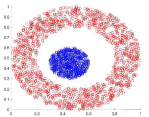{ height=150px }

2. Perche?

#### Domanda 14
a. Disegnare una rete di Hopfield con 4 neuroni

b. Quali sono i valori di tutti i pesi ottenuti dalla memorizzazione delle seguenti memorie fondamentali $[1,1,1,1], [-1,1,1,1], [-1,-1,-1,-1]$?

#### Domanda 15
In una RBM con 2 unità visibili e una hidden, assumendo che i pesi iniziali siano 0, come vengono modificati i pesi alla prima iterazione dell’algoritmo di contrastive divergence in cui si considera un elemento del training set $[1,0]$. (Si ignorino i bias. Si assuma che il sampling attribuisca 1 ad ogni unità $u$ tale che $p(u=1)>=0.5$)

#### Domanda 16
Descrivere in generale come sono fatte e come apprendono le reti profonde basate su RBM e fare almeno un esempio di tale architettura (Max 8 righe).

#### Domanda 17
a. Cos'e' una LSTM? (Max 5 righe)
b. Fare un esempio di problema linguistico che noi umani risolviamo meglio di una LSTM.

#### Domanda 18
Data una rete di Hopfield con tre nodi 1,2,3 i cui pesi sono $w_{1,2}=1$,
$w_{1,3} = -2$, $w_{2,3}=1$. 

1. Lo stato $[1,-1,1]$, in cui i tre neuroni hanno rispettivamente attivazione
   $y_1 =1$, $y_2 =-1$, $y_3 =1$ è uno stato stabile?
    * Si
    * No

2. Perche'? (Max 5 righe)

3. Data una configurazione iniziale si arriva sempre ad uno stato stabile? E perche'? (Max 5 righe)

#### Domanda 19
In una self-organizing map che cosa rappresentano le tre sottofigure qui sotto, viste in laboratorio? Descrivere ogni elemento (croci rosse, pallini neri, linee grigie). (Maz 3 righe per sottofigura)

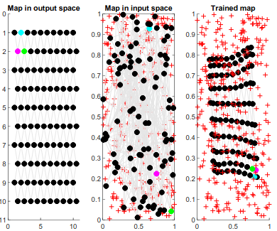{ height=150px }

* Sottofigura di sinistra
* Sottofigura di centro
* Sottofigura di destra

Una self organizing map impara:

* Grazie a un allenamento con un insegnante esterno
* Da sola senza supervisione esterna

#### Domanda 20
Nell’articolo “*Atoms of recognition in human and computer vision*” quale tesi sostengono Shimon Ullman e collaboratori sul rapporto tra visione umana e artificiale (in particolare con Deep NN)? Con quali argomenti? (Max 8 righe)

#### Domanda 21
In una rete convoluzionale profonda tutti i livelli hanno la stessa forma ed effettuano le stesse operazioni

* Vero
* Falso

I livelli di pooling di una rete convoluzionale profonda servono a:

1. Ridurre la dimensione del segnale che fluisce verso l’uscita, perché si ‘raggruppa’ l’informazione data dai valori di uscita di neuroni vicini nel livello
2. Ridurre la dimensione del segnale che fluisce verso l’uscita pur mantenendo l’informazione necessaria a risolvere il task
3. Moltiplicare l’informazione presente nella rete perché i livelli sono di piú man mano che ci si avvicina al livello di output

#### Domanda 22
Completare i passaggi mancanti per calcolare la generica correzione al peso $\Delta w$ entrante in un neurone $j$ del livello di uscita che abbia funzione di attivazione $y = f(v)$
$$
\Delta w_{ji} = \eta \frac{\partial E}{\partial w_{ji}} = \eta \frac{\partial E}{\partial v_{j}} \frac{\dots}{\partial w_{ji}} = 
\eta \frac{\partial E}{\partial e_{j}} \dots \frac{\partial y_j}{\partial v_{j}} \dots = 
-\eta e_j (-1) \dots y_i
$$

#### Domanda 23
Considerando l'algoritmo di backpropagation per una rete FeedForward, ricavare l'espressione della correzione ad un peso $w_{jm}$ entrante in un neurone generico $j$ del livello hidden. Considerare una generica funzione di attivazione del neurone $\varphi$.

Nota: la correzione e' $\Delta w_{jm} = \eta \delta_j y_m$, con $\delta_j = -\frac{\partial E(n)}{\partial v_j}$ e $v_j$ campo in ingresso al neurone $j$.

#### Domanda 24
Dato il livello di ingresso 5x5 di una rete convoluzionale e il filtro 3x3 (in giallo), di elementi $x_1$ = 0, $x_0$ = 1, entrambi rappresentati nella matrice (A), calcolare:

1. Il risultato della convoluzione con stride 1 (completando la matrice 3x3)
2. Il risultato di un max pooling efffettuato con filtro 2x2 e stride 1 (completando la matrice 2x2)

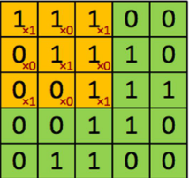{ height=150px }

#### Domanda 25
1. La tecnica di addestramento mediante pseudo-inversione (es. ELM) è efficace quando la rete neurale ha tanti neuroni hidden quanti sono gli esempi di addestramento

2. Il calcolo della matrice pseudo-inversa, applicandosi anche a matrici non quadrate, consente di trovare sempre dei pesi di uscita che risolvono efficacemente il problema dato

#### Domanda 26
Il problema di classificazione non linearmente separabile rappresentato in figura può essere risolto esattamente usando una RBF neural networks?

{ height=150px }

#### Domanda 27
Capsule networks: qual è la loro utilità ed in cosa consistono? Rispondete sinteticamente (Max 5 righe).

#### Domanda 28
Scriver di seguito la regola che consente di calcolare il valore dei pesi in una rete di Hopfield.

Spiegare qual è il meccanismo che consente di memorizzare anche le cosiddette memorie spurie

#### Domanda 29
E’ possibile risolvere esattamente il problema di classificazione definito dall’operatore booleano OR con un percettrone singolo (quindi senza livelli hidden)?

* Si
* No

In riferimento allo stesso problema, scrivere l’equazione generica della decision boundary e spiegare cosa rappresenta la figura riportata di seguito.

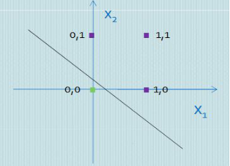{ height=150px }

#### Domanda 30
Nell'ambito di un modello **encoder-decoder con attenzione** per la generazione di linguaggio, l'attenzione viene usata per generare uno score $e_{ij}$ che mette in relazione gli stati prodotti nelle celle ricorrenti nell'encoder e del decoder.

Scriverne la formula, esplicitando il significato dei singoli termini.

#### Domanda 31
Dato il livello di Input 3x4 di una rete convoluzionale e il Kernel 2x2 rappresentati in figura, calcolare il valore $Y$ risultante dall’operazione di convoluzione del Kernel con la zona evidenziata nell’Input.

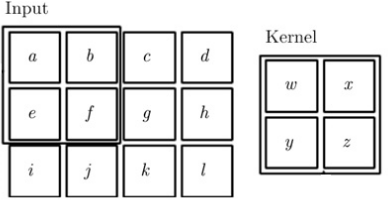{ height=150px }

$Y= \dots$

#### Domanda 32
Dato il percettrone rappresentato in figura, scrivere il valore del campo in ingresso $v$ e della funzione di attivazione $\varphi(v)$

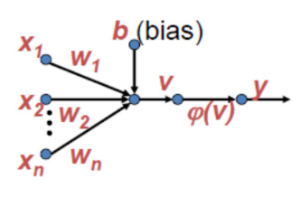{ height=150px }

$v = \dots, \varphi = \dots$

#### Domanda 33
Dato l’insieme rappresentato in figura, determinare quante iterazioni sono necessarie ad un percettrone single-layer per classificare correttamente gli elementi delle due classi.

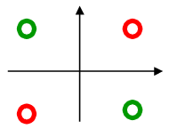{ height=150px }

#### Domanda 34
In una rete convoluzionale alcuni livelli estraggono le caratteristiche dell'immagine, mentre altri effettuano la classificazione

* Vero
* Falso

I livelli di average pooling di una rete convoluzionale profonda servono a:

* Ridurre la dimensione del segnale che fluisce verso l’uscita, annullando l’informazione di neuroni vicini all’interno del filtro
* Ridurre la dimensione del segnale che fluisce verso l’uscita pur mantenendo l’informazione necessaria a risolvere il task
* Moltiplicare l’informazione presente nella rete perché i livelli sono piú numerosi man mano che ci si avvicina al livello di output

#### Domanda 35
Disegnare lo sviluppo del grafico nella figura seguente utilizzando il meccanismo di addestramento dell’unfolding in time ai tempi $t-1, t, t+1$

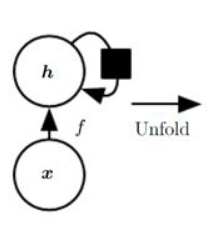{ height=150px }

#### Domanda 36
1. L’insieme di dati rappresentati in Fig. 1 è linearmente separabile?
2. Relativamente all’uso fatto in laboratorio del MLP, cosa rappresenta la Fig.2?

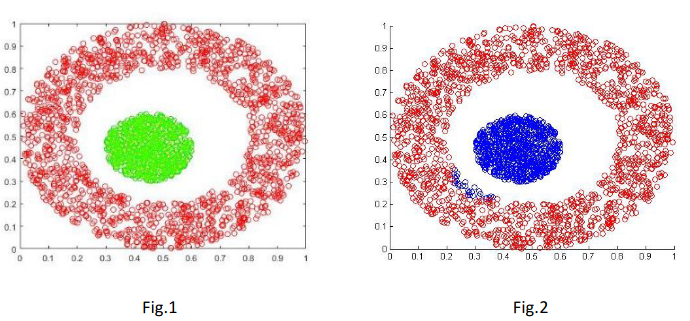{ height=150px }

#### Domanda 37
Scrivere la regola di updating dei pesi per una self-organizing map, chiarendo il significato di ogni quantità che vi compare.

# Soluzioni

#### Risposta 1

* Alcune scelte dei valori iniziali la garantiscono

L'algoritmo di backpropagation e' un algoritmo di ottimizzazione stocastica, per cui non e' garantito che ritorni il minimo globale per ogni scelta dei valori iniziali. Alcuni valori che sono particolarmente vicini al minimo globale, potrebbero pero' permettere all'algoritmo di convergerci.

#### Risposta 2

* Entrambi gli scopi

La delta rule permette all'algoritmo di modificare il learning rate e correggere gli andamenti altamente oscillatori nelle zone molto vicine al minimo. Per cui ne stabilizza la convergenza, di fatto determinando anche un minor numero di iterazioni necessarie a raggiungerla.

#### Risposta 3
1. $W = \Phi^{-1} \mathbf{d}$
2. $W = \Phi^{+} \mathbf{d}$, dove $\Phi^+ = (\Phi^T \Phi)^{-1} \Phi^T$

Nel primo caso abbiamo una matrice quadrata per cui possiamo invertirla siccome $det = 0$. 

Si, poiche' l'inversa di Moore-Penrose ci permette di calcolare sempre una matrice che e' l'approssimazione dell'inversa.

#### Risposta 4
2. 12 connessioni e 3 pesi

#### Risposta 5
Sia $\varphi(x) = sin(x)$
$$
\begin{split}
-\frac{\partial E}{\partial v_j} &= -\frac{\partial E}{\partial e_j}\frac{\partial e_j}{\partial y_j}\frac{\partial y_j}{\partial v_j}\\
&= e_j \cdot cos(v_j)\\
\end{split}
$$
per cui
$$
w_{ji}(n+1) = w_{ji}(n) + \eta \cdot e_j(n) \cdot cos(v_j(n)) \cdot y_i(n)
$$

#### Risposta 6
```
+--------------+
| 12 | 12 | 15 |
+----+----+----+
| 4  | 15 | 15 |
+----+----+----+
| 5  | 6  | 14 |
+----+----+----+
```

#### Risposta 7
$$
Z = softmax \left(\frac{Q K^T}{\sqrt{d_k}} \right) V
$$
dove $d_k$ e' la dimensione di $K$.

#### Risposta 8
Una SOM e' rappresentata graficamente dall'immagine seguente

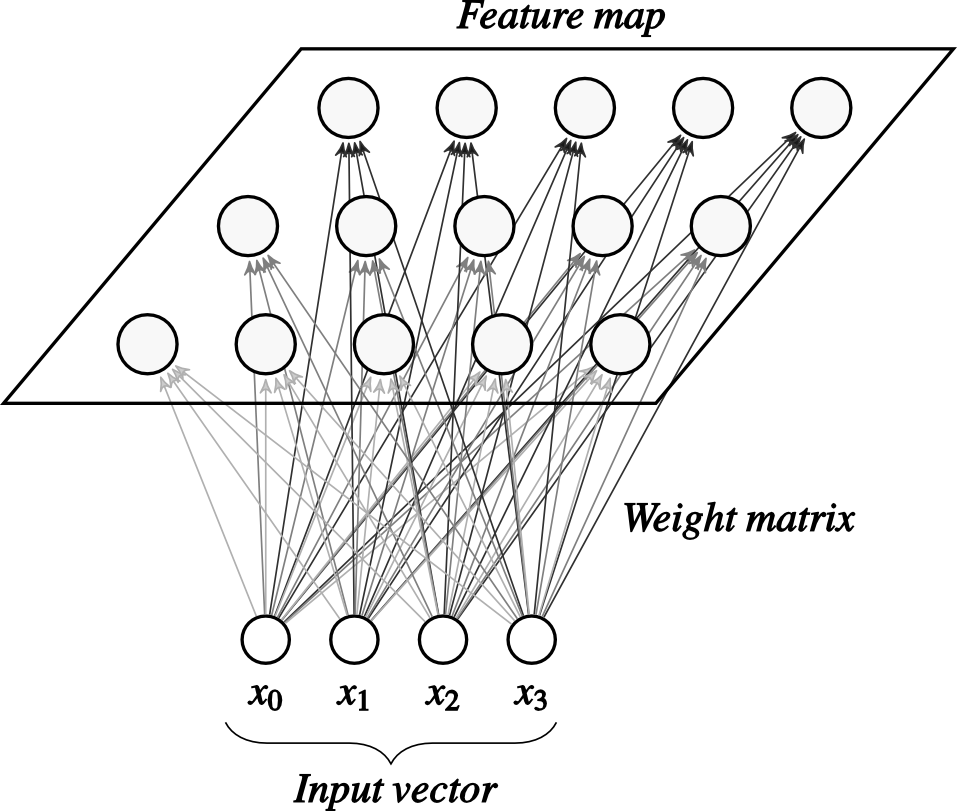{ height=150px }

Una *Best Matching Unit* e' l'unita' di output che ha l'attivazione maggiore tra tutte quando viene presentato un determinato stimolo.
Si calcola come l'indice dell'unita' di output con distanza minore tra tutte le altre unita'
$$
BMU(x)=\arg \min_i \|x - w_i\|
$$
dove $w_i$ e' il *prototype vector* del neurone *i-esimo*.

La regola di update dei pesi e'
$$
w_j(n+1)= w_j(n) + \eta(n) \cdot h_{i,j}(n)\cdot(x - w_j)
$$
dove:

* $h_{i,j}(n) = exp(-\frac{d_{i,j}^2}{2 \sigma(n)^2})$
* $\sigma(n) = \sigma_0 \cdot exp(-\frac{n}{\tau})$
* $\eta(n) = \eta_0 \cdot exp(-\frac{n}{\tau})$

#### Risposta 9
Siccome $p(h_1 = 1) = \frac{1}{1+e^{-\Delta E_i}}$ e $\Delta  E_i=\sum_j w_{i,j} \cdot s_i$, allora abbiamo
$$
p(h_1 = 1) = \frac{1}{e^{-(0.5 - 0.5)}} = \frac{1}{2}
$$
per cui $p(h_1 = 1) = 0.5$

Per calcolare il nuovo peso bisogna fare due iterazioni di attivazione e calcolarne la differenza.

Al primo passo abbiamo $h_1 = 1$, per cui dobbiamo calcolare l'attivazione dei neuroni visible.
$$
\begin{split}
p(v_1 = 1) &= \frac{1}{1+ e^{-0.5}} = 0.62\\
p(v_2 = 1) &= \frac{1}{1+ e^{0.5}} = 0.37\\
\end{split}
$$
Quindi
$$
\begin{split}
v_1 = 1\\
v_2 = 0\\
\end{split}
$$
Ora bisogna calcolare di nuovo l'attivazione del layer hidden, quindi
$$
p(h_1 = 1) = \frac{1}{1+e^{-(0.5 \cdot 1 - 0.5\cdot0)}} = 0.62
$$
quindi $h_1 = 1$.

L'update dei pesi e' il seguente:
$$
\begin{split}
\Delta w_{v_1, h_1} &= 0.1\cdot(<1\cdot1> - <1 \cdot 1>) = 0\\
\Delta w_{v_2, h_1} &= 0.1\cdot (<1 \cdot 1> - <0 \cdot 1>) = 0.1 \cdot 1 = 0.1
\end{split}
$$
Per cui
$$
\begin{split}
w_{v_1, h_1} &= 0.5 + 0 = 0.5\\
w_{v_2, h_1} &= -0.5 + 0.1 = -0.4\\
\end{split}
$$

#### Risposta 10
Una LSTM e' rappresentata graficamente dall'immagine seguente

{ height=150px }

I gates presenti sono:

* Forget Gate: Decide quale informazione **eliminare** dallo stato
* Input Gate: Decide quale informazione **aggiungere** dello *stato candidato* allo stato attuale
* Output Gate: Decide quale informazione dello stato **mantenere** da mandare in output

#### Risposta 11
La tesi dell'articolo e' che nonostante le LSTM siano in grado di apprendere abbastanza bene alcune dipendenze strutturali quando le si allena in un apprendimento supervisionato, esse non siano adatte per modellare come gli umani imparano il linguaggio in maniera non supervisionata.

#### Risposta 12
* Per ogni esempio di train alterna due fasi: foward in cui la rete viene attivata per un determinato esempio, calcolandone l'errore, e backward in cui l'errore viene propagato all'indietro verso tutti i layers calcolando ricorsivamente il gradiente locale di ogni peso e applicandone l'update rule. Il calcolo del gradiente locale e' differisce in base alla tipologia del neurone. In generale vale che
$$
\delta_j = \begin{cases}
e_j\cdot\varphi'(v_j) & se \;j\; output\\
\varphi'(v_j) \cdot \sum_{k \;next \; layer} \delta_k \cdot w_{kj} & se \;j\; hidden\\
\end{cases}
$$

* No

#### Risposta 13
Non si puo'.

Per definizione, un percettrone non e' in grado di imparare a separare un problema non linearmente separabile. L'unico modo possibile sarebbe aggiungere un layer hidden.

#### Risposta 14
Il disegno e' semplicemente un set di 4 neuroni completamente connessi.

Basta applicare la regola seguente
$$
w_{i,j} = \frac{1}{M} \sum_{m=1}^M f_m(i) \cdot f_m(j)
$$
$$
\begin{split}
w_{1,2} = w_{2,1} &= (1\cdot1) + (-1 \cdot 1) + (-1\cdot -1) = \frac{1}{3}\\
w_{1,3} = w_{3,1} &= (1\cdot1) + (-1 \cdot 1) + (-1\cdot -1) = \frac{1}{3}\\
w_{1,4} = w_{4,1} &= (1\cdot1) + (-1 \cdot 1) + (-1\cdot -1) = \frac{1}{3}\\
w_{4,3} = w_{3,4} &= (1\cdot1) + (1 \cdot 1) + (-1\cdot -1) = 1 \\
w_{4,2} = w_{2,4} &= (1\cdot1) + (1 \cdot 1) + (-1\cdot -1) = 1 \\
w_{2,3} = w_{3,2} &= (1\cdot1) + (1 \cdot 1) + (-1\cdot -1) = 1 \\
\end{split}
$$

#### Risposta 15
Prima calcoliamo la probabilita' di attivazione del neurone hidden
$$p(h_1 = 1) = \frac{1}{1 + e^{0}} = 0.5$$
Per cui $s(h_1) = 1$
Successivamente calcoliamo l'attivazione dellle unita' visible
$$
\begin{split}
p(v_1 =1) &= \frac{1}{1+e^{0}} = 0.5\\
p(v_2 = 1)&=\frac{1}{1+e^{0}} = 0.5
\end{split}
$$
Per cui $s(v_1) = s(v_2) = 1$.
Ricalcoliamo la probabilita' e l'attivazione del neurone hidden
$$p(h_1 = 1) = \frac{1}{1 + e^{0}} = 0.5$$
Quindi otteniamo la regole di update
$$
\begin{split}
w_{v_1, h_1} &= 0 + (<1\cdot1> - <1\cdot1>) = 0\\
w_{v_2, h_1} &= 0 + (<0\cdot1> - <1\cdot1>) = -1
\end{split}
$$

#### Risposta 16
Sono reti multi layer in cui i singoli livelli sono connessi tra di loro ma i neuroni di un singolo livello no. L'apprendimento di queste reti consiste in due fasi principali di Pre-Train e Fine-Tuning. La fase di pre-train consiste nel forzare un esempio nel primo livello e prendere i livelli a coppie, considerandoli come una singola RBM, per cui viene fatto imparare ai layers a forzare le rappresentazioni nel layer considerato visible. La fase di fine-tuning serve a "*cristallizzare*" le rappresentazioni che sono state apprese nella fase di pre-train. Alcune architetture basate su RBM sono i Deep Autoencoders e le Deep Belief Networks.

#### Risposta 17
Una Long Short Term Memory e' una rete neurale ricorrente per il trattamento di dati sequenziali in grado di ricordare valori (es. il soggetto di una frase) anche per intervalli di valori molto grandi nelle sequenze che tratta. Utilizza uno **stato** e dei **gates** (forget, input, output) per poter funzionare.

Noi umani riusciamo a risolvere meglio delle LSTM il problema della concordanza tra soggetto e verbo. Sopratutto quando questi hanno una distanza in termini di parole molto grande all'interno della frase, con la presenza di diversi attrattori. 

#### Risposta 18
No, perche' l'applicazione della funzione di attivazione fa cambiare il valore del primo neurone $y_1$.

Si. Perche' e' garantita dal teorema di convergenza. Siccome il numero di stati possibili e' finito ($2^N$), e ogni applicazione della funzione di attivazione decresce l'energia totale della rete $E - E' > 0$, allora si arrivera' ad uno stato in cui l'energia totale $E=0$.

#### Risposta 19
La sottofigura di sinistra rappresenta i neuroni nello spazio di output, cioe' secondo la loro posizione assegnata nel reticolo.

La sottofigura di centro rappresenta il training set (le croci rosse), i pallini neri rappresentano i prototype vectors (vettori pesi) associati ai neuroni della SOM prima dell'apprendimento.

La sottofigura di destra e' come la prima ma rappresenta la SOM dopo l'apprendimento. Le linee grige rappresentano la relazione di vicinanza tra le SOM.

Una SOM impara da sola senza supervisione esterna.

#### Risposta 20
Secondo gli autori, gli umani utilizzano features e processi di apprendimento a livello visivo cruciali che non sono presenti nelle reti neurali profonde convoluzionali.
La loro tesi e' supportata da un esperimento in cui sono state create delle immagini "atomiche" (nel senso che l'ulteriore suddivisione o la decrescita della risoluzione non le renderebbe piu' riconoscibili) chiamate MIRC (*Minimum Recognizable Configurations*). Tali immagini sono poi state preesentate sia a un gruppo di umani che ad diversi modelli basati su CNN. I risultati ottenuti furono che le reti hanno delle performance di gran lunga inferiori a quelle umane nel riconoscimento degli elementi presenti nelle immagini.

#### Risposta 21
Falso. I layer di convoluzione e di pooling riducono di fatto la dimensione della feature map in output, per cui almeno un layer avra' dimensione diversa da quelli precedenti.

I livelli di pooling servono a ridurre la dimensione del segnale che fluisce verso l’uscita pur mantenendo l’informazione necessaria a risolvere il task.

#### Risposta 22
$$
\Delta w_{ji} = \eta \frac{\partial E}{\partial w_{ji}} = \eta \frac{\partial E}{\partial v_{j}} \frac{\partial v_j}{\partial w_{ji}} = 
\eta \frac{\partial E}{\partial e_{j}} \frac{\partial e_j}{\partial y_j} \frac{\partial y_j}{\partial v_{j}} \frac{\partial v_j}{\partial w_{ji}} = 
-\eta \cdot e_j \cdot (-1) \cdot f'(v_j) \cdot y_i
$$

#### Risposta 23
$$
\frac{\partial E}{\partial v_j} = 
\frac{\partial E}{\partial y_j}
\frac{\partial y_j}{\partial v_j}
$$
$$
\begin{split}
\frac{\partial E}{\partial y_j} &= \sum_{k\; in \; next\; layer} \frac{\partial E}{\partial v_k} \frac{\partial v_k}{\partial y_j}\\
&=  \sum_{k\; in \; next\; layer} \delta_k \cdot w_{kj}\\
\end{split}
$$
$$
\frac{\partial y_j}{\partial v_j} = \varphi'(v_j)
$$
$$
\delta_j = \varphi'(v_j) \cdot \sum_{k\;in\;next\;L} \delta_k \cdot w_{kj}
$$
per cui 
$$
\Delta w_{jm} = \eta \cdot  y_m \cdot  \varphi'(v_j) \cdot \sum_{k\;in\;next\;L} \delta_k \cdot w_{kj}
$$

#### Risposta 24
```
+---+---+---+   +---+---+
| 3 | 3 | 3 |   | 3 | 3 |
+---+---+---+   +---+---+
| 1 | 2 | 3 |   | 3 | 3 |
+---+---+---+   +---+---+
| 1 | 1 | 2 |
+---+---+---+
```

#### Risposta 25
No. Perche' la pseudo-inversione viene utilizzata quando la matrice non e' invertibile.

Si. Anche se i pesi danno un'approssimazione del problema.

#### Risposta 26
Si. Con un solo neurone hidden centrato al centro del cluster di punti blu con spread sufficiente a incapsulare tutti gli esempi blu ma non troppo grande da includere anche esempi rossi.

#### Risposta 27
Sono utili per task di computer vision, sopratutto quando le immagini sono sovraffollate da elementi (ad esempio overlapping digits). Come il nome suggerisce consistono in delle capsule che rappresentano un oggetto in termini di presenza (una probabilita') e la propria posa (cioe' i parametri di istanziazione dell'ogggetto).

#### Risposta 29
Si, perche' e' un problema linearmente separabile.

$w_1 x_1 + w_2 x_2 + b = 0$

#### Risposta 30
$$
e_{ij} = <W_a \cdot s_i, U_a \cdot h_j>  
$$
In cui:

* $W_a, U_a$ sono delle trasformazioni lineari apprendibili (parametri del modello)
* $s_i$ e' lo stato hidden del **decoder** al passo $i$-esimo
* $h_j$ e' lo stato hidden dell'**encoder** al passo $j$-esimo

#### Risposta 31
$$Y=w\cdot a + x \cdot b + y \cdot e + f \cdot z$$

#### Risposta 32
$v=\sum_{i=1}^n w_i \cdot x_i + b$
$\varphi(v) = +1 \; if\; v>0, -1 \;otherwise$

#### Risposta 33
Il percettrone single layer non e' in grado di classificare un insieme non-linearmente separabile come quello in figura.

#### Risposta 34
Vero. I layer iniziali fanno feature extractions, gli ultimi fanno discriminazione (MLP)

Ridurre la dimensione del segnale che fluisce verso l’uscita pur mantenendo l’informazione necessaria a risolvere il task.

#### Risposta 35
La rete neurale ricorrente unfolded e' la seguente:

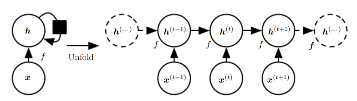{ height=150px }

#### Risposta 36
No. La figura 2 rappresenta il problema “concentric” (ovvero un problema non
linearmene separabile), dopo i tentativi di classificazione da parte del MLP
infatti attraverso l'addestramento andrà a ruotare/traslare i piani, si nota
però che una parte dei dati (blu) nella corona circolare (rossa) non è ancora
ben classificata (*Courtesy of Ale Sarac*).

#### Risposta 37
$$
w_j(n+1) = w_j(n) + \eta \cdot h_{i,j}(n) \cdot (x - w_j(n))
$$
dove:

* $h_{i, j}$ e' una funzione radiale che dipende dalla distanza tra la BMU e il neurone attuale
* $\eta$ e' il learning rate
* $x$ e' l'esempio del training set che si sta considerando attualmente
* $i$ e' la best matching unit
* $w_j$ e' il prototype vector del neurone $j$

