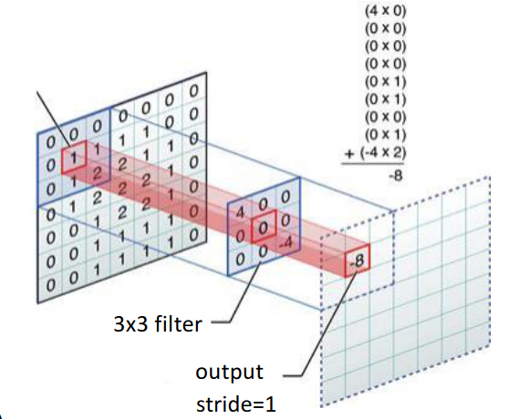
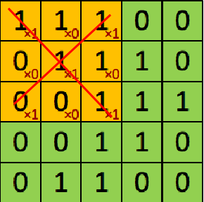
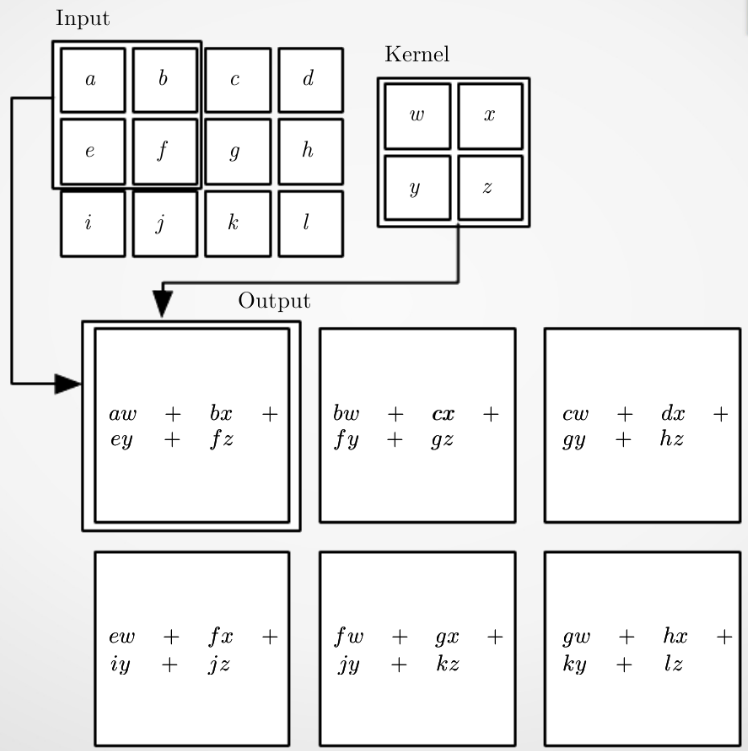

# Convolutional Neural Networks

Le reti neurali convoluzionali differiscono dal MLP su diversi fronti:

* I neuroni sono connessi ai neuroni del livello precedente **solo localmente**,
  per cui ogni neurone fa un *processing locale*, diminuendo il numero totale di
  connessioni
* I pesi sono condivisi in modo che neuroni dello stesso livello processino
  nello stesso modo diverse porzioni dell'input. Anche in questo caso il numero
  di connessioni e' drasticamente ridotto

Il processing dei neuroni e' a livello *locale*. Ogni neurone e' connesso solo
ad un gruppo di neuroni precedente, ma non tutti, per cui la computazione
avviene in un sottospazio di input
Questo tipo di processing dell'input sono chiamati *filtri convoluzionali*.
L'output e' detto *feature map*. Ogni neurone di una feature map e' il risultato
di una computazione di una porzione dello spazio delle features, fatto da
neuroni con lo stesso insieme di pesi. 
Tipicamente, l'architettura di queste reti ha i layer intermedi come quelli
descritti, quindi composti da filtri convoluzionali, mentre i layer finali sono
tipicamente completamente connessi, in modo da operare da MLP per fare la
classificazione finale.

Questa tipologia di reti e' utilizzata sopratutto nell'image
processing/recognition. Difatti, il passaggio in un livello convoluzionale
equivale ad applicare di fatto dei filtri digitali alle immagini in input. Ogni
neurone puo' essere pensato come ad uno *stencil* (maschera) che applica una
determinata transformazione in una determinata porzione dell'immagine. Lo spazio
"di slittamento" dello stencil e' chiamato *stride*

Si noti dall'immagine come una porzione dell'input (quadrato piu' a sinistra)
venga mappata dallo stencil (quadrato nel mezzo) descritto da 9 pesi. 

Intuitivamente, se rimaniamo nell'ambito dell'image processing, i pesi che
rappresentano uno stencil sono effettivamente una particolare **forma**
riconosciuta dal layer.

Nel caso dell'immagine, vediamo come lo stencil (la prozione gialla) vada a
riconoscere per mezzo dei pesi assegnati una forma a "X" (delineata in rosso).
Cioe' i valori che non sono nulli su una X. In generale, se l'output e' 5,
sappiamo che la "X" sara' sicuramente presente (cioe' tutti gli input in quelle
posizioni =1)

> *I filtri convoluzionali riescono in qualche modo a ridurre anche la
> dimensionalta'. Se noi applicassimo un filtro 2x2 in un filtro 3x3, otterremmo
> un output 2x2.*

Per i valori sui bordi, di solito vengono aggiunti opportunamente dei valori di
padding.

> **Tensore**: *Matrice a piu' di due dimensioni*.

## Livelli

**Pooling**: Il compito del livello di pooling e' quello di prendere un
determinato insieme di neuroni del livello precedente e di "aggregarne"
successivamente l'informazione. La tipologia di aggregazione determina la
tipologia di pooling:

* **Average Pooling**: Aggrega gli input attraverso la media
* **Max Pooling**: Aggreaga gli input facendone il massimo

Lo scopo del pooling e' dare *invarianza* rispetto alle semplice trasformazioni degli input, mantenendo una quantita' di informazione sufficiente per lo scopo *discriminativo* della rete neurale.

>*Il livello di pooling non ha nessun tipo di parametro da imparare.*

**Livello ReLU**: Livello di neuroni che applica una funzione di attivazione di
tipo Rectified Linear Unit. $f(x) = 0$ con $x \leq 0$, mentre $f(x) = x$ con $x
>0$. In modo compatto: $f(x) = max(0, x)$.

**Livello di Uscita**: Il livello di uscita e' in genere costituito da neuroni
che hanno una funzione di attivazione con funzione *softmax*, definita come

$$
z_k = f(x_k) = \frac{e^{v_k}}{\sum_{c=1\dots s} e^{v_c}}
$$

dove:

* $s$ e' il numero di unita' in output
* $v_k$ e' il campo in uscita del $k$-esimo neurone

Cioe' calcola $e$ elevato al campo in uscita del $k$-esimo neurone, diviso la
somma della stessa quantita' per tutti gli altri. Siccome questa e' una
normalizzazione, la sommma di tutti i valori $z_k$ e' = 1, per cui ogni neurone
in output dara' una *probabilita'*.

**Funzione di Errore**: Al posto di utilizzare l'errore quadratico medio, si
utilizza la *Cross-Entropy*. Siano $p$ e $q$ due distribuzioni. La
*cross-entropy* misura quanto $q$ differisce da $p$

$$
H(q, p) = -\sum_v p(v) \cdot log(q(v))
$$

Nel nostro caso, $p$ e' la distribuzione che noi vogliamo ottenere e $q$ quella
ottenuta in output.

## Seminario su Convolutionals Neural Networks (Marco Roberti)

Il deep learning ha 4 componenti principali:

* **Dati**: il dataset (*che spesso definisce anche il task da risolvere*)
* **Architettura della rete**: tipologia di rete neurale che stiamo utilizzando
* **Processo di apprendimento**: algoritmo di apprendimento
* **Misura dell'errore**

> *Fissata l'**architettura**, le si danno in pasto i **dati**. L'output della
> rete viene confrontato con i dati attesi attraverso una **misura d'errore**,
> che viene utilizzata a sua volta dall'**algoritmo di apprendimento** per
> correggere i pesi della rete.*

Le reti convoluzionali si prestano particolarmente bene al task di *image
processing*. Nonostante siano utilizzate quasi solo unicamente per questo task,
non e' l'unico task in cui possono essere impiegate. Un'immagine:

* **Grayscale** puo' essere rappresentata come una matrice $w \times h$, i cui
  valori tra 0-255 indicano l'intensita' di nero
* **Immagine a colori**: puo' essere rappresentata come un *tensore* $w \times h
  \times 3$, dove ogni *"matrice*" delle 3 rappresenta un particolare *color
  channel*

Ipotizziamo di avere il task di riconoscere il numero scritto in delle immagini
rappresentanti dei numeri in grayscale. (MNIST)
Se volessimo utilizzare un MLP, dovremmo fare il flattening dell'input in primo
luogo, per cui ogni pixel e' effettivammente una feature indipendente e distinta
dalle altre.
L'MLP non e' proprio adatta a risolvere questo tipo di task per diverse ragioni:

* Il singolo pixel in un'immagine non ha una grande valenza significativa
* Il flattening rimuove le informazioni riguardanti posizione e prossimita' dei
  pixel
* Troppi parametri -> il numero di features cresce in modo enorme, per cui il
  collegamento con il livello hidden richiede un numero gigante di pesi.
  Inoltre, troppi parametri portano spesso a overfitting

Vorremmo quindi avere un "*estrattore di features*" in modo da rendere il
percettrone utile. Questo estrattore di features si puo' ottenere combinando due
operazioni principali:

* **Convoluzione**
* **Pooling**

### Convoluzione

La convoluzione utilizza una matrice in dimensioni piccole (tipicamente $3
\times 3, 2\times 2$) di pesi chiamata *filtro* o *kernel*, che viene fatto
scivolare sulla immmagine di input, dando in output una **feature map**.
Ogni elemento della feature map e' una somma pesata degli input per i pesi, come
nella figura seguente:

La convoluzione ha diversi vantaggi:

* I pesi sono sparsi: invece di connettere ogni neurone in input con ogni
  neurone in output, i pesi sono molti di meno -> ne connetto solo $3\times3=9$
  ad uno
* I parametri vengono condivisi
* L'analisi e' basata sulla localita': ogni kernel va a definire una determinata
  caratteristica che si vuole andare a cercare (es. linea, occhio)

> **Equivarianza**: *la posizione della caratteristica dell'immagine NON influenza
> la capacita' di essere rilevata dal kernel (questo perche' facciamo sliding
> window essenzialmente)*

I filtri possono fare diverse cose:

* Identita' (non fare niente)
* Edge Detection
* Sharpening: serve a vedere se ci sono dei motivi molto ripetitivi
* Gaussian Blurring: sfoca l'immmagine

Nell'image processing classico, i pesi dei filtri convoluzionali venivano
definiti dagli operatori

Gli iperrparammetri di ogni layer convoluzionale sono:

* Il numero di filtri convoluzionali: questo perche' posso applicare piu' filtri
  in un passaggio solo (di solito sono potenze di 2) -anche in questo caso
  abbiamo un tensore che ci rappresenta il filtro
* La grandezza del kernel (tipicamente non piu' grande di $4 \times 4$)
* Il padding
* Lo stride

La ***grandezza del kernel*** e' una quantita' che indica quanto locale e'
l'analisi che si fa. Se $k$ e' pari alla grandezza dell'immagine otteniamo un
**percettrone**, per cui perdiamo i vantaggi discussi.

Il ***padding*** indica il numero di componenti che si aggiungono su tutti i
lati (tipicamente con valori pari a 0) in modo da permettere ai kernel di fare
l'analisi anche sulle parti piu' vicine ai bordi dell'immagine.
Ci sono due valori molto ricorrenti di padding in letteratura:

* *Same* = si aggiunge un padding in modo che la feature map in output abbia le
  stesse dimensioni di quella in input
* *Full* = fa in modo che ogni pixel dell'immagine venga analizzato lo stesso
  numero di volte (quindi anche quelli nei corners)

Lo ***stride*** e' la dimensione del *salto* che viene fatto dal kernel ad ogni
passo. Se lo stride e' uguale alla dimensione del filtro, allora ogni pixel
viene analizzato una sola volta.

> *Attenzione*: *uno stride con valore uguale alla dimensione del kernel, fa
> perdere la proprieta' di invarianza rispetto a traslazioni (equivarianza)*

### Pooling

L'operazione di pooling e' un'operazione molto banale ma di grande importanza in
questo contesto. Per chiarire l'utilizzo dell'operazione di pooling, si pensi ad
esempio di essere nel caso in cui un layer convoluzionale dia in output una
feature map che ha pochi valori presenti in alcuni punti e tutti gli altri
nulli.

Questo indica ad esempio che il layer ha trovato delle particolari
caratteristiche (*es. una linea*) in diversi punti dell'immagine, mentre in
tutti gli altri non l'ha trovata.

Se non si facesse pooling, ci si porterebbe dietro una serie di valori nulli che
non danno nessuna informazione ai layer piu' avanti, facendo quindi una serie di
calcoli inutili.
Il pooling non fa altro che ridurre la dimensionalita' *selezionando* i valori
che sono significativi. 

> *Gli strati di pooling non necessitano di nessun tipo di peso*

Due tipologie di pooling:

* **Average Pooling**
* **Max Pooling**: si prende il massimo perche' effettivamente i valori piu'
  alti sono in qualche modo legati ad una *significativita'* nel contesto delle
  reti convoluzionali

Anche qui bisogna specificare una serie di iperparametri:

* Dimensione del kernel
* Padding
* Stride

In generale, una buona pratica e' evitare che si faccia pooling su zone che si
sovrappongono tra di loro, impostando lo stride pari alla dimensione del kernel.

>*Il punto di partenza standard e' $2 \times 2$, con stride = $2$ (non e' un
>risultato teorico, semplicemente funziona molto bene la maggior parte delle
>volte)*

I blocchi convoluzionali della rete sono quindi composti da 3 operazioni
principali:

1. Convoluzioni
2. Pooling
3. Attivazione (ReLU)

Essenzialmente, ogni blocco convolutivo va ad estrarre informazioni sempre piu'
di alto livello, fino a quando non si arriva verso l'ultimo blocco che dara' il
proprio output (che viene essenzialmente *flattened*) in pasto ad un MLP per la
classificazione.
Ogni passaggio tra i blocchi va a ridurre sempre di piu' le dimensioni dei
layers. Questo perche' si passa a dire "*in questa posizione c'e' una riga*" a
"*questa immagine contiene un gatto*".
