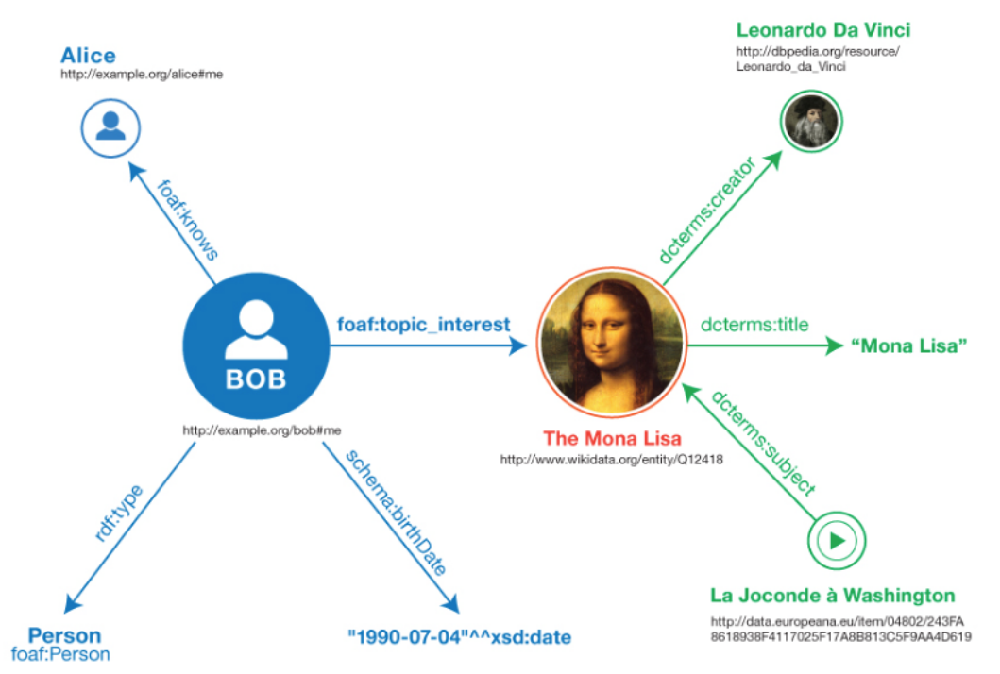
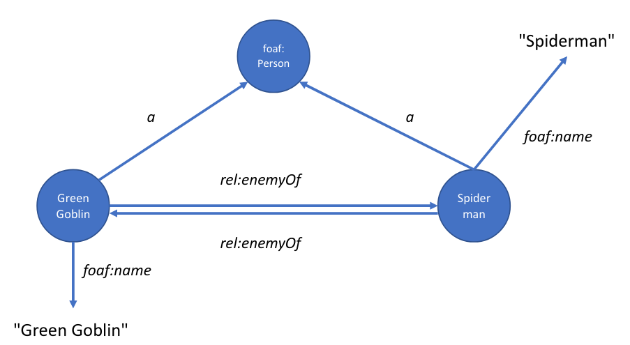

# I linguaggi del Web of Data
## RDF
RDF e' un linguaggio *property centric* che permette di descrivere risorse. Con risorsa si intende
qualsiasi cosa, un documento, una persona, un oggetto fisico o astratto. Piu' in generale il termine
*risorsa* indica qualsiasi cosa che sia identificabile tramite URI (Unified Resource Identifier).
RDF fa parte dello stack di linguaggi del web semantico, costituito da:

* RDF: che permette di descrivere risorse
* RDFS: che permette di descrivere relazioni tra risorse (propriamente estensione di RDF)
* OWL: che permette di descrivere ontologie computazionali (si colloca ad un livello superiore di
  RDF)

Le specifiche del linguaggio RDF consistono in una serie di documenti, noi ci concentreremo sulla
specifica *RDF 1.1 Primer*.  
Come detto in precedenza, RDF e' nato per descrivere risorse digitali e quindi pubblicate sul web.
Tali risorse sono collegate ed organizzate in una struttura a grafo in cui i nodi rappresentano le
entita' e gli archi le relazioni tra di esse (rappresentazione *knowledge graph*).
RDF possiede diverse serializzazioni, tipicamente per favorirne la leggibilita' si preferisce il
linguaggio TURTL. 
GLi elementi di base del data model di RDF sono:

* Triple
* IRI
* Letterali
* Blank Nodes
* Grafi

L'unita' di base di RDF e' una **tripla**, composta da soggetto, predicato e oggetto. Il soggetto e
oggetto possono essere **IRI** o **blank nodes**, mentre l'oggetto puo' essere anche un
**letterale** e il predicato puo' essere solo un IRI. Un **grafo** e' composto da un insieme di
triple. 

Esempio:

* Soggetto: Monna Lisa
* Predicato: fu creata da
* Oggetto: Leonardo da Vinci

che in pseudocodice corrisponde a:
```
<the Monna Lisa><was created by><Leonardo da Vinci>
```
Mentre un esempio di insieme di triple (e quindi di grafo) in pseudocodice potrebbe essere il
seguente:
```
<Bob><is a><Person>
<Bob><is a friend of><Alice>
<Bob><is born on><the 4th of July>
<Bob><is interested in><the Mona Lisa>
<the Mona Lisa><was created by><Leonardo da Vinci>
<the Mona Lista><is entitled><Mona Lisa>
<the video 'La Joconde a' Washington><is about><the Mona Lisa>
```
notare come i soggetti di alcuni predicati compaiano come oggetto di altri e viceversa, costruendo
cosi' una struttura a grafo interconnessa.
Tale grafo e' poi possibile rappresentarlo graficamente come in figura \ref{figGraph}.



Vediamo ora nel dettaglio gli elementi costituenti di RDF. 

### URI e IRI
Come detto precedentemente, gli elementi di una tripla devono essere elementi identificabili 
tramite IRI e quindi riconducibili a entita' presenti nel web. 
Il sistema degli IRI, (cioe' URI internazionalizzato) sono utilizzati come strumento da RDF per 
rappresentare le entita'. Cosa rappresenti un IRI nella realta' non e' rilevante, l'importante e'
che sia *de-referenziabile*. Un predicato e' **sempre** rappresentato da un IRI, mentre soggetto e
oggetto possono esssere costituiti da altri elementi. Questo perche' il predicato e' un elemento di
vocabolario definito in qualche vocabolario. 

### Letterali
Sono tutti quei tipi che non sono IRI, ad esempio i tipi di dato primitivi quali:

* Stringhe
* Numeri in vari formati
* Booleani
* Date, ecc..

Solo gli oggetti possono essere letterali.

### Blank Nodes
Sono nodi speciali che permettono di denotare risorse senza l'ausilio di un URI. Un blank node puo'
essere visto come una variabile che puo' comparire in posizione di soggetto e oggetto nella tripla.

```
<><has_x_coord><12.5>
<><is a><Tree>
```

### Grafi
Nel tempo si e' visto che per gestire meglio le triple era piu' convieniente raggrupparle in grafi
diversi. Un grafo viene quindi dotato di un IRI (o un blank node) tramite cui e' possibile
identificarlo. Un grafo in questo modo puo' essere a sua volta il nodo di un altro grafo. Si dice
quindi che un dataset RDF e' costituito da:

* Un grafo e' detto anonimo (o default graph)
* Zero o piu' grafi con un nome (named graphs)

### Il formato Turtle
RDF e' serializzato in diversi formati tra cui Json LD, N-Triples, RDF/XML e Turtle.  Storicamente
si e' sempre utilizzato e prediletto `XML`, tuttavia `Turtle` si e' imposto come standard di
condivisione di documenti. Lo standard attuale e' dato dal formato Turtle (*Terse RDF Triple
Language*) di cui ne vediamo alcune caratteristiche. 
Diamo ora un esempio di formato Turtle [@rdf_turtle] 

```
@base <http://example.org/> .
@prefix rdf: <http://www.w3.org/1999/02/22-rdf-syntax-ns#> .
@prefix rdfs: <http://www.w3.org/2000/01/rdf-schema#> .
@prefix foaf: <http://xmlns.com/foaf/0.1/> .
@prefix rel: <http://www.perceive.net/schemas/relationship/> .

<...#green-goblin>
    rel:enemyOf<#spiderman>;
    a foaf:Person;            # In the context of the Marvel universe
    foaf:name"Green Goblin".

<...#spiderman>
    rel:enemyOf<#green-goblin>;
    a foaf:Person;
    foaf:name"Spiderman",
             "Uomo Ragno".
```

La rappresentazione a grafo risultante e' quella descritta in figura \ref{figGraph2}.



In questo esempio vengono introdotte numerose caratteristiche del linguaggio Turtle: 

* IRI che sono racchiusi tra `<` e `>` e la parte finale che segue `#` identifica un *frammento*.
* `@prefix` e nomi prefissi servono a dare dei nomi agli `IRI` in modo da non doverli riportare 
  ogni volta per intero. 
* `;` indica che allo stesso soggetto si applicano piu' predicati (con diverso oggetto).
* `,` indica che allo stesso soggetto e predicato si applicano piu' oggetti. 
* `:` indica il prefisso a cui ci si riferisce. Se vuoto si riferisce al prefisso `@base`. 

I blank nodes sono rappresentati in Turtle mediante la notazione con le parentesi quadre. Un blank
node e' una risorsa che si vuole descrivere attraverso le sue specifiche ma che non corrisponde ad
un `IRI`. Se si volesse rappresentare il concetto "*qualcuno conosce qualcun'altro di nome Bob*"
corrisponderebbe alla seguente sintassi:

```
[] foaf:knows [foaf:name "Bob"]
```

I letterali si specificano inserendo prima il valore e poi il datatype secondo la seguente sintassi
`18^^xsd:<http://www.w3.org/2001/XMLSchema#integer>`. Se non viene specificato il datatype, viene
applicato quello di default che e' `String`. 

N-Triples e' un sottoinsieme di Turtle che non ammette abbreviazioni e prefissi che ne sacrifica la
leggibilita' facilitandone la parsificazione da parte di programmi.

## RDFS
RDF e' un linguaggio che presenta diverse limitazioni dal punto di vista semantico, poiche' tramite
esso non e' possibile fornire nessuna informazione sulle entita' descritte, ne' sul vocabolario
utilizzato per descriverle. La descrizione del vocabolario e' quindi affidata agli **schemi RDFS**.
Tramite RDF Schema e' possibile creare un vocabolario andando a descrivere delle classi e delle
proprieta'. I principali costrutti di RDF Schema sono riassunti nella seguente tabella:

| Costrutto   | Descrizione                                                   |
|-------------|---------------------------------------------------------------|
| Class       | C (una risorsa) e' una classe RDF                             |
| Property    | P (una risorsa) e' una proprieta' RDF                         |
| Type        | I (una risorsa) e' una istanza di C (una classe)              |
| Subclass    | C1  (una classe) e' sottoclasse di C2 (una classe)            |
| Subproperty | P1 (una proprieta') e' sottoproprieta' di P2 (una proprieta') |
| Domain      | Il dominio di P (una proprieta') e' C (una classe)            |
| Range       | Il range di P (una proprieta') e' C (una classe)              |

Gli elementi di RDF e RDFS sono contraddistinti tra di loro tramite namespace diversi: `rdf` e
`rdfs` rispettivamente.
Diamo ora un esempio di definizione di vocabolario in RDFS per illustrare come si definiscono 
classi e sottoclassi e proprieta'.

```
# Definisco il nome del vocabolario
@prefix animals: <http://www.funny_animals.org#>

# Definisco la classe Film 
# (=l'oggetto Film ha tipo Classe)
animals:Film rdf:type rdfs:Class.

# Definisco la classe Animale
# (=l'oggetto Animale ha tipo Classe)
animals:Animale rdf:type rdfs:Class.

# Definisco la classe quadrupede, sottoclasse di Animale
# (=l'oggetto Quadrupede ha tipo classe ed e' sottoclasse di Animale)
animals:Quadrupede rdf:type rdfs:Class;
                   rdfs:subClass animals:Animale.
                   
# Proprieta' hasLegs
animals:hasLegs rdf:type rdfs:Property.

# Proprieta' hasFourLegs
animals:hasFourLegs rdf:type rdf:Property;
                    rdfs:subPropertyOf animals:hasLegs.

# In una proprieta' possiamo definire anche range e dominio 
animals:isCharacterOf rdf:type rdf:Property;
                      rdfs:domain animals:Animale;
                      rdfs:range animals:Film.
```

## Vocabolari RDF
Un vocabolario RDF e' costituito da un insieme di **classi** e **proprieta'**. Ad esso viene poi
associato un IRI in modo da poter essere referenziato da tutti.  
Esistono vocabolari precostruiti contententi definizioni di largo uso al giorno d'oggi. Lo scopo di
questi vocabolari e' quello di uniformare diversi termini ed elementi di uso comune sotto le stesse
definizioni ed evitare quindi ridondanze.
I vocabolari che verranno utilizzati principalmente all'interno del corso sono:

* FOAF *(Friend Of A Fiend*): vocabolario per descrivere reti e relazioni sociali
* Dublin Core: vocabolario di elementi per descrivere risorse in termini editoriali
* Scherma.org: vocabolario di elementi per descrivere gli argomenti delle pagine web secondo uno
  schema semantico 
* SKOS: permette di descrivere e allineare terminologie diverse

### Dublin Core
Il vocabolario dublin core consiste in 15 descrittori generici e largamente usati che sono stati
introdotti per facilitare l'interoperabilita' delle informazioni nel Web introducendo semplici
metadati all'interno delle pagine. Dublin Core consiste quindi in uno schema di metadati che sono
utilizzati per annotare risorse identificabili tramite IRI.
L'insieme dei 15 descrittori e' racchiuso nel *Dublin Core Metadata Element Set (MES)*, mentre i
termini e proprieta' di dublin core sono racchiusi nel *Dublin Core Metadata Terms*.
Europeana e' un archivio europeo dei beni culturali il cui schema di metadati e' descritto in un
formato basato su Dublin Core. 

### Friend Of A Friend (FOAF)
Anche in questo caso, il vocabolario e' diviso in due parti: Foaf Core e Social Web. Il primo
contiene termini di base di FOAF mentre il secondo e' un'estensione che e' stata sviluppata
principalmente prendendo come riferimento l'ambito dei social media.
 
### Schema.org
E' un insieme di vocabolari di tipo enciclopedico, concepiti per associare una descrizione semantica
a contenuti presenti nel web come pagine, mails, messaggi ecc..

### SKOS (Simple Knowledge Representation System)
E' uno standard W3C sviluppato per la rappresentazione di vocabolari strutturati. Il suo scopo
principale e' quello di facilitare l'uso e la pubblicazione di tali vocabolari come linked data.
Il vocabolario SKOS e' basato sulla nozione di concetto, dove gli oggetti primitivi non sono
termini ma sono nozioni astratte. I concetti possono essere relazionati tra loro usando delle
relazioni di tipo `broader`/`narrower`. Ad ogni concetto puo' essere anche associata della
documentazione.   
SKOS permette anche di definire vocabolari (`conceptScheme`), specificando quali concetti fanno
parte di un determinato vocabolario (`inScheme`).
La finalita' di SKOS e' principalmente quella di mettere in relazione concetti e termini che stanno
in vocabolari (ma anche tassonomie, soggettari ecc) diversi tra di loro. Tramite SKOS si puo'
specificare ad esempio se un determinato concetto corrisponde esattamente o comunque ha certe
similitudini con altri concetti in altri vocabolari. 
Di seguito e' illustrato un esempio di mapping tra due schemi in SKOS:

```
ex1:referenceAnimalScheme rdf:type skos:ConceptScheme;
    dct:title"Extensivelist of animals"@en.
    
ex1:platypus rdf:type skos:Concept;
    skos:prefLabel"platypus"@en;
    skos:inScheme ex1:referenceAnimalScheme.
    
ex2:eggSellerScheme rdf:type skos:ConceptScheme;
    dct:title"Obsessedegg-seller'svocabulary"@en.
    
ex2:eggLayingAnimals rdf:type skos:Concept;
    skos:prefLabel"animals that lay eggs"@en;
    skos:inScheme ex2:eggSellerScheme.
    
ex1:platypus skos:broadMatch ex2:eggLayingAnimals.
```

[Linked Open Vocabularies](https://lov.linkeddata.es/dataset/lov/): Raccolta di vocabolari
scopribili e resi pubblici. 

### DCAT
Anche se non citato precedentemente vale la pena citare anche DCAT, un vocabolario specifico per la
descrizione di cataloghi di dati. L'obiettivo di DCAT e' quello di favorire l'interoperabilita' tra
dati e servizi relativi ai dati. 
