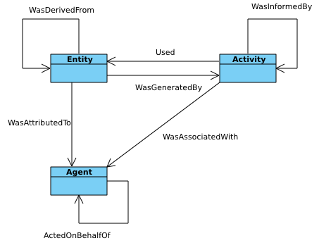

# Ontology Engineering

* Ambito che si occupa del design di ontologie e del loro mantenimento
* Pratiche e linee guida per progettare ontologie interoperabili e ben fondate
* Tra queste metodologie troviamo OntoClean e Neon
* Tali pratiche sono molto importanti dal momento che spesso si lavora in modo collettivo e
  collaborativo alle ontologie

## OntoClean
(An Overview of OntoClean, in Handbook on ontologies (pp. 201-220))

* Deriva dal lavoro effettuato sulle ontologie formali e fondazionali condotto tra la fine degli
  anni 90 e il primo decennio di questo secolo
* Metodologia basata su nozioni molto generali tratte dalla filosofia quali concetti come essenza,
  identita' e unita', usate per caratterizzare aspetti rilevanti quali il significato delle
  proprieta', classi e relazioni che compongono un'ontologia.
* Questi aspetti vengono rappresentati da delle cosiddette "*metaproprieta'* delle classi, che
  impongono diversi vincoli sulla struttura tassonomica di un'ontologia.
* L'analisi di questi vincoli aiuta a valutare e validare le scelte fatte.
    * Esempio: Una classe anti-rigida (come un ruolo), non puo' sussumere una classe rigida. Ne
      consegue che la classe *studente* non puo' sussumere la classe *persona*.
* Le metapropreta' sono:
    * Identita' (I): proprieta' *intrinseca* che identifica un tipo di oggetti (Es. triangolo
      $\rightarrow$ lunghezza dei lati). viene ereditata dalle sottoclassi
    * Unita' (U): proprieta' di un tipo di oggetto di essere unitario (Es. persona vs. argilla)
    * Rigidita' (R): proprieta' di un tipo di oggetto che non e' soggetta a cambiamenti (Es. persona
      vs. Studente - lo studente quando finisce il corso di studi decade da questa classe). viene
      ereditata dalle sottoclassi (non vale per -U)
    * Dipendenza (D): proprieta' di un tipo di oggetti di dipendere da un altro per la propria
      definizione (Es. studente - scuola). Solo l'antirigidita' (~R) viene ereditata dalle
      sottoclassi.
* Queste metaproprieta' non sono prescrittive, cioe' che a seconda di come decido di rappresentare
  una classe o un'entita' del mondo reale, potrei ottenere delle metaproprieta' diverse
* Le classi vengono annotate con metaproprieta':
    * `+P`: la classe possiede la metaproprieta' $P$
    * `-P`: la classe non possiede la metaproprieta' $P$
    * `~P`: la classe possiede l'anti proprieta' $~P$ (non-proprieta')
* *Phase sortal* e' la proprieta' di alcune istanze di essere in grado di cambiare alcuni criteri
  della propria identita' durante la propria esistenza, pur sempre rimanendo sempre la stessa
  entita'. Un esempio sono i bruchi, che cambiano totalmente alcune caratteristiche, pur rimanendo
  lo stesso individuo. I phase sortal sono indipendenti (-D), anti-rigidi (~R) e hanno un criterio
  di identita' (+I)
* **Vedere esempi nell'articolo**

## NeOn Methodology

* Metodologia che si occupa principalmente allo sviluppo di newtork di ontologie, mirata
  particolarmente agli aspetti collaborativi del loro sviluppo e mantenimento
* Si articola in 9 scenari, ciascuno associato ad un insieme di attvitia' e documenti. Alcuni esempi
  possono essere:
    * Scenario 1: prevede che si produca un documento di requisiti per l'ontologia.
    * Scenario 3: comporta il fatto di cercare le risorse ontologiche, valutarle, confrontarle e
      selezionarne un sottoinsieme.
* **Vedere tutti gli scenari dalle slides**
* Un punto interessante di NeOn e' l'ontology lifecycle, secondo il quale l'ontologia ha un ciclo di
  vita strutturato secondo le seguenti fasi
    * Fase di Inizio
    * Fase di Design
    * Fase di Implementazione
    * Fase di Mantenimento

## Ontology Design Patterns

* Mattoncini per la creazione di ontologie secondo schemi condivisi
* Tali schemi sono divisi in categorie, in base alle finalita' degli stessi
* Disponibili su [questo](ontologydesignpatterns.org) sito
* Ad esempio, un esempio di questo pattern e' il pattern `List` per rappresentare Liste
* Ogni pattern puo' ad esempio importarne altri (essere definito in termini di altri)
* *Competency Question*: Sono le domande a cui risponde il pattern

## DOLCE

* Ontologia orientata alla cognizione e al linguaggio
* Distinzione chiave tra:
    * Perduranti: entita' che hanno natura temporale, nel linguaggio naturale sono i verbi.
    * Enduranti: entita' che non hanno natura temporale, individui, oggetti ecc..

## PROV (The Provenance Ontology)

* E' stata concepita per l'interscambio sul web di informazioni riguardanti la *provenienza* delle
  entita'
* La probenienza delle entita' viene rappresentata in termini dei processi che hanno determinato la
  creazione di quelle entita'
* I metadati delle entita' sono affidati a altre ontologie quali FOAF (agenti) e Dublin Core
  (entita')
* Un agente assume un certo ruolo per cui puo' essere assegnato un certo grado di responsabilita'
  per l'attivita' in questione
* Le attivita' riguardano il come le entita' vengono ad esistere e come i loro attributi cambiano,
  diventando di fatto altre entita'
* Un ruolo e' una descrizione della funzione o della parte che un entita' ha preso parte in
  un'attivita'. I ruoli specificano la relazione tra entita' e attivita'.

{ width=50% }

* Esempi di *entita'* possono essere: un documento identificato da un IRI, un file in un filesystem,
  un'auto, un'idea, ecc..
* Esempi di *attivita'* possono essere la pubblicazione di un documento nel web, twittare un post,
  estrarre metadati da un file, editare un file, ecc..
* Entita' (`prov:Entity`) e attivita' (`prov:Activity`) sono relazionate tra loro tramite un'*associazione* (`prov:Association`)
* Un vantaggio di questa rappresentazione e' che e' possibile rappresentare diverse attivita' svolte
  dallo stesso attore, differenziandole ad esempio per il tempo in cui sono state svolte o per altre
  caratteristiche

