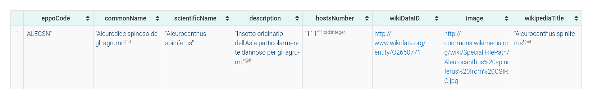

## Motivazioni

Grazie allo sviluppo economico e tecnologico degli ultimi anni, l'uomo ha
assistito a un repentino aumento della popolazione globale, con conseguente
aumento del consumo di cibo totale.  Circa il 56% del cibo consumato in media da
un adulto ha origine di tipo vegetale/cereale [@NatGeo1].  Per poter sostenere
questo maggior consumo di cibo, è necessario che i raccolti siano ad alto
rendimento, per cui è fondamentale una riduzione delle perdite causate da
parassiti e malattie delle piante. 

Un'ontologia fornirebbe un contributo notevole in questo contesto, facilitando
l'accesso e la consultazione di informazioni riguardanti le patologie delle
piante. L'utilizzo di questa tecnologia semantica permetterebbe inoltre di
promuovere la consistenza nella descrizione delle malattie delle piante. Infine,
l'utilizzo di ontologie migliorerebbe lo scambio di dati tra ricercatori
nell'ambito della fitopatologia, e fornirebbe agli imprenditori agricoli un
notevole supporto nell'identificazione e nel trattamento delle patologie.

L'obiettivo prefissatosi è stato quindi quello di creare una risorsa bilingue
(inglese e italiana) per assistere all'identificazione di un dato patogeno a
partire dai sintomi rinvenuti sulla pianta in questione, ma allo stesso tempo,
di fornire informazioni sulla presenza regionale del dato patogeno, così da
poterne valutare anche la componente epidemiologica.

## Requisiti

La finalità della seguente ontologia è quella di ottenere un sistema per
catalogare e successivamente supportare l'identificazione di patologie relative
ad alcune specie di piante presenti in Italia. Il supporto all'identificazione
può essere dato attraverso l'interrogazione del sistema sulla base dei sintomi
che vengono osservati visivamente nelle piante. 

Nonostante sia lo scopo principale del sistema, l'interrogazione non è limitata
solo all'identificazione della malattia in base ai sintomi. Altre interrogazioni
possibili potrebbero riguardare:

- Gli agenti patogeni presenti in un territorio nazionale;
- Le malattie possibili che può contrarre una determinata pianta;
- Le piante che possono essere affette da un determinato patogeno;
- I sintomi possibili causati da un patogeno.

Le informazioni inserite nella risorsa ne permettono un uso sia specialistico
che generalista, le due possibili figure al suo utilizzo ricadono generalmente
nelle due seguenti categorie: 

1. **Agricoltura**: interrogazione del sistema in uno dei modi descritti in
   precedenza;
2. **Ricerca in ambito biologico**: consultazione della conoscenza del sistema a
   scopo di ricerca, con eventuale registrazione e monitoraggio della presenza
   territoriale di un patogeno.

## Descrizione del dominio

Come già anticipato, il dominio in cui si colloca la seguente
ontologia è quello della fitopatologia, una branca della botanica che si occupa
di studiare le malattie provocate alle piante da organismi nocivi. Tutte le
alterazioni delle piante che riguardano fattori endemico/ambientali sono state
invece ignorate ai fini della formalizzazione del dominio, ma possono essere
integrate eventualmente come estensione dell'ontologia esistente. 

Siccome la letteratura in questo contesto è molto ampia, considerare ogni
fattore di stress richiederebbe uno sforzo che supera decisamente le richieste del
progetto. Ci si è limitati quindi a restringere il dominio considerando
una selezione di patogeni (le cui fonti e il razionale sono elencati dopo)
presenti sul territorio italiano. Una volta identificato il bacino di patogeni,
si sono utilizzati progetti fitosanitari standardizzati per ottenere
programmaticamente le piante ospiti di questi patogeni. L'obiettivo è stato
comunque quello di creare una risorsa generale, che permetta di coprire il più
possibile le caratteristiche degli individui coinvolti nel dominio.

Nonostante si possa assumere che il nucleo centrale di una risorsa di patologia
sia il concetto di *malattia*, nello specifico fitopatologico (oltre ad alcuni
casi particolari) la distinzione tra *malattia* e *patogeno* causante non è
definita come in altri ambiti. Gli sforzi di formalizzazione si sono quindi
invece focalizzati su due altri tipi di entità: i *patogeni* e le *piante*.

Gli organismi patogeni che possono causare danni alla pianta possono essere:
batteri, funghi, insetti, nematodi (*vermi parassiti*), oomiceti (organismi un
tempo afferenti al regno dei funghi), virus. Questa classificazione è
comunemente accettata a livello nazionale e internazionale, come evidente dal
servizio fitosanitario nazionale @ServizioFitosanitario.

Il dominio delle piante è da secoli fortemente formalizzato, con classificazioni
standardizzate già definite e ampiamente utilizzate. Abbiamo però constato che
il livello di granularità di queste tassonomie fosse eccessivo per il nostro
caso d'uso. Si è scelto quindi, piuttosto che una modellazione completa di
queste tassonomie, di considerarne un sottoinsieme che fornisse abbastanza
potere discriminativo da permettere un uso della risorsa efficace ed efficiente.
Ci si è focalizzati quindi su due livelli della gerarchia: la *divisione* o
*phylum* (il livello più alto, composto da 15 classi), e quello di *famiglia*,
che in base alla divisione di appartenenza si trova al quinto o al sesto livello
della gerarchia. Questa scelta ha permesso di formalizzare il dominio in maniera
efficace senza però appesantirne troppo la rappresentazione.

Per soddisfare un ulteriore componente del progetto, quella del monitoraggio
territoriale, l'ultimo elemento centrale del dominio è quello di *presenza* di
un patogeno in un dato territorio, così da permettere di formalizzare dove e da
quando un patogeno è stato rilevato (istituzionalmente), con sua eventuale
(seppur poco frequente) eradicazione[^1].

[^1]: A fini esplicativi, nelle seguenti sezioni si farà riferimento al caso pratico 
relativo alla presenza dell'*aulerodide spinoso* sul territorio lombardo, un
insetto particolarmente dannoso per un grande numero di piante.

### Fonti

Per la componente rappresentativa una risorsa fondamentale è stata quella del
*European and Mediterranean Plant Protection Organization* (EPPO) @EPPO2023. Il
database fornito da questo progetto costituisce un punto d'incontro di varie
realtà comunitarie, fornendo varie componenti utilizzate all'interno del
progetto in più stadi: una rappresentazione standardizzata (il cui *EPPOCode* ha
permesso il collegamento con importanti risorse come Wikidata); un esteso
catalogo di rilevamenti fitopatologici a livello regionale (subnazionale) con
fonti annesse; un ampio database di piante ospiti in base al patogeno
(interrogabile programmaticamente attraverso API). 

Per la selezione di patogeni da inserire come individui si è deciso di
focalizzarsi invece su quelli forniti dai sistemi fitosanitari piemontese
@ServizioPiemontese e lombardo @ServizioLombardo. Questa selezione è stata però
generalizzata a tutto il caso italiano andando a indicare la presenza di questi
patogeni non solo per queste due regioni, ma in tutte le venti unità
amministrative italiane (sfruttando il *reporting* disponibile sulla piattaforma
EPPO).

## Competency questions

Si sono considerate le seguenti come le questioni più rilevanti al dominio
scelto:

- Quali sintomi sono causati dal dato patogeno?
- Quali piante sono affette dal dato patogeno?
- Quali sono i patogeni altamente infettivi?
- Quali patogeni sono connessi a un dato sintomo?
- Quali sono i patogeni mortali?
- Quali patogeni sono presenti in una data regione?
- Quali patogeni affliggono una data pianta?
- Quali sono le piante a rischio?

## Documentazione

Per rispondere alle competency questions descritte precedentemente, è necessario
ottenere una risorsa che fornisca un vocabolario sufficientemente completo per
rappresentare patogeni, sintomi, piante e presenze registrate sul territorio. La
concettualizzazione del dominio individuata consiste (a linee generali) nella
seguente descrizione:

> Un patogeno appartenente a una determinata \underline{famiglia}, provoca un
> \underline{insieme di sintomi}, ognuno dei quali può interessare una specifica
> \underline{parte di pianta} oppure la sua interezza (e.g. cessione delle
> attività vitali). Tale patogeno, \underline{infetta} delle specifiche specie
> di \underline{piante}. Per scopi di monitoraggio, tale patogeno può essere
> registrato in una \underline{presenza} in un determinato
> \underline{territorio} nazionale.

Questa descrizione (in cui i termini sottolineati indicano i concetti chiave
dell'ontologia) è stata ottenuta consultando varie risorse già citate in
precedenza.


La lista dei patogeni con cui si è scelto di popolare gli individui
dell'ontologia è composta da quelli presenti nel sistema fitosanitario
piemontese e quello lombardo (\prettyref{fig:Fig1}). Come indicato però
precedentemente, nonostante ci si sia limitati a rappresentare i patogeni
elencati su queste due piattaforme regionali, la presenza di questi patogeni è
invece stata valutata su tutto il territorio nazionale (basandosi sulle
distribuzioni presenti nell'EPPO Global Database, vedi dopo). Nonostante si
possa immaginare che limitarsi a due regioni su venti possa offrire solo
un'immagine parziale della condizione fitosanitaria nazionale, nell'effettivo si
è ottenuta una copertura considerevole: 31 patogeni, 148 presenze nazionali e
1130 piante ospiti potenziali.

Fondamentale per il progetto è la necessità di rappresentare informazioni
riguardo al patogeno in maniera strutturata e coerente. A tal fine si è fatto
riferimento ai vari servizi fitosanitari regionali, un cui esempio di scheda
informativa è presente in \prettyref{fig:Fig2}.

{height=80%}

Per inserire le presenze di un dato patogeno in un dato territorio all'interno
della nostra risorsa, abbiamo avuto come riferimento principale le schede di
distribuzione disponibili nell'EPPO Global Database (\prettyref{fig:Fig3}).
Questo raccoglie infatti tutti i bollettini fitopatologici nazionali e
internazionali con i loro relativi riferimenti bibliografici. Quando i dati
presenti erano imprecisi o incompleti, si è fatto invece riferimento (mediante
consultazione manuale) alle diverse fonti bibliografiche elencate nella scheda
delle distribuzioni. 

{height=70%}

Per formalizzare i sintomi causati da un patogeno, si sono valutate le
descrizioni in linguaggio naturale presenti sui siti Web dei vari servizi
fitopatologici (\prettyref{fig:Fig4}). Da questi si è costruito un vocabolario
iniziale di sintomi formalizzati, divisi per categorie (e.g. *appassimento*,
*deiezioni*, *secrezioni*, *marcitura*, *cancheri* e *morte della pianta*).
Ognuno di questi sintomi viene poi specializzato in base alla parte di pianta
interessata (sempre ottenuto in base a un'annotazione manuale, basata sulla
consultazione delle schede informative).

{height=25%}

Per ottenere le piante ospiti di un determinato patogeno si è sempre fatto
riferimento all'EPPO Global Database (\prettyref{fig:Fig5}). In questo caso,
piuttosto che l'annotazione manuale, si è deciso di interrogare la piattaforma
in maniera programmatica attraverso l'API aperta resa disponibile dal progetto
@EPPO2023DS (mediante lo sviluppo di uno script Python ad-hoc). In questa
maniera è stato possibile ottenere automaticamente non solo la lista di piante
ospiti, ma anche i loro nomi comuni (sia in inglese che in italiano) e i loro
attributi tassonomici, in modo tale da formalizzarli correttamente all'interno
dell'ontologia.


In relazione all'allineamento con ontologie e tassonomie esterne, i due
riferimenti principali sono stati la NCBI Taxon @NCBITaxon, la tassonomia
ufficiale della *National Center for Biotechnology Information* statunitense e
il tesauro multilingua AGROVOC @agrovoc, risorsa della *Food and Agriculture
Organization* delle Nazioni unite.

Il primo fornisce una classificazione curata di nomenclature di organismi
biologici ampiamente utilizzata in vari progetti relativi alla modellazione
concettuale (così da fornire ulteriori possibilità di allineamento con altre
risorse semantiche). Il secondo, invece, fornisce un vocabolario (nello
specifico, un lessico multilingue) così da allineare l'ontologia sviluppata a un
lessico e a una concettualizzazione comune all'ambito agriculturale
(\prettyref{fig:Fig6}).

Per l'identificazione univoca delle regioni, si è deciso di assegnare ad ogni
individuo il corrispettivo codice `ISO 3166-2`, standard ISO per la definizione
di codici geografici, dove a regioni, provincie e città metropolitane vengono
assegnati codici alfanumerici di lunghezza fissa (e.g. `IT-21` per la regione
Piemonte e `IT-TO` per la città metropolitana di Torino). L'utilizzo di questi
codici ha inoltre permesso un ulteriore allineamento a risorse esterne quali
Wikidata (utilizzata, per esempio, nello sviluppo del client). 


## Verifica dell'ontologia

> **TODO**: *Aggiungere un commento sulla generazione e verifica tramite Ontology
> Pitfall Scanner*.

## Visualizzazione dell'ontologia

{height=95%}

La \prettyref{fig:Fig7} mostra la tassonomia individuata durante la fase di
sviluppo. Le classi top level definiscono a grandi linee le varie tipologie di
individui che possono comporre il knowledge graph:

* `Biological Entity`: comprende qualsiasi entità biologica, per cui comprende
  sia un patogeno che una pianta;
* `Collection`: *Ontology Design Pattern* per rappresentare collezioni di
  istanze, le cui specializzazioni rappresentano collezioni di sintomi e
  collezioni di regioni (o più genericamente, territori sub-nazionali);
* `Event`: *Ontology Design Pattern* atto alla rappresentazione di *eventi*
  temporali, la cui specializzazione rappresenta una rilevazione della presenza
  di un patogeno;
* `Disease Symptom`: un sintomo osservabile, che può essere circoscritto a una
  parte della pianta specifica, oppure all'intera pianta;
* `Geographical Entity`: entità geografica generica rispetto alla quale possono
  essere registrate delle presenze di patogeni;
* `Plant Part`: classe enumerata per indicare le possibili parti di una pianta
  colpite da un sintomo.

Oltre a queste classi sono state inoltre introdotte delle classi definite in
modo tale da sfruttare le capacità di ragionamento automatico fornite dalle
tecnologie semantiche. Le classi definite sono:

* `Highly Infective Pathogen`: patogeni che infettano almeno $10$ specie di
  piante differenti;
* `Highly Specific Pathogen`: patogeni che infettano solamente una specie di
  pianta;
* `Deadly Pathogen`: patogeni che causano la morte della pianta come sintomo;
* `Endangered Plant`: specie di piante che possono essere infettate da patogeni
  altamente infettivi e che causano la morte come sintomo.

L'insieme di classi descritto è poi relazionato per mezzo delle seguenti
`objectProperties`:

* `concerns`: relaziona un sintomo e la parte di pianta a cui è interessato.
* `affects`: relaziona un patogeno e le piante che esso infetta;
* `presenceOf`: relaziona una presenza di patogeno rilevata e il patogeno a cui
  essa fa riferimento;
* `causes`: relaziona un patogeno e l'insieme di sintomi che tipicamente causa;
* `hasSymptomMember`: relaziona un insieme di sintomi e un sintomo specifico.

Una volta stabilito il vocabolario necessario a descrivere il dominio di
riferimento, si è passati a utilizzarlo per rappresentare conoscenza vera e
propria. Riprendendo l'esempio pratico utilizzato sopra, di seguito si riporta
una parte di grafo di conoscenza rappresentante la presenza del patogeno
*Aleurocanthus spinifereus* in Lombardia. Si tratta di un insetto, comunemente
noto come *aleurodide spinoso*, dannoso per un gran numero di piante (le
relazioni `affects` ottenute interrogando programmaticamente le API dell'EPPO
Global Database sono 99), andando a colpire piante che vanno dall'*Arbutus
unedo*, il corbezzolo, alla *Vitis vinifera*, la vite comune. I sintomi tipici
di questo patogeno sono un generale appassimento dell'intera pianta e la
presenza di una fitta melata sia sulle foglie che sui fiori. Si veda la
\prettyref{fig:Fig8} per la formalizzazione di questi fatti.

{height=50%}

Di seguito si riportano le triple relative all'esempio sopra: 

{width=95%}

{width=95%}

{width=95%}

## Flusso di interazione

Il flusso di interazione preso in considerazione si basa sul caso d'uso di
consultazione di patogeni in base a una specifica pianta (potrebbe trattarsi,
per esempio, di un individuo del settore vinifero che vuole sapere quali
patogeni possono affliggere il proprio vigneto), con eventuale consultazione
specifica di un patogeno presente nella lista.

{width=95%}

L'interazione dell'utente con il sistema è schematizzata in
\prettyref{fig:Fig12}: in homepage l'utente può selezionare un modo di navigare
la risorsa, nel caso specificato andrà a selezionare la vista per pianta; tra le
1130 piante presenti nella risorsa, l'utente potrà o selezionarne direttamente
una dalla lista o filtrarle in base a una ricerca per *keyword*; una volta
identificata la pianta di interesse, potrà visualizzarne la scheda, contenente
vari dettagli presenti nell'ontologia o ottenuti programmaticamente da altre
risorse (come Wikipedia); nella stessa scheda è presente la lista dei patogeni
che affliggono la pianta, da questa l'utente potrà navigare fino alla scheda
specifica di un patogeno; in questa saranno presenti descrizioni e dettagli
(ottenuti come sopra), sintomi comuni e piante ospiti (presenti nella risorsa).

### Mockup esplicativi dell'interazione

{width=80%}

{width=80%}

{width=80%}

{width=80%}

### Query a supporto dell'interazione[^2]

[^2]: A fini di chiarezza si è evitato di includere i prefissi delle query.

#### Query #1

Query SPARQL per la visualizzazione delle piante. Seleziona
tutte le triple del grafo di tipo `Plant`, ordinate per il loro nome
scientifico.

```sql
SELECT DISTINCT * WHERE {
  ?iri a :Plant;
  :hasScientificName ?scientificName.
  FILTER (
    datatype(?scientificName) != rdf:PlainLiteral
  )
}
ORDER BY ?scientificName
```


#### Query #2

Query SPARQL federata per la visualizzazione dei dettagli della pianta. Dall'endpoint
GraphDB ottiene dettagli relativi alla pianta (`eppoCode`, `scientificName`) e 
tramite una sottoquery calcola il numero di patogeni che affliggono la pianta.
Tramite il codice EPPO esegue poi una query federata a Wikidata dove vengono
richiesti (se presenti) un'immagine e il titolo della pagina di Wikipedia
corrispondente. Questo titolo verrà poi utilizzato (in una chiamata REST
successiva) per ottenere il primo paragrafo della pagina italiana Wikipedia da
usare come descrizione per la pianta.

```sql
SELECT DISTINCT ?eppoCode ?scientificName ?pathogensNumber
                ?image ?wikipediaTitle
WHERE {
  <${plant}> a :Plant;
  :hasEppoCode ?eppoCode;
  :hasScientificName ?scientificName.
  { 
    SELECT (COUNT(?pathogen) as ?pathogensNumber)
    WHERE { 
      ?pathogen ?affects <${plant}>.
    }
  }
  FILTER (
        datatype(?scientificName) != rdf:PlainLiteral
  )
  SERVICE <https://query.wikidata.org/sparql> {
    ?wikiDataID wdt:P3031 ?eppoCode ;
      OPTIONAL {
          ?wikiDataID wdt:P18 ?image .
      }
      OPTIONAL {
          ?wikipediaPage schema:about ?wikiDataID .
          ?wikipediaPage schema:inLanguage "it" .
          ?wikipediaPage schema:name ?wikipediaTitle .
    }
  }
}
```


#### Query #3

Query SPARQL per la visualizzazione dei nomi comuni di una
specifica pianta. Dato l'IRI di una pianta (`${plant}`), ne seleziona l'insieme
di nomi comuni (in italiano) associati ad essa, presenti nel grafo di
conoscenza.

```sql
SELECT ?commonName WHERE {
  <${plant}> a :Plant;
    :hasCommonName ?commonName .
    FILTER ( lang(?commonName) = 'it' )
}
ORDER BY ?commonName
```


#### Query #4

Query SPARQL per la visualizzazione dei patogeni della pianta. Dato l'IRI di una
pianta (`${plant}`), seleziona l'IRI, il nome scientifico e comune (quest'ultimo
in italiano) dei patogeni che affliggono la pianta. I risultati sono ordinati in
base al nome comune.

```sql
SELECT ?pathogen ?scientificName ?commonName WHERE {
  ?pathogen a :Pathogen;
    :affects <${plant}>;
    :hasScientificName ?scientificName;
    :hasCommonName ?commonName;
    FILTER (
        lang(?commonName) = 'it' &&
        datatype(?scientificName) != rdf:PlainLiteral
    )
}
ORDER BY ?commonName
```


#### Query #5

Query SPARQL federata per la visualizzazione dei dettagli di un patogeno. Dall'endpoint
GraphDB ottiene dettagli relativi al patogeno (`eppoCode`, `scientificName`,
`commonName`). Tramite il codice EPPO esegue poi una query federata a Wikidata
dove vengono richiesti (se presenti) un'immagine e il titolo della pagina di
Wikipedia corrispondente. Questo titolo verrà poi utilizzato (in una chiamata
REST successiva) per ottenere il primo paragrafo della pagina italiana Wikipedia
da usare come descrizione per il patogeno.

```sql
SELECT DISTINCT ?eppoCode ?commonName ?scientificName ?description
                ?hostsNumber ?wikiDataID ?image ?wikipediaTitle 
WHERE {
  <${pathogen}> a :Pathogen;
  :hasEppoCode ?eppoCode;
  :hasCommonName ?commonName;
  :hasScientificName ?scientificName;
  rdfs:comment ?description .
  { 
    SELECT (COUNT(?plant) as ?hostsNumber)
    WHERE { 
      ?plant ?affectedBy <${pathogen}>.
    }
  }
  FILTER (
        lang(?commonName) = 'it' &&
        lang(?description) = 'it' &&
        datatype(?scientificName) != rdf:PlainLiteral
  )
  SERVICE <https://query.wikidata.org/sparql> {
    ?wikiDataID wdt:P3031 ?eppoCode ;
      OPTIONAL {
          ?wikiDataID wdt:P18 ?image .
      }
      OPTIONAL {
          ?wikipediaPage schema:about ?wikiDataID .
          ?wikipediaPage schema:inLanguage "it" .
          ?wikipediaPage schema:name ?wikipediaTitle .
    }
  }
}
```



#### Query #6

Query SPARQL per la visualizzazione dell'insieme di sintomi che sono causati dal
patogeno. Partendo dall'IRI del patogeno (`${pathogen}`), si ottiene l'insieme
di sintomi comuni (`?symptoms`) a esso associati. Si selezionano poi tutti i
sintomi (`?symptom`) che sono associati all'insieme di sintomi comuni.

```sql
SELECT ?symptomLabel ?symptomDescription WHERE {
  <${pathogen}> a :Pathogen;
    :causes ?symptoms .
  ?symptoms a :CommonSymptoms ;
    :hasSymptomMember ?symptom .
  ?symptom a :DiseaseSymptom ;
    rdfs:label ?symptomLabel ;
    rdfs:comment ?symptomDescription
  FILTER (
    lang(?symptomLabel) = 'it' &&
    lang(?symptomDescription) = 'it'
  )
}
```


#### Query #7

Query SPARQL per il recupero delle presenze regionali di un patogeno. Partendo
dall'IRI di un patogeno (`${pathogen}`), si selezionano il nome della regione e
l'anno di prima rilevazione (se presente) dalle presenze territoriali associate
al patogeno. Si utilizza la funzione `bound` per ritornare un valore booleano
se il patogeno è stato eradicato in un dato sottoterritorio.


```sql
SELECT ?regionName ?encounter
  (BOUND(?eradicatedPathogen) as ?eradicated)
WHERE {
  <${pathogen}> a :Pathogen .
    ?presence a :Presence ;
              :presenceOf <${pathogen}> ;
              :presenceIn ?region .
    OPTIONAL {?presence :hasFirstEncounter ?encounter }.
    OPTIONAL {?presence :hasEradicatedPathogen ?eradicatedPathogen }.
    ?region rdfs:label ?regionName .
    FILTER ( lang(?regionName) = 'it' )
} ORDER BY ?encounter
```


#### Query #8

Query SPARQL per la visualizzazione delle piante ospiti del patogeno. Sempre partendo
dall'IRI di un patogeno (`${pathogen}`), si selezionano varie informazioni della
pianta ospite quali il suo IRI, il suo nome scientifico e se ne sono presenti
svariati, seleziona casualmente un nome comune italiano (tramite la funzione
`sample`).

```sql
SELECT ?host ?hostName (sample(?commonName) as ?italianCommonName)
WHERE {
  <${pathogen}> a :Pathogen;
    :affects ?host .
    ?host rdfs:label ?hostName .
    OPTIONAL {
        ?host :hasCommonName ?commonName .
        FILTER ( lang(?commonName) = 'it' )
    }
}
GROUP BY ?host ?hostName
ORDER BY ?hostName
```


## Estensione #1: Applicazione client

Per fini di praticità, si è deciso di sviluppare come client per l'interazione
con l'ontologia una web app. Non necessitando di nessuna installazione, un
client di questo tipo renderebbe più semplice l'accesso alla risorsa,
soprattutto da categorie non estremamente specializzate nel settore. Lo sviluppo
dell'intera applicazione si è basato sul framework Javascript *React*. Questo
mette infatti a disposizione diverse API che permettono di effettuare un
rendering differenziale, visualizzando diversi componenti che riflettono lo
stato del programma (e.g. visualizzando una barra di caricamento fin quando è in
corso una chiamata HTTP ad un servizio esterno). Per effettuare chiamate HTTP si
è anche introdotta una libreria apposita chiamata *Axios*. Infine, l'intera
codebase è stata scritte in Typescript anziché Javascript, in modo tale da avere
diverse garanzie teoriche a *compile time*.

La struttura della codebase del progetto è descrivibile in base
alla posizione dei files all'interno delle directories presenti:

* `src/`: radice del progetto. Contiene files che sono comuni e possono essere
  importati da tutti i vari componenti;
* `src/components`: contiene l'implementazione di tutti i componenti (un esempio
  di componente potrebbe essere ad esempio uno spinner di caricamento);
* `src/pages`: contiene l'implementazione delle varie schermate della WebApp
  (e.g. lista dei patogeni, homepage);
* `src/assets`: contiene gli asset statici come immagini, vector graphics, ecc..

Per garantire un'esperienza utente il più reattiva possibile e coerente con lo
stato del programma, si è sviluppato un *React hook* in modo da monitorare lo
stato di una chiamata HTTP[^3]. In questo modo è possibile visualizzare diversi
componenti in base allo stato della chiamata HTTP, sia che essa sia *on-flight*,
terminata con errore, oppure terminata correttamente (visualizzando
eventualmente i dati in essa contenuti).

[^3]: Per l'implementazione si veda la funzione `useSparql` in `src/Common.tsx`.

Utilizzando tale *hook* è poi possibile effettuare delle chiamate HTTP
all'endpoint SPARQL di GraphDB. Per far ciò, l'applicazione effettua una
chiamata HTTP con metodo `POST`, contenente nel *payload* della chiamata la
query da eseguire ed eventuali altri parametri impostabili dalla piattaforma. 

I componenti dell'applicazione si appoggiano poi tutti su questo hook per fare
il retrieval dei dati da GraphDB. Nel caso delle pagine di dettaglio dei
patogeni e delle piante, invece, si fa un'ulteriore chiamata all'API REST di
Wikipedia, in modo da ottenere l'estratto del primo paragrafo della pagina
italiana corrispondente al patogeno o alla pianta in questione.

## Estensione #2: Mapping con OnTop

Durante lo svolgimento del progetto si è cercato di automatizzare il più
possibile il processo di inserimento di individui all'interno della risorsa.
Nonostante ciò non è stato possibile inserire programmaticamente sin da subito
la totalità degli individui: i patogeni, nello specifico, richiedevano
l'esposizione a materiale di natura diversa per poterne definire i dettagli
e soprattutto i sintomi. Queste operazioni sono state quindi svolte manualmente
attraverso l'interfaccia di Protégé.

Si è successivamente creato ad-hoc un database (\prettyref{fig:Fig25}) dove memorizzare in
un formato più accessibile i dati da inserire nella risorsa ontologica
tramite mapping R2RML con OnTop. Dapprima si è inserito (ancora manualmente)
le presenze territoriali dei patogeni (derivate, come descritto sopra, 
utilizzando le schede di distribuzione dell'EPPO Global Database).
Successivamente si è sviluppato uno script Python che programmaticamente
interrogasse l'EPPO GDB per ottenere le piante ospiti di un dato patogeno, 
i nomi comuni e dei dati tassonomici relativi a quest'ultime. Una volta
ottenuti questi dati, al posto di essere inseriti direttamente nell'ontologia, 
lo script ne genera un file SQL, così da ottenere una miglior ergonomia in
ambito di gestione file e poter sfruttare appieno OnTop.

{width=95%}

Analizzando lo schema del database in \prettyref{fig:Fig25} è possibile
constatare come le tabelle create rispecchino le classi fondamentali
descritte nelle sezioni precedenti, non ci soffermerà quindi ulteriormente su esse. 
L'unicatabella il cui ruolo non è stato accennato in precedenza è quella delle 
`special families`: si tratta di una tabella di supporto dove vengono indicate
delle famiglie (di piante) particolarmente frequenti, utilizzate
nei mapping R2RML per inserire queste piante come individui delle *famiglie* 
associate piuttosto che genericamente come entità della loro *divisione* 
(classificazione tassonomica più grossolana).

#### Mapping #1

Mapping R2RML per l'inserimento di piante da famiglie non frequenti. Queste 
vengono quindi inserite come individui appartenenti alla loro divisione 
(`a :{phylum_name}`). Si noti, in questo mapping come nei successivi,
come si vanno a inserire i commenti correttamente localizzati tramite `@lang`.

Source:

```SQL
SELECT eppo_code, name, phylum_name
FROM plants 
WHERE 
  family_eppo_code NOT IN (SELECT eppo_code FROM special_families)
```

Target:

```sql
:{eppo_code} a :{phylum_name} ; 
  :hasEppoCode {eppo_code} ; 
  :hasScientificName {name} ; 
  rdfs:label {name} ; 
  rdfs:comment "Plant of the {phylum_name} phylum."@en , 
               "Pianta della divisione {phylum_name}."@it .
```

Triple materializzate per l'individuo *Annona senegalensis*:

```
<http://www.semanticweb.org/onto_plant_pathology#ANUSE>
  <http://www.w3.org/1999/02/22-rdf-syntax-ns#type>
<http://www.semanticweb.org/onto_plant_pathology#Magnoliophyta> .

<http://www.semanticweb.org/onto_plant_pathology#ANUSE>
  <http://www.semanticweb.org/onto_plant_pathology#hasEppoCode>
"ANUSE" .

<http://www.semanticweb.org/onto_plant_pathology#ANUSE>
  <http://www.semanticweb.org/onto_plant_pathology#hasScientificName>
"Annona senegalensis" .

<http://www.semanticweb.org/onto_plant_pathology#ANUSE>
  <http://www.w3.org/2000/01/rdf-schema#label>
"Annona senegalensis" .

<http://www.semanticweb.org/onto_plant_pathology#ANUSE>
  <http://www.w3.org/2000/01/rdf-schema#comment>
"Plant of the Magnoliophyta phylum."@en .

<http://www.semanticweb.org/onto_plant_pathology#ANUSE>
  <http://www.w3.org/2000/01/rdf-schema#comment>
"Pianta della divisione Magnoliophyta."@it .
```

#### Mapping #2

Mapping R2RML per l'inserimento di piante da famiglie frequenti. Queste 
vengono quindi inserite come individui appartenenti alla loro famiglie
(`a :{family_name}`).

Source:

```SQL
SELECT eppo_code, name, family_name
FROM plants
WHERE family_eppo_code IN (SELECT eppo_code FROM special_families)
```

Target:

```sql
:{eppo_code} a :{family_name} ; 
  :hasEppoCode {eppo_code} ; 
  :hasScientificName {name} ; 
  rdfs:label {name} ;
  rdfs:comment "Plant of {family_name} family."@en , 
               "Pianta della famiglia {family_name}."@it . 

```

Triple materializzate per l'individuo *Vitis vinifera*:

```
<http://www.semanticweb.org/onto_plant_pathology#VITVI>
  <http://www.w3.org/1999/02/22-rdf-syntax-ns#type>
<http://www.semanticweb.org/onto_plant_pathology#Vitaceae> .

<http://www.semanticweb.org/onto_plant_pathology#VITVI>
  <http://www.semanticweb.org/onto_plant_pathology#hasEppoCode>
"VITVI" .

<http://www.semanticweb.org/onto_plant_pathology#VITVI> 
  <http://www.semanticweb.org/onto_plant_pathology#hasScientificName> 
"Vitis vinifera" .

<http://www.semanticweb.org/onto_plant_pathology#VITVI>
  <http://www.w3.org/2000/01/rdf-schema#label>
"Vitis vinifera" .

<http://www.semanticweb.org/onto_plant_pathology#VITVI>
  <http://www.w3.org/2000/01/rdf-schema#comment> 
"Plant of Vitaceae family."@en .

<http://www.semanticweb.org/onto_plant_pathology#VITVI>
  <http://www.w3.org/2000/01/rdf-schema#comment>
"Pianta della famiglia Vitaceae."@it .
```

#### Mapping #3

Mapping R2RML per l'inserimento di relazioni patogeno-pianta ospite.

Source:

```SQL
SELECT pathogen, plant
FROM pathogens_hosts
```

Target:

```sql
:{pathogen} :affects :{plant} . 
```

Tripla materializzata per relazione tra il patogeno *Aleurocanthus spiniferus* e la pianta ospite *Vitis vinifera*:

```
<http://www.semanticweb.org/onto_plant_pathology#ALECSN>
  <http://www.semanticweb.org/onto_plant_pathology#affects>
<http://www.semanticweb.org/onto_plant_pathology#VITVI> .
```

#### Mapping #4

Mapping R2RML per l'inserimento della presenza di un patogeno in un dato territorio. 
L'IRI di un individuo di classe `Presence` è composto dalla concatenazione del codice EPPO
del patogeno e del codice ISO 3166-2 del territorio sotto-nazionale in questione
(`:{pathogen}-{subterritory}`).

Source:

```SQL
SELECT pathogen, subterritory, name, italian_name, english_name 
FROM presences, pathogens, subterritories 
WHERE 
  pathogens.eppo_code = presences.pathogen AND 
  presences.subterritory = subterritories.iso_3166_2_it;
```

Target:

```sql
:{pathogen}-{subterritory} a :Presence ;
  :presenceOf :{pathogen} ;
  :presenceIn :{subterritory} ;
  rdfs:label "{name} in {english_name}"@en ,
             "{name} in {italian_name}"@it ;
  rdfs:comment "The presence of the the {name} pathogen 
                in {english_name}."@en , 
               "La presenza del patogeno {name} 
                in {italian_name}."@it . 
```

Triple materializzate per la presenza di *Aleurocanthus spiniferus* in Lombardia:

```
<http://www.semanticweb.org/onto_plant_pathology#ALECSN-IT-25>
  <http://www.w3.org/1999/02/22-rdf-syntax-ns#type>
<http://www.semanticweb.org/onto_plant_pathology#Presence> .

<http://www.semanticweb.org/onto_plant_pathology#ALECSN-IT-25> 
  <http://www.semanticweb.org/onto_plant_pathology#presenceOf>
<http://www.semanticweb.org/onto_plant_pathology#ALECSN> .

<http://www.semanticweb.org/onto_plant_pathology#ALECSN-IT-25> 
  <http://www.semanticweb.org/onto_plant_pathology#presenceIn>
<http://www.semanticweb.org/onto_plant_pathology#IT-25> .

<http://www.semanticweb.org/onto_plant_pathology#ALECSN-IT-25>
  <http://www.w3.org/2000/01/rdf-schema#label>
"Aleurocanthus spiniferus in Lombardy"@en .

<http://www.semanticweb.org/onto_plant_pathology#ALECSN-IT-25>
  <http://www.w3.org/2000/01/rdf-schema#label>
"Aleurocanthus spiniferus in Lombardia"@it .

<http://www.semanticweb.org/onto_plant_pathology#ALECSN-IT-25>
  <http://www.w3.org/2000/01/rdf-schema#comment>
"The presence of the the Aleurocanthus spiniferus pathogen in Lombardy."@en .

<http://www.semanticweb.org/onto_plant_pathology#ALECSN-IT-25> 
  <http://www.w3.org/2000/01/rdf-schema#comment>
"La presenza del patogeno Aleurocanthus spiniferus in Lombardia."@it .
```

#### Mapping #5

Mapping R2RML per specificare (quando presente) l'anno di primo rilevamento
di un patogeno in un dato territorio. Per identificare la presenza
di un patogeno in un sottoterritorio si compone l'IRI come visto sopra 
nel mapping #4.

Source:

```SQL
SELECT pathogen, subterritory, year
FROM presences
WHERE year IS NOT NULL
```

Target:

```sql
:{pathogen}-{subterritory} :hasFirstEncounter {year} . 
```

Tripla materializzata per la presenza di *Aleurocanthus spiniferus* in Lombardia:

```
<http://www.semanticweb.org/onto_plant_pathology#ALECSN-IT-25>
  <http://www.semanticweb.org/onto_plant_pathology#hasFirstEncounter>
"2022"^^<http://www.w3.org/2001/XMLSchema#integer> .
```

#### Mapping #6

Mapping R2RML per l'inserimento dei nomi comuni in Inglese relativi a una pianta.

Source:

```SQL
SELECT DISTINCT plant, name
FROM plants_names
WHERE language LIKE 'en'
```

Target:

```sql
:{plant} :hasCommonName {name}@en .
```

Triple materializzate per l'individuo *Vitis vinifera*:

```
<http://www.semanticweb.org/onto_plant_pathology#VITVI>
  <http://www.semanticweb.org/onto_plant_pathology#hasCommonName>
"European grape"@en .

<http://www.semanticweb.org/onto_plant_pathology#VITVI>
  <http://www.semanticweb.org/onto_plant_pathology#hasCommonName>
"Common grapevine"@en .

<http://www.semanticweb.org/onto_plant_pathology#VITVI>
  <http://www.semanticweb.org/onto_plant_pathology#hasCommonName>
"Grapevine"@en .
```

#### Mapping #7

Mapping R2RML per l'inserimento dei nomi comuni in Italiano relativi a una pianta.

Source:

```SQL
SELECT DISTINCT plant, name
FROM plants_names
WHERE language LIKE 'it'
```

Target:

```sql
:{plant} :hasCommonName {name}@it .
```

Triple materializzate per l'individuo *Vitis vinifera*:

```
<http://www.semanticweb.org/onto_plant_pathology#VITVI>
  <http://www.semanticweb.org/onto_plant_pathology#hasCommonName>
"Vite"@it .

<http://www.semanticweb.org/onto_plant_pathology#VITVI>
  <http://www.semanticweb.org/onto_plant_pathology#hasCommonName>
"Vite comune"@it .
```

#### Mapping #8

Mapping R2RML per specificare l'eradicazione (eventuale) del patogeno 
in una presenza patogeno-territorio. Per identificare la presenza
di un patogeno in un sottoterritorio si compone l'IRI come visto sopra 
nel mapping #4.


Source:

```SQL
SELECT pathogen, subterritory, eradicated
FROM presences
WHERE eradicated = true;
```

Target:

```sql
:{pathogen}-{subterritory} :hasEradicatedPathogen "true"^^xsd:boolean.
```

Tripla materializzata per l'eradicazione di *Geosmithia morbida* in Lombardia:


```
<http://www.semanticweb.org/onto_plant_pathology#GEOHMO-IT-25>
  <http://www.semanticweb.org/onto_plant_pathology#hasEradicatedPathogen>
"true"^^<http://www.w3.org/2001/XMLSchema#boolean> .
```

\newpage
