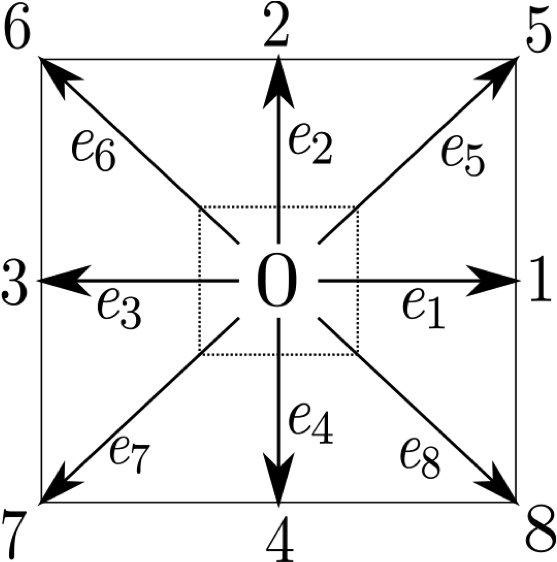
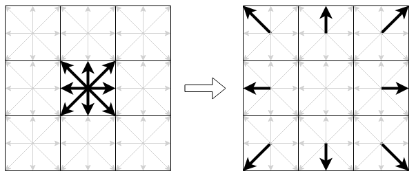
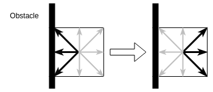
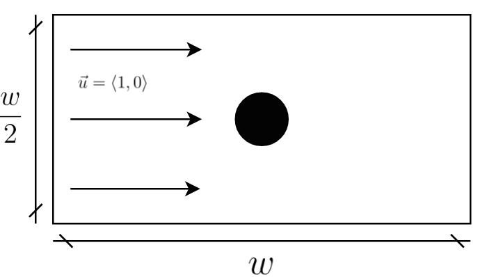

# Introduzione
In questa relazione di laboratorio si discutera' dello sviluppo di un simulatore
(o *solver*) di fluidi in due dimensioni. Un solver e' un software che sfrutta i
metodi della fluidodinamica computazionale per simulare il flusso di fluidi
(liquidi o gas), e la loro interazione con le superfici. Verranno discusse due
implementazioni del solver: una sequenziale e una parallela su GPU (implementata
utilizzando CUDA). Nella sezione 1 verra' discusso il metodo impiegato per la
simulazione di fluidi, da cui ne deriva naturalmente anche la versione
sequenziale del solver (discussa invece brevemente nella sezione 2). Nella
sezione 3 si esaminera' l'implementazione parallela sulla piattaforma CUDA, per
cui verranno proposti anche alcuni miglioramenti possibili per eventuali
sviluppi futuri. Infine, nella sezione 4 verranno messe a confronto le due
versioni, esaminando i diversi benchmarks eseguiti.

# Il Metodo Reticolare di Boltzmann
Quando di parla di fluidodinamica computazionale, e' impossibile non parlare
anche delle equazioni di Navier Stokes: un insieme di equazioni parziali
differenziali che descrivono il moto dei fluidi nel tempo. Simulare un fluido
richiede essenzialmente di ottenere delle soluzioni (anche approssimate) di queste
equazioni, spesso discretizzate.
Da questo punto di vista, simulare un fluido incompressibile richiede di
calcolare ad ogni passo $t$ lo stato successivo al tempo $t + \Delta t$, in cui
lo stato del fluido e' descritto in termini di due quantita': la sua *densita'
macroscopica* ($\rho$) e la sua *velocita' macroscopica* ($\vec{u}$).
Nella fluidodinamica computazionale esistono diversi metodi e tecniche che
possono essere impiegate per ottenere un'approssimazione di queste soluzioni, ma
proprio per la natura delle equazioni parziali differenziali, molti di questi
risultano molto dispendiosi in termini di risorse computazionali. Il metodo alla
base del solver che e' stato scelto, invece, rappresenta un'approccio
alternativo, basato sugli automi cellulari anziche' sulla soluzione delle
equazioni di Navier Stokes. La motivazione principale della scelta e' che
risulta particolarmente indicato a sfruttare al meglio architetture multicore
massive, senza la necessita' di dover modificare radicalmente l'implementazione
sequenziale.

Il metodo pone le sue basi nella teoria cinetica dei gas di Ludwig Boltzmann,
secondo la quale i fluidi/gas possono essere immaginati come un grande numero di
particelle che si muovono secondo moti apparentemente casuali. L'idea
fondamentale del metodo reticolare di Boltzmann e' quella di discretizzare lo
spazio nel quale queste particelle si muovono, confinandole ai nodi di un
*reticolo*. In generale, in uno spazio a due dimensioni, le particelle
all'interno di un nodo sono limitate a muoversi in 9 possibili direzioni
(inclusa la possibilita' di rimanere stazionarie). Questo modello in cui lo
spazio bidimensionale e' discretizzato in 9 direzioni possibili, e' anche
chiamato comunemente modello `D2Q9`\footnote{Naturalmente esistono altri
modelli quali il D3Q19, che rappresenta uno spazio a 3 dimensioni con 19
possibili direzioni}.

{ width=20% }

Le possibili direzioni sono rappresentate matematicamente mediante 9 vettori
$\vec{e_i}, i=0,\dots,8$ a due componenti ($x$, $y$), definiti come:
$$
\vec{e_i} =
\begin{cases}
    \langle0, 0\rangle &i = 0 \\
    \langle1, 0\rangle, \langle0, 1\rangle, \langle-1, 0\rangle, \langle0,
    -1\rangle &i = 1,..4\\
    \langle1, 1\rangle, \langle-1, 1\rangle, \langle-1, -1\rangle, \langle1,
    -1\rangle&i = 5,.. 8\\
\end{cases}
$$
La densita' macroscopica $\rho$ di un fluido, e' modellata mediante una
funzione di densita' di probabilita' $f(\vec{x}, \vec{e_i}, t)$, che indica la
densita' di fluido alla posizione $\vec{x}$, con direzione $\vec{e_i}$, al tempo
$t$. Come detto precedentemente, quello che si vuole ottenere e' lo stato del
fluido al tempo $t+\Delta t$, cioe' dato il valore di $f(\vec{x}, \vec{e_i},
t)$, si deve trovare il valore di $f(\vec{x}, \vec{e_i}, t+\Delta t)$.
Nel metodo reticolare di Boltzmann il calcolo del nuovo stato e' eseguito per
mezzo di tre passi:

1. **Propagazione**: le particelle di fluido vengono propagate a seconda della loro
   direzione ai nodi adiacenti
2. **Collisione**: le particelle di fluido collidono tra loro, di fatto rimodulando
   la densita' all'interno dei singoli nodi
3. **Rimbalzo**: le particelle di fluido rimbalzano alla collisione con eventuali
   superfici solide

Sotto determinate ipotesi, e' dimostrato che questi 3 passaggi rappresentano
un'approssimazione delle equazioni di Navier Stokes.

## Propagazione
Il passo di propagazione consiste essenzialmente nel trasferire la densita' di
fluido presente alla direzione $\vec{e_i}$, di un nodo del reticolo alla
posizione $\vec{x}$, alla direzione $\vec{e_i}$ al nodo adiacente corrispondente
alla posizione $\vec{x} + \vec{e_i}$. Dal punto di vista del metodo, il passo e'
riassumibile con la seguente equazione:
$$
f(\vec{x} + \vec{e_i}, \vec{e_i}, t + \Delta t) = f(\vec{x}, \vec{e_i}, t)
$$
Il passo e' illustrato anche in Figura \ref{figStreaming}, in cui le frecce piu'
spesse indicano il fluido presente inizialmente nei siti del nodo centrale e la
freccia vuota indica il passo di propagazione.



## Collisione
Il passo di collisione e' leggermente piu' complicato rispetto al passo di
propagazione, poiche' richiede di calcolare il valore della distribuzione di
densita' di equilibrio, data dall'equazione di seguito
$$
f^{eq}(\vec{x}, \vec{e_i}, t) = \rho w_i
[1 + 3\vec{e_i}\cdot \vec{u} + \frac{9}{2}(\vec{e_i} \cdot \vec{u})^2 - \frac{3}{2} |\vec{u}|^2]
$$
In cui $w_i$ indica un peso associato alla direzione *i-esima*. Il peso serve a
modellare il fatto che alcune direzioni siano piu' probabili rispetto ad altre.
Risultati teorici suggeriscono la valorizzazione dei pesi nel modo seguente
$$
w_0 = \frac{4}{9}, \quad w_{1, \dots, 4} = \frac{1}{9} \quad w_{5, \dots, 8} = \frac{1}{36}
$$
$\rho$ e $\vec{u}$ si riferiscono invece alle quantita' macroscopiche del nodo
$\vec{x}$. Tali quantita' possono essere calcolate sostanzialmente mediante una
somma e una media.
$$
\begin{aligned}
\rho(\vec{x}, t) &= \sum^{8}_{i=0} f(\vec{x}, \vec{e_i}, t) \\
\vec{u}(\vec{x}, t) &= \frac{1}{\rho} \sum^{8}_{i=0} f(\vec{x}, \vec{e_i}, t) \cdot \vec{e_i}
\end{aligned}
$$
Una volta ottenuto il valore di $f^{eq}(\vec{x}, \vec{e_i}, t)$ e' possibile
infine calcolare per ogni posizione $\vec{x}$ e direzione $i$ il nuovo
stato\footnote{Per semplicita' di notazione, si impone che $f(\vec{x},
\vec{e_i}, t) = f_i(\vec{x}, t)$ }:
$$
f_i(\vec{x}, t+\Delta t) = f_i(\vec{x}, t) +
\omega [f_i^{eq}(\vec{x}, t) - f_i(\vec{x},t)]
$$
Il termine $\omega$ e' un valore costante, determinato dalla *viscosita'* del
fluido.

### Rimbalzo
Quando le particelle di fluido collidono con una superficie solida, non la
devono attraversare, per cui e' necessario gestire questa condizione in un passo
apposito. Esistono diversi metodi per gestire tale condizione. Per semplicita'
e' stato scelto il metodo di *bounce-back*, descritto graficamente in figura.

{ width=40% }

In sintesi, se in una cella $\vec{x}$ del reticolo e' presente un ostacolo,
allora il fluido viene respinto verso la direzione opposta.

# Implementazione Sequenziale
L'implementazione sequenziale del solver non richiede particolari trattazioni,
siccome l'algoritmo consiste nell'implementazione diretta del metodo descritto.
L'implementazione necessita solo di un'accortezza: dal momento che nel passo di
propagazione e' richiesta la distribuzione di fluido al tempo $t$, e' necessario
introdurre un altro reticolo di *"supporto"* $f'$, corrispondente alla
distribuzione al tempo $t + \Delta t$. In questo modo, si evita di sovrascrivere
valori che sarebbero diversamente richiesti dal passo, un'operazione che
invaliderebbe di fatto la correttezza del metodo.
Un singolo passo di
simulazione del solver consiste nell'esecuzione sequenziale dei passi
descritti per ogni nodo del reticolo
\begin{algorithm}
    \caption{Passo di Simulazione}
    \begin{algorithmic}
        \For {$x=0$ to $width$}
            \For {$y=0$ to $height$}
                \State $\vec{x}_{pos} = (x, y)$
                \State $Collide(f, \vec{x}_{pos})$
                \State $Stream(f, f', \vec{x}_{pos})$
                \State $Bounce(f', obstacle, \vec{x}_{pos})$
            \EndFor
        \EndFor
        \State Swap $f$ with $f'$
    \end{algorithmic}
\end{algorithm}

I cicli piu' esterni servono a scorrere l'intero spazio bidimensionale, in modo
da calcolare poi i passaggi richiesti in ogni nodo del reticolo.
Per implementare l'equazione del passo di collisione e' necessario inizialmente
calcolare le quantita' macroscopiche, per poi calcolare le corrispondenti
$f^{eq}$ per ogni direzione.

\begin{algorithm}
    \caption{Passo di Collisione}
    \begin{algorithmic}
    \State Compute $\rho(\vec{x}_{pos})$ and $\vec{u}(\vec{x}_{pos})$
    \For {i = 0 to Q}
        \State Compute $f^{eq}(\vec{x}_{pos})$ using $\rho$ and
        $\vec{u}$
        \State $f_i(\vec{x}_{pos}) \mathrel{+}= \Omega
        [f^{eq}_i(\vec{x}_{pos}) - f_i(\vec{x}_{pos})]$
    \EndFor
    \end{algorithmic}
\end{algorithm}

Il passo di propagazione consiste solamente nel trasferimento delle densita' in
ogni direzione nel reticolo di supporto.

\begin{algorithm}
    \caption{Passo di Propagazione}
    \begin{algorithmic}
        \For {i = 0 to Q}
            \State $f'(\vec{x} + \vec{e}_i) = f(\vec{x})$
        \EndFor
    \end{algorithmic}
\end{algorithm}

Nel passo di rimbalzo e' stato deciso di eseguire l'*unwrap* del loop per
scorrere le direzioni, in modo da eliminare anche eventuali operazioni di modulo
che avrebbero diversamente appesantito il passo, per cui le direzioni opposte
sono codificate direttamente all'interno dell'algoritmo. Per rappresentare le
superfici solide, il passo necessita che sia previsto a livello di
implementazione un array bidimensionale di booleani (*bitmap*) `obstacle`.

\begin{algorithm}
    \caption{Passo di Rimbalzo}
    \begin{algorithmic}
    \State $\vec{x}_{pos} = (x, y)$
    \If{$obstacle(\vec{x}_{pos})$}
        \State $f'_1(\vec{x}_{pos} + \vec{e}_1) = f_3(\vec{x}_{pos})$
        \State $f'_2(\vec{x}_{pos} + \vec{e}_2) = f_4(\vec{x}_{pos})$
        \State $f'_3(\vec{x}_{pos} + \vec{e}_3) = f_1(\vec{x}_{pos})$
        \State $f'_4(\vec{x}_{pos} + \vec{e}_4) = f_2(\vec{x}_{pos})$
        \State $f'_5(\vec{x}_{pos} + \vec{e}_5) = f_7(\vec{x}_{pos})$
        \State $f'_6(\vec{x}_{pos} + \vec{e}_6) = f_8(\vec{x}_{pos})$
        \State $f'_7(\vec{x}_{pos} + \vec{e}_7) = f_5(\vec{x}_{pos})$
        \State $f'_8(\vec{x}_{pos} + \vec{e}_8) = f_6(\vec{x}_{pos})$
    \EndIf
    \end{algorithmic}
\end{algorithm}

## Implementazione del Modello
Il modello `D2Q9` e' implementabile in due modi differenti. Il primo
consiste nel rappresentare il reticolo come una matrice di dimensioni $larghezza
\times altezza$ di nodi di reticolo. Ogni nodo contiene il valore di $f$ in
tutte le 9 direzioni e il valore del vettore a due componenti $\vec{u}$.
```c
typedef Real float;
#define Q 9

typedef struct LatticeNode {
    Real[Q] f;
    Vector2D<Real> u = {0, 0};
} LatticeNode;

LatticeNode[WIDTH][HEIGHT] lattice;
```

Il secondo, invece, consiste nel rappresentare un reticolo come molteplici
matrici.

```c
typedef struct Lattice {
    Real[WIDTH][HEIGHT][Q] f;
    Vector2D<Real> u[WIDTH][HEIGHT];
}

Lattice lattice;
```

Sebbene i due metodi siano semanticamente equivalenti, la scelta di
un'implementazione rispetto all'altra puo' influenzare gli accessi in memoria,
con conseguente influenza delle performance significativa. Nell'implementazione
e' stato deciso di utilizzare la seconda rappresentazione per tre motivi
principali.
Il primo e' in termini di utilizzo della memoria poiche' il compilatore, se si
scegliesse la prima rappresentazione, potrebbe inserire un *padding* in ogni
struttura, che sara' a sua volta replicata piu' volte all'interno di un array,
con un conseguente spreco di memoria. La seconda motivazione e' che ogni volta
che si accede ad un nodo, non sempre ci si serve di tutti i suoi campi
(propagazione e collisione utilizzano solo la densita'), per cui se si
scegliesse la prima implementazione, ne risulterebbe che ogni volta che si deve
accedere ad un campo di un nodo, sia necessario leggere l'intera struttura dalla
memoria, anche se i rimanenti campi non sono necessari.
Infine, la seconda rappresentazione e' anche particolarmente adatta ad
implementazioni su GPU, poiche' favorisce l'accesso *coalescente* dei threads
alla memoria.

L'implementazione del solver finale, legge la configurazione iniziale del
problema da un file di configurazione, esegue il numero specificato di passi di
simulazione, e infine scrive lo stato finale all'interno di un file VTK, cosi'
che possa essere visualizzato con il software di visualizzazione
Paraview\textsuperscript{\textcopyright}.
Alternativamente e' possibile eseguire il programma in una modalita' di
visualizzazione *realtime* della simulazione, in cui ad ogni step del solver
viene renderizzato lo stato con SDL2 [@libsdl]

# Implementazione Parallela
Per la parallelizzazione del solver, si e' seguita la metodologia descritta in
[@9092429]. E' possibile notare come i due loop nello step del solver, servano
essenzialmente a scorrere l'intero spazio della simulazione, per cui evidenziano
come la computazione sia di tipo data parallel *globally synchronous*.
Per questa ragione, e' stato deciso di implementare il solver parallelo su
piattaforma CUDA, poiche' si presta particolarmente bene a questo tipo di
computazioni. L'idea principale consiste essenzialmente nello sfruttare
l'organizzazione bi-dimensionale fornita da CUDA per *"mappare"* un thread ad
un determinato numero di nodi di reticolo della simulazione, che rappresenta di
fatto la grana compuazionale del problema.
Ogni passaggio del metodo, prima che possa essere eseguito, necessita che i
passaggi precenti siano stati eseguiti, in altri termini, esiste una TDD
(*True Data Dependency*) tra loro. Nella progettazione dell'algoritmo parallelo,
si traduce in una necessita' di sincronizzazione tra tutti i threads della
griglia alla fine di ogni passo. In altri termini, e' necessario implementare
una barrier inter-blocco (a livello di griglia). Per implementare questa
primitiva di sincronizzazione globale ci sono tre metodi principali [@5537722]:
1) Sfruttare la barrier implicita alla fine dell'esecuzione di un kernel (*CPU
Synchronization*); 2) Utilizzare una variabile globale, con accesso in mutua
esclusione (*GPU lock-based Synchronization*); 3) Sincronizzazione lockfree
(*GPU lock-free Synchronization*).
Nonostante la sincronizzazione implicita dei kernel introduca un overhead dovuto
al lancio consecutivo di piu' kernel, e' stato scelto il primo metodo.
Le motivazioni risiedono in primo luogo nella semplicita' di implementazione, e
in secondo luogo, un'implementazione corretta delle soluzioni 2 e 3
introdurrebbe troppo overhead, al punto di avere performance peggiori della prima
soluzione [@5537722].

Il partizionamento del problema avviene suddividendo l'intera area della
simulazione in base al numero di threads della griglia CUDA, per cui la
grandezza della grana computazionale e' calcolata nel modo seguente
```c
task_size.x = WIDTH / (BLOCK.x * GRID.x)
task_size.y = HEIGHT / (BLOCK.y * GRID.y)
```
Una volta calcolata la grandezza dell'area di simulazione associata ad ogni
thread, il passo di simulazione, consistera' semplicemente in una chiamata dei
kernels corrispondenti ai sotto-passi della simulazione in sequenza, e di una
successiva sincronizzazione a livello di device. Alla fine dei sotto-passi, si
trasferiscono i dati del reticolo allocato sul device all'host. Cosi' come
nell'implementazione sequenziale, anche qui e' necessario allocare un reticolo
di supporto sul device, per cui alla fine dello step si scambiano i puntatori
dei reticoli $f_{dev}$ ed $f'_{dev}$.

\begin{algorithm}
    \caption{Passo di Simulazione Parallelo}
    \begin{algorithmic}
        \State CollideKernel<$n_{blocks}$, $n_{threads}$>($f_{dev}$)
        \State Synchronize with device
        \State StreamKernel<$n_{blocks}$, $n_{threads}$>($f_{dev}$, $f'_{dev}$)
        \State Synchronize with device
        \State BounceKernel<$n_{blocks}$, $n_{threads}$>($f'_{dev}$)
        \State Transfer memory back to host $f_{dev}' \rightarrow f$
        \State Swap $f_{dev}$ with $f'_{dev}$
    \end{algorithmic}
\end{algorithm}

Come detto in precedenza, la parallelizzazione dei singoli passi consiste
nell'eliminazione dei due cicli for dell'implementazione sequenziale necessari a
scorrere l'intero spazio bidimensionale della simulazione.
Per far cio', il singolo thread calcola inizialmente gli indici che delimitano
la porzione di simulazione che deve calcolare, per poi scorrere quest'ultima per
mezzo di due cicli `for`.
Siccome tutti i sotto-passi sono stati parallelizzati seguendo lo stesso
principio, e' stato riportato solo il passo di collisione.

\begin{algorithm}
    \caption{Passo di Collisione Parallelo}
    \begin{algorithmic}
        \State x\_from = task\_size.x * (blockIdx.x * blockDim.x + threadIdx.x)
        \State y\_from = task\_size.y * (blockIdx.y * blockDim.y + threadIdx.y)
        \State x\_to = x\_from + task\_size.x
        \State y\_to = y\_from + task\_size.y
        \For {x\_from to x\_to}
            \For {y\_from to y\_to}
            \State $\vec{x}_{pos} = \langle x, y \rangle$
            \State Compute $\rho(\vec{x}_{pos})$ and $\vec{u}(\vec{x}_{pos})$
                \For {i = 0 to Q}
                    \State Compute $f^{eq}(\vec{x}_{pos})$ using $\rho$ and
                    $\vec{u}$
                    \State $f_i(\vec{x}_{pos}) \mathrel{+}= \Omega
                    [f^{eq}_i(\vec{x}_{pos}) - f_i(\vec{x}_{pos})]$
                \EndFor
            \EndFor
        \EndFor
    \end{algorithmic}
\end{algorithm}

L'implementazione parallela utilizza un partizionamento a blocchi di threads di
dimensioni $16 \times 16$ (256 *threads*) in modo da massimizzare l'occupazione
degli *streaming multiprocessors*.

# Risultati e benchmarks
Per valutare le performance delle implementazioni si e' scelto un problema
specifico di fluidodinamica, che consiste nel simulare un'ipotetica galleria del
vento. La geometria del problema e' data da uno spazio di dimensioni $w \times
w/2$, al cui centro e' posto un'oggetto sferico. La figura \ref{figGeometry}
riassume il problema, in cui il fluido (in questo caso un *gas*) si muove da
sinistra verso destra, parallelamente all'asse $x$, per cui ogni nodo del
lattice avra' $\vec{u} = \langle 1, 0 \rangle$.



Ai fini della valutazione, si e' sviluppata un'apposita suite di benchmarking,
che calcola il tempo di esecuzione dei passi di simulazione indicati nel file di
configurazione.
Per effettuare il benchmarking dell'implementazione parallela sono state
utizzate due macchine, chiamate `turing` e `alpha`. La prima e' dotata di GPU
NVIDIA RTX 2070, mentre la seconda di una GPU NVIDIA T4, messa a disposizione
dal dipartimento.
I test dell'implementazione sequenziale, invece, sono stati effettuati su un
processore Ryzen 5 2600, compilando il programma con ottimizzazione `-O3`.
I benchmarks sono stati effettuati su un problema di dimensioni $1024\times512$,
con $1000$ passi di simulazione. I risultati in termini di speedup sono da
considerarsi rispetto all'esecuzione sequenziale migliore, e sono riassunti nel
grafico seguente.


\begin{tikzpicture}
    \begin{axis}[
        xmin=1,
        xlabel=n. blocks,
        ylabel=speedup,
        %% xmode=log,
        %% log basis x={2},
        legend pos=north west
]

        \addplot[mark=*,blue] coordinates {
            (1,128289/25751)
            (2,128289/13125)
            (4,128289/6685)
            (8,128289/3436)
            (16,128289/3195)
            (32,128289/2525)
            (64,128289/1371)
            (128,128289/1361)
            (256,128289/1273)
            (512,128289/620)
            (1024,128289/454)
            (2048,128289/269)
        };

        \addplot[mark=*,red] coordinates {
            (1,128289/32145)
            (2,128289/16493)
            (4,128289/8674)
            (8,128289/5086)
            (16,128289/5060)
            (32,128289/3679)
            (64,128289/2031)
            (128,128289/2227)
            (256,128289/2031)
            (512,128289/997)
            (1024,128289/781)
            (2048,128289/454)
        };

        \addlegendentry{turing}
        \addlegendentry{alpha}

    \end{axis}
\end{tikzpicture}

## Conclusioni
Dagli esperimenti risulta che lo speedup migliore ottenuto dalla
prima macchina e' di circa 476.91 con uno speedup medio di 118.10, mentre per la
seconda macchina e' di 282.57, con uno speedup medio di 72.62.
E' possibile notare dal grafico che lo speedup migliore ottenuto e' quello che
si trova in corrispondenza al numero di threads della griglia che sono pari al
numero di nodi del reticolo, quindi, idealmente, alla situazione in cui ogni
thread e' assegnato ad un nodo del lattice. Possiamo concludere quindi che la
grana computazionale ottima ottenuta e' di un singolo nodo di reticolo.

Il programma di cui si e' discusso in questa relazione e' Open Source ed e'
reperibile online [@LBMRepo].
