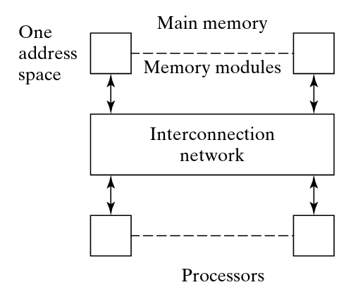
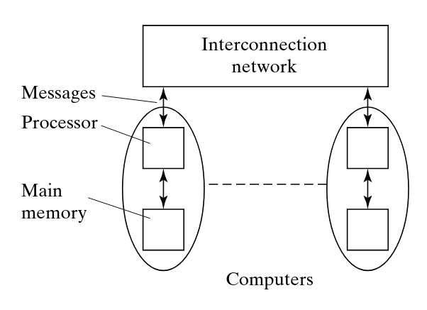
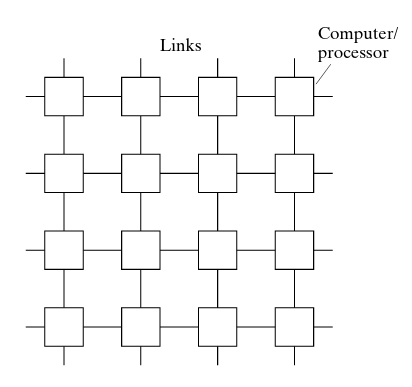
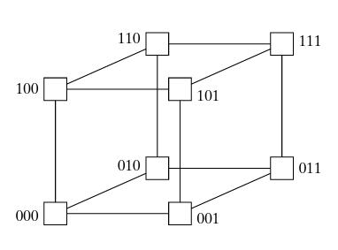
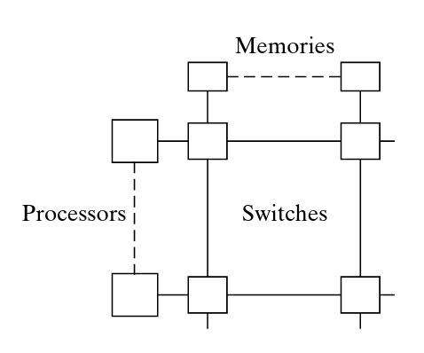
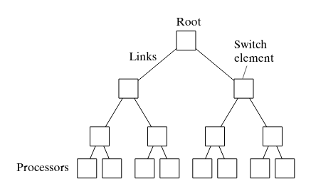
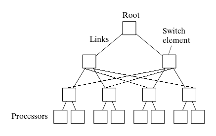
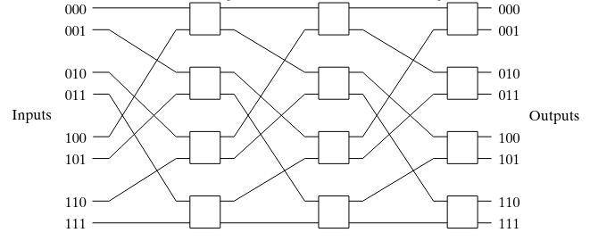

# Sistemi di calcolo paralleli [@par_comp_arch, @par_prog]
Le architetture parallele sono un'estensione naturale delle architetture dei
computer convenzionali, in cui l'attenzione e' posta su problemi quali la
comunicazione e la cooperazione tra diversi elementi di calcolo. In sostanza,
quando si parla di architetture parallele, non si fa altro che parlare di un
concetto piu' esteso di architettura di calcolo. Tale estensione e' proprio data
dalla presenza di un'ulteriore architettura che si occupa dei problemi di
comunicazione. 

>Architettura parallela = Architettura di calcolo + Architettura di
comunicazione

L'architettura di comunicazione estende anche l'organizzazione dell'architettura
di calcolo andando ad aggiungere anche elementi hardware per il suppporto alla
comunicazione. In generale quando si parla di architetture parallele si tende
anche a descrivere un modello di un programmazione ad esse associato. Esso
rappresenta una concettualizzazione del modello di esecuzione, cioe' della
macchina che esegue i programmi. I 3 modelli di programmazione parallela
trattati in questo corso sono:

* *Shared Memories*
* *Message Passing*
* *Single Instruction, Multiple Threads*
 
Storicamente parlando, i modelli di programmazione corrispondevano ad un
determinato modello di esecuzione, per cui era pratica comune associare con un
mapping 1:1 modello di programmazione e di esecuzione. Tale approccio e' pero'
meno appropriato al giorno d'oggi; in primo luogo perche' esistono ormai molte
similitudini tra modelli di esecuzione paralleli, mentre in secondo luogo
perche' i modelli di esecuzione hanno introdotto il supporto a differenti
modelli di programmazione.  In questo senso si puo' parlare di una convergenza
verso un modello "misto" dei diversi modelli di programmazione. 

## Modelli di esecuzione
Con il termine *parallel computer* (sistema di calcolo parallelo) ci si
riferisce arbitrariamente ad un singolo computer dotato di piu' processori o
piu' computers interconnessi coerentemente tra di loro in modo da formare una
piattaforma di calcolo ad alte prestazioni [@par_prog].  Riprendendo quanto
descritto in precedenza, e' possibile far corrispondere ai 3 modelli di
programmazione 3 tipologie differenti di sistema di calcolo parallelo:

* Sistemi multiprocessore a memoria condivisa
* Sistemi multicomputer a memoria distribuita 
* **G**raphics **P**rocessing **U**nit

Ovviamente, come gia' detto in precedenza, la corrispondenza diretta e' solo di
natura storica e non implica che determinati sistemi di calcolo non supportino
altri modelli di programmazione.  Vediamo ora nel dettaglio i sistemi di calcolo
descritti.

### Sistemi Multiprocessore a Memoria Condivisa
Sono sistemi che estendono il modello di esecuzione a processore singolo. L'idea
e' quella di aggiungere altri processori, connettendoli a diversi moduli di
memoria in modo che ogni processore possa accedere ad ogni altro modulo di
memoria. La connessione tra la memoria e i processori e' mediata da una *rete di
interconnessione*. In questi sistemi ogni locazione di memoria e' unica per ogni
processore che la vuole utilizzare. In altri termini si dice che tali sistemi
hanno uno *spazio di indirizzamento singolo*. Cio' implica che la memoria e'
condivisa da tutti i processori connessi.

{ width=50% }

Tale caratteristica e' in un certo senso un'arma a doppio taglio: da una parte
e' particolarmente convieniente il fatto che i dati siano condivisi tra tutti i
processori, soprattutto dal un punto di vista di un programmatore.  Tuttavia,
pero', il fatto che la memoria sia condivisa e l'assenza di supporto hardware
adeguato non permettono a tali sistemi di scalare in numero di processori. Per
questa ragione quando si parla di questo tipo di sistemi, ci si riferisce spesso
a computer singoli multiprocessore, i quali hanno spesso un numero limitato di
processori.  I sistemi di questo tipo possono inoltre essere classificati in
base al tempo di accesso dei processori alla memoria principale. Secondo questo
criterio si possono avere due tipologie di sistema a memoria condivisa:

* UMA (*Uniform Memory Access*): Il tempo di accesso alla memoria e' sempre
  uguale per ogni indirizzo e per ogni processore.
* NUMA (*Non-Uniform Memory Access*): E' l'oppposto di UMA.

### Sistemi Multicomputer a Scambio di Messaggi
Con sistemi a multicomputer ci si riferisce ad un insieme di computer
interconnessi tra di loro attraverso una rete di interconnessione, come mostrato
in figura \ref{figMPM}

{ width=55% }

Ogni computer connesso ha a sua volta la propria memoria, percio' ogni computer
avra' uno spazio di indirizzamento privato. Per questa ragione i computer
connessi non possono accedere direttamente alla memoria di altri computer, di
fatto rendendo privato l'accesso alla memoria di ogni nodo.  In opposizione al
modello a memoria condivisa che utilizza la memoria come medium di comunicazione
per l'informazione tra diversi processori, nei sistemi a multicomputer si
utilizza lo scambio di messaggi per raggiungere lo stesso scopo. La rete di
interconnessione serve quindi come mezzo attraverso il quale i messaggi passano.
In questo senso quindi rappresenta un fattore che puo' influenzare l'efficienza
con cui i messaggi raggiungono un determinato nodo.   Dal punto di vista di
programmazione si utilizzano linguaggi sequenziali che supportano procedure e
strutture dati per lo scambio di messaggi. Un programma viene suddiviso in
*processi* che possono essere eseguiti in parallelo da diversi computer, ma che
possono essere anche eseguiti sullo stesso computer tramite una politica di tipo
*time sharing*. Come anticipato, i processi comunicano dati e informazioni tra
di loro tramite lo scambio di messaggi.  Dal momento che la memoria condivisa e'
deprecata in favore a un modello basato sullo scambio di messaggi asincroni, i
sistemi a scambio di messaggi scalano molto piu' facilmente all'aumentare del
numero di computer connessi. 

## Memoria Condivisa Distribuita (Distributed Shared Memory) 
Il paradigma basato sullo scambio di messaggi presenta delle limitazioni dal
punto di vista dei programmatori. Questo perche', codice scritto per questo
modello di esecuzione e' in generale difficile da debuggare. Inoltre, il fatto
che i dati non possano essere condivisi tra tutti i processori ma che possano
essere solo in un certo senso copiati potrebbe essere problematico, soprattutto
in applicazioni che richiedono di effettuare operazioni su grandi quantita' di
dati.  Dall'altra parte, pero', questo paradigma offre la possibilita' ai
programmatori di evitare operazioni di sincronizzazione che sarebbero invece
necessarie per la programmazione di sistemi basati sul modello a memoria
condivisa.  Queste diverse motivazioni hanno favorito la concentrazione degli
sforzi verso la ricerca di modello che sfruttasse i vantaggi di entrambi i
modelli, che culmino' con la nascita del concetto di *sistema a memoria
condivisa distribuita*.  In questi sistemi la memoria e' *fisicamente*
distribuita tra tutti i processori ma con la differenza che ogni processore ha
accesso all'intera memoria utilizzando uno *spazio di indirizzamento singolo*.
Un processore accede ad una locazione di memoria facente parte dello spazio ad
esso riservato lo fa in modo usuale, mentre quando tale locazione fa parte dello
spazio riservato ad un altro processore, allora avviene uno scambio di messaggi.
Il funzionamento avviene in maniera totalmente nascosta dal punto di vista del
programmatore, che in questo modo potra' sfruttare i vantaggi del modello a
memoria condivisa.

## Reti di interconnessione
Una rete di interconnessione e' un sistema di collegamenti che connette uno o
piu' dispositivi tra di loro con lo scopo di connettere processori (computer) ad
altri processori o di consentire a piu' processori di accedere a uno o piu'
moduli di memoria condivisi [@csci493].  Nei sistemi a multicomputer, una rete
di interconnessione rappresenta il percorso fisico tramite il quale i messaggi
vengono inviati da un computer ad un altro.  In queste tipologie di reti ci sono
diversi fattori da tener conto che possono influenzare le prestazioni quali:

* Bandwidth: numero di bits che possono essere trasmessi in un'unita' di tempo
* Latenza: tempo impiegato da un messaggio a raggiungere la destinazione
* Latenza di comunicazione: tempo totale impiegato per inviare il messaggio che
  comprende ritardi dovuti all'overhead del software, ed eventuali ritardi nelle
  interfacce hardware

Quando si parla di *diametro* di una rete di interconnessione ci si riferisce al
numero minimo di connessioni tra i due nodi piu' distanti nella rete, mentre con
*bisection width* ci si riferisce al numero minimo di connessioni che devono
essere eliminate in modo da dividere la rete in due parti uguali.  Vediamo ora
nel dettaglio alcune tipologie di reti di interconnesione.

### Mesh Network
Una mesh network a due dimensioni consiste in una matrice di dimensioni $\sqrt{p}
\times \sqrt{p}$ in cui ogni nodo e' connesso a tutti i suoi 4 nodi adiacenti. I
nodi situati su di una frontiera possono essere connessi agli estremi dei nodi
situati alla frontiera opposta. Questa tipologia di reti e' detta anche
*toroidale* o *torus network*. Secondo questo principio di connessione e'
possibile ottenere anche mesh network a tre dimensioni, collegando ogni nodo ai
suoi 6 nodi adiacenti.  E' facile notare come sia possibile generalizzare la
nozione a dimensioni generiche $k$.

{ width=50% }

Per questa loro caratteristica, le reti mesh sono particolarmente utilizzate in
applicazioni in cui i punti della soluzione sono organizzati in array a due o
tre dimensioni.  In generale vale che in una mesh network di $k$ dimensioni i
nodi hanno $2k$ vicini (e quindi connessioni).  Degno di nota e' anche il
diametro delle mesh network; per reti di dimensioni $\sqrt{p} \times \sqrt{p}$
il diametro e' $2(\sqrt{p}-1)$. Mentre la bisection width e' pari a $\sqrt{p}$.
Dove $p$ e' il numero di processori all'interno della rete.

### Hypercube Networks
In una hypercube network a $d$ dimensioni, ogni nodo e' connesso ad un nodo in
ogni dimensione della rete. Ogni nodo della rete possiede un indirizzo univoco
formato da $d$ bits. Per esempio, nel caso di una hypercube network a 3
dimensioni, ogni nodo sara' connesso ad altri 3 nodi e ogni indirizzo sara'
composto da una sequenza di 3 bit.

{ width=50% }

Un vantaggio delle reti hypercube e' dato dal fatto che il diametro di tali reti
risulta $log_2 p$, che indica una crescita ragionevolmente bassa all'aumentare
del numero di processori $p$. La bisection width e' $p/2$.
Un'altro vantaggio principale di questa tipologia di reti e' l'algoritmo di
routing. Tale algoritmo si basa sull'idea che ogni bit di indirizzo corrisponde
ad una dimensione nella rete.  Sfruttando questo fatto, dato un indirizzo
sorgente $X$ e un indirizzo destinazione $Y$, ogni bit dell'indirizzo $Y$ che
differisce dall'indirizzo $X$ rappresenta una dimensione nel cubo che deve
essere scelta per raggiungere $Y$. Per fare cio' l'algoritmo calcola $Z = X
\oplus Y$, il quale conterra' tutti i bit che differiscono da $Y$. Viene poi
scelto il bit piu' significativo di $Z$ come dimensione da scegliere per il
reindirizzamento (il che corrisponde ad un bit flip nella stessa posizione
dell'indirizzo $X$). E' bene notare che ad ogni passo il nodo sorgente $X$
cambia, mentre $Y$ rimane invariato.
Per esempio, ipotizzando il caso in cui si voglia inviare un messaggio dal nodo
$X = 001101$ al nodo $Y = 101010$, l'algoritmo compierebbe i seguenti passi:

| Passo |   X    | $Z=X \oplus Y$ |  Next  |
|:-----:|:------:|:--------------:|:------:|
|   1   | 001101 |     100111     | 101101 |
|   2   | 101101 |     000111     | 101001 |
|   3   | 101001 |     000011     | 101011 |
|   4   | 101011 |     000001     | 101010 |

### Crossbar Switch
Una rete di interconnessione di tipo crossbar switch consiste in una collezione
di switch connessi tra di loro in modo da formare una matrice [@cswitch]. Ogni
nodo e' connesso ad uno switch che a sua volta e' connesso ad altri switch e
cosi' via. Questa tipologia di reti e' piu' prevalente in sistemi a memoria
condivisa che in sistemi a scambio di messaggi. 

{ width=50% }

### Tree Networks
Un'altra tipologia di rete che impiega l'utilizzo di switch e' proprio la tree
network. In queste reti ogni switch e' connesso ad altri $m$ switch sottostanti
fino ad arrivare ai nodi foglia che sono i processori. Un aspetto chiave in
queste reti e' che il numero di connessioni per arrivare dal nodo radice fino ai
nodi foglia e' logaritmico ($log_m p$).

{ width=60% }

Un problema noto di questo tipo di reti e' la congestione che si forma verso il
nodo radice, rappresentando di fatto un collo di bottiglia.

#### Fat Trees
Per ovviare al problema della congestione verso il nodo radice si possono
impiegare i cosiddetti *fat trees*, in cui il numero di connessioni aumenta
progressivamente all'avvicinarsi al nodo radice. Cosi' facendo, si aumenta
esponenzialmente il numero di connessioni verso la radice, di fatto riducendo il
collo di bottiglia.

{ width=60% }

### Multistage Interconnection Networks
Sotto questa tipologia di reti ricadono diverse configurazioni che si basano
sulla connessione di diversi livelli di switch. Diversi livelli di switch sono
connessi tra di loro in modo che un pacchetto possa viaggiare indipendentemente
da una parte all'altra della rete mediante un percorso arbitrario. La rete omega
e' un esempio che ricade in questa tipologia, particolarmente conveniente per la
semplicita' dell'algoritmo di routing. Dato un indirizzo composto da $n$ cifre
$X_n..X_1$, se si passa la rete scegliendo la porta di output in base al valore
del bit: alta se il bit e' 0, bassa se il bit e' 1. In questo modo ogni
indirizzo contiene in modo implicito anche il percorso da fare all'interno della
rete per essere raggiunto. 

{ width=80% }

## Tassonomia di Flynn Nel 1966 Flynn invento' una tassonomia per classificare
le diverse tipologie di sistema di calcolo.  Le classificazioni sono basate sul
numero concorrente di istruzioni eseguite e sulla disponibilita' del flusso di
dati. In sostanza, si dividono in 4 classificazioni:

* Single Instruction Stream Single Data Stream (SISD): Sistema che non sfrutta
  nessun meccanismo di parallelismo, ne a livello di istruzioni ne a livello di
  flusso dati. Sono i tradizionali sistemi di calcolo sequenziali. 
* Single Instruction Stream Multiple Data Streams (SIMD): Sistemi in cui una
  singola istruzione opera su piu' dati contemporaneamente. A livello di
  architettura sono composti da piu' processori che effettuano la stessa
  operazione contemporaneamente su dati differenti. Particolarmente utili per
  applicazioni di tipo multimediale o di processing grafico dove la stessa
  operazione deve essere effettuata su dati diversi (ad esempio applicare un
  kernel ad una immagine). I processori moderni offrono alcune istruzioni SIMD
  specifiche per questi utilizzi.
* Multiple Instruction Streams Single Data Stream (MISD): In questa tipologia di
  sistemi, i processori eseguono diverse operazioni sugli stessi dati.
* Multiple Instruction Streams Multiple Data Streams (MIMD): Sono i sistemi di
  calcolo descritti fin ora che comprendono i sistemi a memoria condivisa e a
  scambio di messaggi. In questi sistemi i processori eseguono indipendentemente
  istruzioni differenti su dati differenti. Tipicamente il software eseguito
  segue il modello di programmazione SPMD (*Single Program, Multiple Data*), che
  consiste nel far eseguire a tutti i processori lo stesso programma
  indipendentemente su dati diversi.
