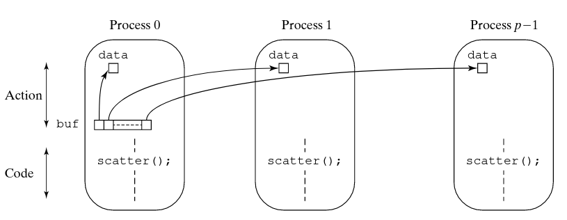
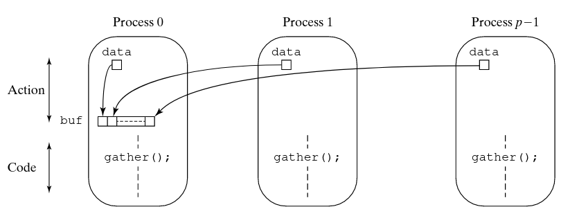
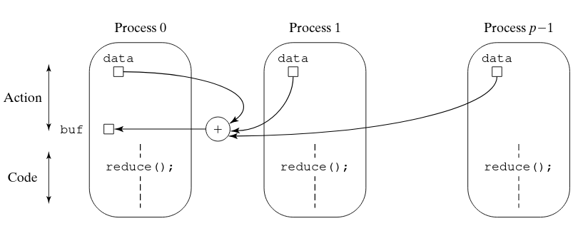

# Programmazione Message-Passing
[Come](Come) detto in precedenza, per programmare sistemi di calcolo paralleli (e quindi
anche un multicomputer basato sullo scambio di messaggi) e' possibile utilizzare
principalmente:

1. Un linguaggio di programmazione appositamente creato per la programmazione
   parallela
2. Un linguaggio di programmazione sequenziale la cui sintassi e' estesa da
   istruzioni specifiche per la programmazione parallela
3. linguaggio di programmazione sequenziale e una libreria apposita per accedere
   alle funzionalita' di procedure e primitive utili alla programmazione
   parallela

Oltre a queste modalita', potrebbe essere possibile anche utilizzare compilatori
specifici atti a parallelizzare codice sequenziale. Tale opzione pero' non e'
praticabile soprattutto su sistemi a scambio di messaggi, per il fatto che i
linguaggi sequenziali non sono dotati della nozione di scambio di messaggi.  Noi
ci concentreremo principalmente sulla terza opzione, utilizzando come linguaggio
di programmazione `C` e la libreria `Open MPI` (*Open Message Passing
Interface*). Il paradigma message passing si basa su due meccanismi principali:

1. Un metodo per la creazione di processi separati per l'esecuzione su computer
   differenti
2. Un metodo per mandare e ricevere messaggi tra processi

## Creazione di processi
Si divide essenzialmente in creazione dinamica e statica. Nella creazione
statica, il numero di processi viene definito prima dell'esecuzione e il sistema
eseguira' tale numero fissato di processi. Nella creazione dinamica un numero
arbitrario di processi puo' essere eseguito. I processi possono essere creati
anche durante l'esecuzione di altri processi. E' piu' flessibile ma introduce
*overhead*.  Un'altra distinzione viene fatta se i processi sono creati a
partire dallo stesso codice o a partire da codici diversi. Nel primo caso si
parla di SPMD, mentre nel secondo di MPMD.  `MPI` segue il modello di
programmazione SPMD, in cui lo stesso programma viene eseguito su piu'
processori, operando su dati diversi. La diversificazione e' ottenuta attraverso
diversi statement di controllo di flusso all'interno del programma. In questo
modello la creazione dei processi e' statica.

## Metodi per lo scambio di messaggi
Lo scambio di messaggi nella programmazione basata sul message-passing utilizza
principalmente due istruzioni principali per lo scambio di messaggi: `send` e
`receive`.  La tipologia di queste istruzioni puo' a sua volta essere
organizzata in modo tassonomico. Si parla quindi di `send/receive`
*sincrona/asincrona*, *simmetrica/asimmetrica*: Per sincrono si indica
un'operazione in cui si *attende* che venga conclusa, mentre con simmetrica si
indica uno scambio di messaggi mediato tra soli due processi.   Una send
sincrona attende fino a quando il messaggio puo' essere accettato dal processo
destinazione prima di spedire il messaggio. D'altra parte, una receive sincrona
attende finche' il messaggio che ci si aspetta arrivi. Intrinsecamente queste
primitive oltre che a *trasferire dati* servono anche a *sincronizzare
processi*. Il termine *rendezvouz* e' usato per descrivere proprio l'azione con
cui si sincronizzano dei processi utilizzando operazioni `send` e `receive`
sincrone.  E' inoltre importante menzionare che la versione sincrona di queste
primitive non necessita di buffer interni come invece richiedono le varianti
asincrone. L'implementazione e' spesso mediata tramite un protocollo 3-way
handshake.

D'altro canto, le send e receive asincrone consistono nel non aspettare che le
azioni completino prima di andare avanti con l'esecuzione. In generale, servono
solo a scambiare dati e non hanno nessuna utilita' in termini di
sincronizzazione di processi.  Le primitive asincrone utilizzano dei buffer
interni di messaggi per poter ottenere questo comportamento. 

In questa tipologia di primitive possiamo distinguere altre due
caratterizzazioni: 

* Bloccanti (*locally blocking*): la primitiva completa (va alla prossima
  istruzione) dopo che l'azione locale completa.  Nel caso della send, con
  azione locale si intende che il messaggio sia stato inserito nel buffer.
  Questo garantisce che il messaggio sara' inviato ma non che sara'
  necessariamente ricevuto.  Nel caso della receive, invece, se il buffer dei
  messaggi e' vuoto l'azione non ritorna fin quando il messaggio non e'
  arrivato.  
* Non Bloccanti: la primitiva completa immediatamente. Nell'esempio della send,
  non da la garanzia che il messaggio sia effettivamente stato spedito. Cio'
  significa che non e' nemmeno bloccante sullo stato del buffer dei messaggi. 
  
Siccome l'asincronia e' legata direttamente allo spazio di bufferizzazione
interno per i messaggi, nei casi delle send asincrone, si potrebbero verificare
casi in cui l'invio dei messaggi sia molto piu' veloce rispetto al consumo dei
tali. Questo potrebbe portare alla saturazione del buffer, con un conseguente
comportamento sincrono della primitiva. In altre parole, quando il buffer e'
saturo, la primitiva si blocca e aspetta che si svuoti. 

## Selezione e differenziazione dei messaggi
I messaggi sono differenziati tra di loro attraverso un `tag` che viene
incapsulato nel messaggio stesso. In questo modo, le primitive di send e receive
accetteranno anche un parametro addizionale `tag` per specificare un messaggio
che che si vuole inviare o che ci si aspetta. Esistono anche delle *wildcards*,
cioe' degli opportuni tag speciali predefiniti, che permettono di specificare
l'intenzione di ricevere messaggi con tag qualsiasi da parte di un processo.  

## Primitive Collettive
Sono routines di natura asimmetrica per lo scambio di messaggi tra piu'
processi. Lo scopo e' quello di mandare un messaggio a piu' processi nel caso
della send, e viceversa nella receive per ricevere messaggi di piu' processi da
un processo singolo.  La presenza di queste routines e' legata al fatto che
sfruttando particolari caratteristiche del sistema, si possano ottenere delle
implementazioni piu' efficienti, rispetto a implementazioni basate ad esempio
sulle primitive a scambio di messaggi singoli.

### Scatter 
A partire da un gruppo di $n$ processi, tra cui uno di questi e' un processo
*root* contenente un *array*, la primitiva scatter consiste nel inviare ogni
*i-esimo* elemento di tale array ai corrispondenti *i-esimi* processi. L'idea e'
quella di avere un mapping 1:1 tra elementi dell'array e messaggi inviati ai
processi. Quando le due dimensioni non coincidono si ricorre a partizionamento. 

{ width=100% }

### Gather 
E' l'inversa della scatter. Permette ad un processo root di collezionare i
valori inviati attraverso messaggi da parte degli altri processi all'interno di
un array. Il dato arrivato dall'*i-esimo* processo viene inserito nell'*i-esima*
posizione dell'array del processo root. 

{ width=100% }

### Reduce
E' una vaiante della gather. Al posto di salvare i dati all'interno di un array,
i dati vengono combinati attraverso un'operazione associativa. E' come la `fold`
dei linguaggi funzionali, dove lo stream di dati e' rappresentato dai messaggi
(dati) provenienti dagli altri processi.

{ width=100% }

## MPI (Message Passing Interface)
E' uno *standard de-facto* che definisce le routines e le primitive (in sostanza
un API) utili per la programmazione di sistemi message passing. E' importante
notare che MPI non definisce l'implementazione di tale standard.  Ad oggi ci
sono diverse implementazioni di MPI, alcune free e open source e altre
commerciali. Noi ci concentreremo su una versione *FOS* chiamata *OpenMPI*. 

### Creazione di processi ed esecuzione 
La creazione e' volutamente non definita esplicitamente, lasciando aperta la
flessibilita' dell'implementazione.  Principalmente la creazione di processi e'
statica, cioe' che il numero di processi che verranno eseguiti e creati
(contemporaneamente) e' definita a priori (al momento dell'esecuzione del
programma). OpenMPI permette nelle versioni piu' recenti la creazione dinamica
di processi, ma in generale non se ne consiglia l'utilizzo per diverse ragioni e
problematiche.  OpenMPI segue inoltre il modello di programmazione SPMD, cio'
significa che un singolo programma verra' eseguito su piu' processori e che il
comportamento di tale programma si differenziera' a runtime.   
Prima di utilizzare qualsiasi funzione, il sistema MPI deve essere inizializzato
mediante l'istruzione `MPI_Init()` e terminato alla fine con `MPI_Finalize()`.

### Comunicatori
Inizialmente, tutti i processi fanno parte dello stesso contesto comune di
comunicazione, a cui ogni processo e' assegnato un *rank* univoco (un numero
compreso tra $0$ e $1-p$). Tale contesto e' chiamato `MPI_COMM_WORLD`. I
processi pero' possono appartenere a contesti di comunicazione (chiamati
comunicatori) differenti. In questo modoo si separano i processi tra di loro in
differenti contesti di comunicazione. Esistono due diversi tipi di comunicatori:

* Intracomunicatori: per la comunicazione all'interno di un gruppo di processi
* Intercomunicatori: per la comunicazione tra gruppi di processi

La presenza di contesti di comunicazione e' utile soprattutto per differenziare
i messaggi di libreria (in questo caso di OpenMPI) dai messaggi del programma.
E' importante inoltre notare che un processo possa appartenere a piu' contesti
di comunicazione differenti. Grazie a questa caratteristica, tutte le primitive
MPI per lo scambio di messaggi richiedono sempre di specificare il comunicatore.

### Primitive per lo scambio di messaggi
Vediamo ora le diverse primitive fornite da MPI per lo scambio di messaggi tra
processi.

#### Comunicazione Point to Point
Come detto in precedenza, il comportamento delle routine send e receive in MPI
e' di default asincrono bloccante (*locally blocking*). Cio' significa che
l'operazione blocchera' solo il tempo necessario per poter completare l'azione
locale. L'eccezione e' solo la receive, che nel caso in cui il buffer sia vuoto,
si blocchera' fin quando non arrivera' il messaggio desiderato nel buffer.  Il
formato generale dei parametri di una send asincrona bloccante e' il seguente

```
MPI_Send(buf, count, datatype, dest, tag, comm);
```

In cui:

* buf: variabile che contiene il contenuto del messaggio
* count: numero di elementi da inviare del contenuto del messaggio
* datatype: tipo del singolo elemento di ogni array
* src: rank del processo a cui e' destinato il messaggio
* tag: tag del messaggio
* comm: comunicatore
* status: stato dopo l'operazione

Mentre la routine receive ha il seguente formato:

```
MPI_Recv(buf, count, datatype, src, tag, comm, status);
```

In cui i campi sono l'opposto della send. In caso in cui il numero di dati
inviati da un altro processo sia piu' grande di quelli specificati dalla
receive, si incorre in un errore di overflow.  Esistono poi le varianti non
bloccanti, che terminano a prescindere dal fatto che l'azione locale sia
terminata o meno.  Il nome di questa versione delle primitive ha come prefisso
una `I` che indica "*immediate*".

```
MPI_Isend(buf, count, datatype, dest, tag, comm, request)
MPI_Irecv(buf, count, datatype, dest, tag, comm, request)
```

In caso di utilizzo di questa tipologia di primitive, si possono utilizzare
altre operazioni per controllare se l'azione locale e' stata completata o meno,
quali `MPI_Wait()` e `MPI_Test()`.  In questo senso le varianti non bloccanti
insieme alle primitive per controllare la terminazione delle azioni locali, sono
delle versioni piu' generiche e flessibili di quelle bloccanti. 

La primitiva send puo' avere tre modalita' di comunicazione che definiscono il
protocollo di send/receive:

* Modalita' standard: la send non assume che la corrispondente routine di
  receive sia stata eseguita.
* Modalita' bufferizzata: serve in caso sia necessario specificare
  esplicitamente lo spazio di bufferizzazione riservato ai messaggi tramite
  `MPI_Buffer_attach()`.
* Modalita' sincrona: la send e la receive possono iniziare prima l'una rispetto
  all'altra in qualsiasi ordine ma completeranno solamente insieme.
* Modalita' ready: una send puo' iniziare solo se una receive corrispondente e'
  gia' stata iniziata, altrimenti ritorna un errore. 

#### Comunicazione Collettiva
Le primitive di comunicazione collettiva sono quelle principali discusse in
precedenza, piu' altre primitive meno utilizzati ma non meno importanti: 

* `MPI_Bcast()`: Manda un messaggio in broadcast 
* `MPI_Gather()`: Primitiva Gather
* `MPI_Scatter()`: Primitiva Scatter
* `MPI_Alltoall()`: Invia i dati da tutti i processi a tutti i processi
* `MPI_Reduce()`: Primitiva Reduce
* `MPI_Reduce_scatter()`: Combina i valori e utilizza scatter sul risultato della combinazione 
* `MPI_Scan()`: Distribuisce ai vari processi tutti i prefissi accumulati

Tutte queste primitive di comunicazione hanno come effetto collaterale anche la
necessita' di sincronizzazione. La barrier e' una primitiva atta alla
sincronizzazione e non allo scambio di messaggi. Serve a far sincronizzare tutti
i processi di un determinato comunicatore.  La barrier e' una primitiva da usare
con cura. Secondo alcuni autori ha utilita' solo per supportare il programmatore
nello scrivere programmi paralleli, poiche' tutti i programmi che utilizzano la
primitiva barrier possono essere scritti senza tale primitiva, essendo cosi'
piu' efficienti, siccome la barrier deve aspettare il processo piu' lento per
sincronizzarli tutti. 

## Valutazione di programmi paralleli
Nella valutazione di programmi sequenziali si usa spesso come metrica il numero
di istruzioni che vengono eseguite. Per un algoritmo parallelo, le cose si
complicano leggermente ed e' necessario tener conto anche del tempo che passa il
programma a far comunicare i processi tra loro. In questo caso, quello che si
misura e' il cosiddetto *work-clock* time, cioe' il tempo misurato *"a
orologio"*.
Come prima approssimazione e' possibile esprimere il tempo di esecuzione
parallela $t_{p}$ come la somma di due parti: il tempo di computazione e il
tempo di comunicazione
$$
t_{p} = t_{comp} + t_{comm}
$$
In realta' il tempo di comunicazione sarebbe piu' propriamente chiamato tempo di
*overhead*, in modo da comprendere tutte quelle parti (come la sincronizzazione,
load balancing ecc..) che non verrebbero comprese altrimenti.
Nel caso in cui piu' di un processo venga eseguito in parallelo, si tiene conto
solo del processo che ha tempo di esecuzione massimo.  L'unita' di tempo di
$t_{comp}$ puo' essere misurata in numero di istruzioni eseguite ma molto spesso
si tratta di vere e proprie "*fasi*" che il programma ha bisogno di eseguire per
computare il risultato. Possiamo quindi eseprimere il tempo computazionale come
la somma del tempo necessario ad eseguire le fasi che lo compongono, separate
dai momenti in cui avvengono gli scambi di messaggi.
$$
t_{comp}=t_{comp1}+t_{comp2}+\dots
$$

> Per utilizzare queste relazioni, ovviamente, bisogna supporre che tutte le
macchine/processori operino alla stessa velocita'.

Il tempo di comunicazione $t_{comm}$, invece, dipende direttamente dal numero di
messaggi, dalla grandezza di un singolo messaggio, dalla tipologia di rete di
interconnessione e dalla modalita' di trasmissione. Siccome l'indice e'
influenzato da diversi fattori, e' difficile ottenere un modello molto preciso.
Come prima approssimazione si potrebbe utilizzare la seguente relazione:
$$
t_{comm} = t_{startup} + w t_{data}
$$
Questa relazione indica che il tempo di comunicazione e' dato dal tempo di
startup ($t_{startup}$) (essenzialmente il tempo necessario a mandare un
messaggio senza nessun dato) piu' il tempo necessario a inviare un messaggio
($t_{data}$) moltiplicato per il numero di messaggi inviati ($w$). 
Anche in questo caso, il tempo di comunicazione complessivo e' dato dalla somma
dei singoli tempi di comunicazione
$$
t_{comm} = t_{comm1} + t_{comm2} + t_{comm3} +  ...
$$
Una volta ottenuti i valori di $t_s$, $t_{comp}$ e di $t_{comm}$ e' possibile
calcolare il fattore di speedup (descritto in precedenza). Riscriviamo la
relazione sostituendo il valore di $t_{p}$
$$
speedup=\frac{t_s}{t_{comp} + t_{comm}}
$$
Da questa relazione, risulta inoltre evidente come il tempo di comunicazione
influenzi direttamente il fattore di speedup. In alcune implementazioni, ad
esempio, si potrebbe verificare la condizione in cui il programma passi
significativamente piu' tempo a comunicare che ad effettuare calcoli
all'aumentare della grandezza del problema. In altri termini, se la complessita'
computazionale del tempo di computazione e del tempo di comunicazione sono le
stesse, allora difficilmente le performance aumenterebbero all'aumentare della
grandezza del problema $n$.  Il rateo computazione/comunicazione da' una stima
di come questi due tempi cambiano. 
$$
comp/comm_{ratio} = \frac{t_{comp}}{t_{comm}}
$$
Generalmente una buona implementazione parallela ha un rateo di
computazione/comunicazione in cui la complessita' computazionale e' piu' grande
di quella della comunicazione. Questo rapporto e' anche espresso spesso come
$G$, che indica la *granularita'* (o grana) della computazione.

> Per grana computazionale si intende la quantita' di dati con la quale si e'
suddiviso il problema generale. (Cioe' la grandezza di un task) Ad esempio, se
decido di suddividere una griglia LxH per 4, la grana sara' (LxH/4).

### Valutazione Empirica
Tutte le considerazioni fatte nella sezione precedente, valgono solo se il 
paradigma scelto per la computazione parallela e' noto. Nonostante una
valutazione teorica sia in linea di massima preferibile, in alcuni casi e'
necessario valutare empiricamente le prestazioni del programma parallelo. 
