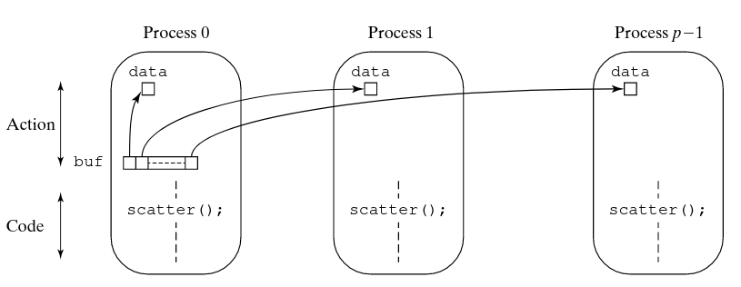
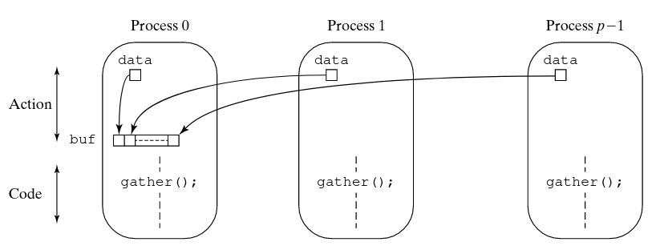

# Programmazione Message-Passing 
Come detto in precedenza, per programmare sistemi di calcolo paralleli (e quindi anche un
multicomputer basato sullo scambio di messaggi) e' possibile utilizzare principalmente:

1. Un linguaggio di programmazione appositamente creato per la programmazione parallela
2. Un linguaggio di programmazione sequenziale la cui sintassi e' estesa da istruzioni specifiche per
   la programmazione parallela
3. linguaggio di programmazione sequenziale e una libreria apposita per accedere alle
   funzionalita' di procedure e primitive utili alla programmazione parallela 

Oltre a queste modalita', potrebbe essere possibile anche utilizzare compilatori specifici atti a
parallelizzare codice sequenziale. Tale opzione pero' non e' praticabile soprattutto su sistemi a
scambio di messaggi, per il fatto che i linguaggi sequenziali non sono dotati della nozione di
scambio di messaggi. 
Noi ci concentreremo principalmente sulla terza opzione, utilizzando come linguaggio di
programmazione `C` e la libreria `Open MPI` (*Open Message Passing Interface*).
Per programmare secondo il paradigma message passing principalmente sono coinvolti due meccanismi
principali:

1. Un metodo per la creazione di processi separati per l'esecuzione su computer differenti
2. Un metodo per mandare e ricevere messaggi tra processi

## Creazione di processi
Si divide essenzialmente in creazione dinamica e statica. Nella creazione statica, il numero di
processi viene definito prima dell'esecuzione e il sistema eseguira' tale numero fissato di
processi. Nella creazione dinamica un numero arbitrario di processi puo' essere eseguito. I processi
possono essere creati anche durante l'esecuzione di altri processi. E' piu' flessibile ma introduce
*overhead*. 
Un'altra distinzione viene fatta se i processi sono creati a partire dallo stesso codice o a partire
da codici diversi. Nel primo caso si parla di SPMD, mentre nel secondo di MPMD.
`MPI` segue il modello di programmazione SPMD, in cui lo stesso programma viene eseguito su piu'
processori, operando su dati diversi. La diversificazione e' ottenuta attraverso diversi statement
di controllo di flusso all'interno del programma. In questo modello la creazione dei processi e'
statica. 

## Metodi per lo scambio di messaggi
Lo scambio di messaggi nella programmazione basata sul message-passing utilizza principalmente due
istruzioni principali per lo scambio di messaggi: `send` e `receive`.
La tipologia di queste istruzioni puo' a sua volta essere organizzata in modo tassonomico. Si parla
quindi di `send/receive` *sincrona/asincrona*, *simmetrica/asimmetrica*:
Per sincrono si indica un'operazione in cui si *attende* che venga conclusa, mentre con simmetrica
si indica uno scambio di messaggi mediato tra soli due processi.   
Una send sincrona attende fino a quando il messaggio puo' essere accettato dal processo destinazione
prima di spedire il messaggio. D'altra parte, una receive sincrona attende finche' il messaggio che
ci si aspetta arrivi. Intrinsecamente queste primitive oltre che a *trasferire dati* servono anche
a *sincronizzare processi*. Il termine *rendezvouz* e' usato per descrivere proprio l'azione con cui
si sincronizzano dei processi utilizzando operazioni `send` e `receive` sincrone. 
E' inoltre importante menzionare che la versione sincrona di queste primitive non necessita di
buffer interni come invece richiedono le varianti asincrone. L'implementazione e' spesso mediata
tramite un protocollo 3-way handshake.

D'altro canto, le send e receive asincrone consistono nel non aspettare che le azioni completino
prima di andare avanti con l'esecuzione. In generale, servono solo a scambiare dati e non hanno
nessuna utilita' in termini di sincronizzazione di processi. 
Le primitive asincrone utilizzano dei buffer interni di messaggi per poter ottenere questo
comportamento. 

In questa tipologia di primitive possiamo distinguere altre due caratterizzazioni: 

* Bloccanti (*locally blocking*): la primitiva completa (va alla prossima istruzione) dopo che
  l'azione locale completa.
  Nel caso della send, con azione locale si intende che il messaggio sia stato inserito nel buffer.
  Questo garantisce che il messaggio sara' inviato ma non che sara' necessariamente ricevuto.  Nel
  caso della receive, invece, se il buffer dei messaggi e' vuoto l'azione non ritorna fin quando il
  messaggio non e' arrivato.  
* Non Bloccanti: la primitiva completa immediatamente. Nell'esempio della send, non da la garanzia
  che il messaggio sia effettivamente stato spedito. Cio' significa che non e' nemmeno bloccante
  sullo stato del buffer dei messaggi. 
  
Siccome l'asincronia e' legata direttamente allo spazio di bufferizzazione interno per i messaggi,
nei casi delle send asincrone, si potrebbero verificare casi in cui l'invio dei messaggi sia molto
piu' veloce rispetto al consumo dei tali. Questo potrebbe portare alla saturazione del buffer, con
un conseguente comportamento sincrono della primitiva. In altre parole, quando il buffer e' saturo,
la primitiva si blocca e aspetta che si svuoti. 

## Selezione e differenziazione dei messaggi
I messaggi sono differenziati tra di loro attraverso un `tag` che viene incapsulato nel messaggio
stesso. In questo modo, le primitive di send e receive accetteranno anche un parametro addizionale
`tag` per specificare un messaggio che che si vuole inviare o che ci si aspetta. Esistono anche
delle *wildcards*, cioe' degli opportuni tag speciali predefiniti, che permettono di specificare
l'intenzione di ricevere messaggi con tag qualsiasi da parte di un processo.  

## Primitive Collettive
Sono routines di natura asimmetrice per lo scambio di messaggi tra piu' processi. Lo scopo e' quello
di mandare un messaggio a piu' processi nel caso della send, e viceversa nella receive per ricevere
messaggi di piu' processi da un processo singolo. 
La presenza di queste routines e' legata al fatto che sfruttando particolari caratteristiche del
sistema, si possano ottenere delle implementazioni piu' efficienti, rispetto a implementazioni basate
ad esempio sulle primitive a scambio di messaggi singoli.

### Scatter 
A partire da un gruppo di $n$ processi, tra cui uno di questi e' un processo *root* contenente un
*array*, la primitiva scatter consiste nel inviare ogni *i-esimo* elemento di tale array ai
corrispondenti *i-esimi* processi. L'idea e' quella di avere un mapping 1:1 tra elementi dell'array
e messaggi inviati ai processi. Quando le due dimensioni non coincidono si ricorre a
partizionamento. 

{ width=100% }

### Gather 
E' l'inversa della scatter. Permette ad un processo root di collezionare i valori inviati attraverso
messaggi da parte degli altri processi all'interno di un array. Il dato arrivato dall'*i-esimo*
processo viene inserito nell'*i-esima* posizione dell'array del processo root. 

{ width=100% }

### Reduce
E' una vaiante della gather. Al posto di salvare i dati all'interno di un array, i dati vengono
combinati attraverso un'operazione associativa. E' come la `fold` dei linguaggi funzionali, dove lo
stream di dati e' rappresentato dai messaggi (dati) provenienti dagli altri processi.

{ width=100% }

## MPI (Message Passing Interface)
E' uno *standard de-facto* che definisce le routines e le primitive (in sostanza un API) utili per
la programmazione di sistemi message passing. E' importante notare che MPI non definisce
l'implementazione di tale standard.  
Ad oggi ci sono diverse implementazioni di MPI, alcune free e open source e altre commerciali. Noi
ci concentreremo su una versione *FOS* chiamata *OpenMPI*. 

### Creazione di processi ed esecuzione 
La creazione e' volutamente non definita esplicitamente, lasciando aperta la flessibilita'
dell'implementazione.  Principalmente la creazione di processi e' statica, cioe' che il numero di
processi che verranno eseguiti e creati (contemporaneamente) e' definita a priori (al momento
dell'esecuzione del programma). OpenMPI permette nelle versioni piu' recenti la creazione dinamica
di processi, ma in generale non se ne consiglia l'utilizzo per diverse ragioni e problematiche.  
OpenMPI segue inoltre il modello di programmazione SPMD, cio' significa che un singolo programma
verra' eseguito su piu' processori e che il comportamento di tale programma si differenziera' a
runtime.   
Prima di utilizzare qualsiasi funzione, il sistema MPI deve essere inizializzato mediante
l'istruzione `MPI_Init()` e terminato alla fine con `MPI_Finalize()`.

### Comunicatori 
Inizialmente, tutti i processi fanno parte dello stesso contesto comune di comunicazione, a cui ogni
processo e' assegnato un *rank* univoco (un numero compreso tra $0$ e $1-p$). Tale contesto e'
chiamato `MPI_COMM_WORLD`. I processi pero' possono appartenere a contesti di comunicazione
(chiamati comunicatori) differenti. In questo modoo si separano i processi tra di loro in differenti
contesti di comunicazione. Esistono due diversi tipi di comunicatori:

* Intracomunicatori: per la comunicazione all'interno di un gruppo di processi
* Intercomunicatori: per la comunicazione tra gruppi di processi

La presenza di contesti di comunicazione e' utile soprattutto per differenziare i messaggi di
libreria (in questo caso di OpenMPI) dai messaggi del programma.  E' importante inoltre notare che
un processo possa appartenere a piu' contesti di comunicazione differenti. Grazie a questa
caratteristica, tutte le primitive MPI per lo scambio di messaggi richiedono sempre di specificare
il comunicatore. 

### Primitive per lo scambio di messaggi 
Vediamo ora le diverse primitive fornite da MPI per lo scambio di messaggi tra processi.

#### Comunicazione Point to Point
Come detto in precedenza, il comportamento delle routine send e receive in MPI e' di default
asincrono bloccante (*locally blocking*). Cio' significa che l'operazione blocchera' solo il tempo
necessario per poter completare l'azione locale. L'eccezione e' solo la receive, che nel caso in cui
il buffer sia vuoto, si blocchera' fin quando non arrivera' il messaggio desiderato nel buffer.
Il formato generale dei parametri di una send asincrona bloccante e' il seguente

```
MPI_Send(buf, count, datatype, dest, tag, comm);
```

In cui: 

* buf: variabile che contiene il contenuto del messaggio
* count: numero di elementi da inviare del contenuto del messaggio
* datatype: tipo del singolo elemento di ogni array
* src: rank del processo a cui e' destinato il messaggio
* tag: tag del messaggio
* comm: comunicatore
* status: stato dopo l'operazione

Mentre la routine send ha il seguente formato:

```
MPI_Recv(buf, count, datatype, src, tag, comm, status);
```

In cui i campi sono l'opposto della send. In caso in cui il numero di dati inviati da un altro
processo sia piu' grande di quelli specificati dalla receive, si incorre in un errore di overflow. 
Esistono poi le varianti non bloccanti, che terminano a prescindere dal fatto che l'azione locale
sia terminata o meno.  
Il nome di questa versione delle primitive ha come prefisso una `I` che indica "*immediate*".

```
MPI_Isend(buf, count, datatype, dest, tag, comm, request)
MPI_Irecv(buf, count, datatype, dest, tag, comm, request)
```

In caso di utilizzo di questa tipologia di primitive, si possono utilizzare altre operazioni per
controllare se l'azione locale e' stata completata o meno. 

La primitiva send puo' avere tre modalita' di comunicazione che definiscono il protocollo di
send/receive:

* Modalita' standard: la send non assume che la corrispondente routine di receive sia stata
  eseguita.
* Modalita' bufferizzata: la send puo' ritornare prima che la receive sia stata eseguita. E'
  necessario inoltre specificare esplicitamente lo spazio di bufferizzazione tramite opportune
  operazioni.  
* Modalita' sincrona: la send e la receive possono iniziare prima l'una rispetto all'altra in
  qualsiasi ordine ma completeranno solamente insieme.
* Modalita' ready: una send puo' iniziare solo se una receive corrispondente e' gia' stata iniziata,
  altrimenti ritorna un errore. 

#### Comunicazione Collettiva
Le primitive di comunicazione collettiva sono quelle principali discusse in precedenza, piu' altre
primitive meno utilizzati ma non meno importanti: 

```
MPI_Bcast()           - Manda un messaggio in broadcast 
MPI_Gather()          - Primitiva Gather
MPI_Scatter()         - Primitiva Scatter
MPI_Alltoall()        - Invia i dati da tutti i processi a tutti i processi
MPI_Reduce()          - Primitiva Reduce
MPI_Reduce_scatter()  - Combina i valori e utilizza scatter sul risultato della combinazione 
MPI_Scan()            - ??
```
