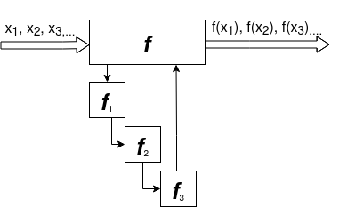

# Paradigmi di programmazione paralleli
Nella programmazione parallela ci sono due macrocategorie principali di
paradigmi di programmazione:
    * Stream Parallel (task parallel)
    * Data Parallel
Lo scopo di tali paradigmi e' di indicare dato un problema, dove si trova (da
dove viene "*estratto*") il parallelismo.

## Stream Parallel
Nel caso stream parallel, l'assunzione e' quella di avere uno stream (lista
unbounded) di dati. L'accesso ai dati di uno stream richiede che ogni elemento
sia acceduto in sequenza, per cui e' differente da un array in cui e' possibile
accedere in modo random in qualsiasi posizione. Le forme di parallelismo piu'
comuni nel caso stream parallel sono a loro volta *Pipeline* e *farm*.
Nel caso della pipeline l'idea e' quella di calcolare una funzione $f$ per uno
stream di dati inbound. Tale funzione e' possibile scomporla in diverse
sottofunzioni indipendenti tra di loro, formalmente e' possibile rappresentare
$f$ come composizione di $n$ funzioni
$$
f = f_1 \cdot f_2 \cdot \dots \cdot f_n
$$
In questo modo, le funzioni possono essere eseguite in parallelo tra di loro,
stile "catena di montaggio".

{
width=50% }

Se nel caso di una pipeline sequenziale il tempo di esecuzione e' 
$$
T_{seq} = T_{f1} + T_{f1} + \dots + T_{fn}
$$
in una pipeline parallela si ha che il tempo di esecuzione e'
$$
T_{par} = \max_{i \in 0, \dots, n}(T_{fi})
$$
In questa forma di parallelismo, il caso migliore e' evidentemente quello in cui
tutti i tempi di esecuzione delle singole $f$ sono uguali, in modo che il tempo
massimo non penalizzi gli altri tempi.
Il problema del pipelining puo' essere essenzialmente evidenziato per mezzo di
un esempio: Se supponiamo che il tempo piu' grande sia quello di $T_{f3}$ e che
tutti gli altri tempi siano minori e che si comunichi con primitive di
comunicazione asincrone bloccanti. Allora il buffer di ricezione del processo
che gestisce $f_3$ molto probabilmente soffrira' di overflow per le troppe
richieste provenienti dai "passi" inferiori della pipeline. Dimensionare tale
buffer e' inoltre impossibile.

Nel caso del paradigma task farm, l'idea e' invece quella di avere un processo
iniziale che distribuisce gli elementi dello stream ad elementi di calcolo
diversi, in cui tutti processano la funzione $f$. In questo senso differisce
dalla pipeline in cui i diversi processi calcolavano le sottofunzioni $f_n$.

{ width=50% }

Il tempo di esecuzione sequenziale di un modello task farm e' pari al tempo di
esecuzione di $f$ stesso
$$
T_{seq} = T_f
$$
Nel caso parallelo, supponendo che si abbiano $n$ elementi di calcolo (workers),
come prima approssimazione si ha
$$
T_{par} = \frac{T_f}{n}
$$
In pratica, se vediamo l'intero sistema come 

# Embarassingly Parallels Computations
Nella parallelizzazione di programmi sequenziali, quello che si vuole ottenere
idealmente e' una suddivisione del problema in parti diverse (idealmente $p$)
che saranno eseguite in parallelo dai diversi $p$ processori. Molti problemi
sono facilmente divisibili mentre altri no. La disivibilita' deriva
principalmente dalla presenza o meno di dipendenze tra operazioni che devono
essere eseguite in un ordine preciso. Quando questa dipendenza e' assente, le
operazioni possono essere eseguite indipendentemente su ogni dato, per cui e'
possibile parallelizzare tali operazioni.  Molti problemi hanno questa
caratteristica, tanto che sono stati chiamati problemi "embarassingly
parallels", proprio per la facilita' con cui si puo' ottenere una suddivisione
del problema sequenziale per ottenere una versione parallela.

