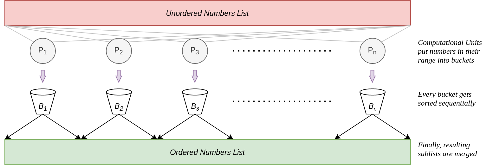
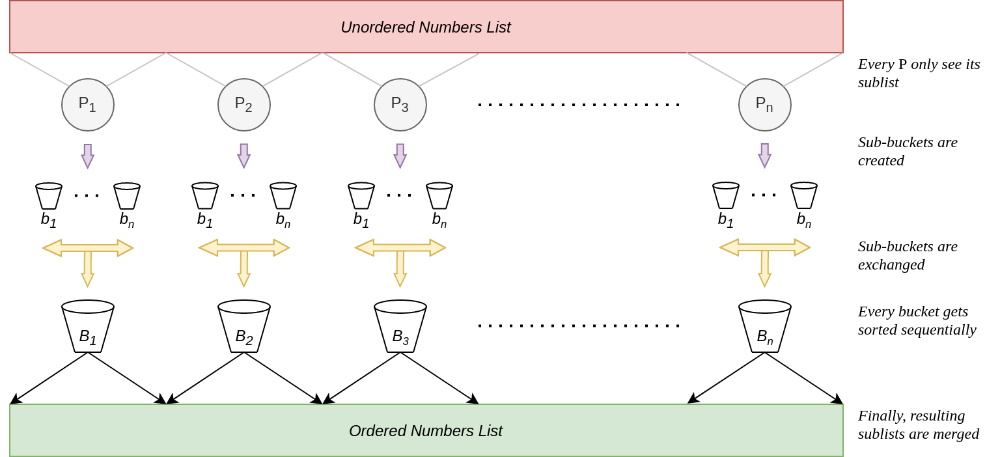

\newpage
# Strategie *Divide et Impera*
La strategia *divide et impera* e' particolarmente utile per la soluzione di
diversi problemi, per tale motivo e' un modo per risolvere i problemi molto
ricorrente in computer science.
Essenzialmente consiste nell'applicare una divisione di un grosso problema in
diversi sottoproblemi di minor dimensione, ma della stessa forma del problema
originale (tipicamente ottenuta mediante *ricorsione*). Ogni soluzione di questi
sottoproblemi di portata piu' piccola viene poi combinata con le altre in modo
da ottenere la soluzione del problema originale.
Una strategia divide et impera e' in generale applicabile quando i problemi
impongono una struttura di tipo gerarchico. Si pensi, ad esempio, agli algoritmi
di ordinamento. Alcuni di essi, nonostante operino su una struttura dati di tipo
lineare (*array*), hanno comunque una struttura imposta dalla computazione
gerarchica, per cui e' possibile sfruttare questa strategia.

> *La strategia dividi e conquista e' diversa dal semplice partizionamento, che
consiste invece in una semplice divisione del problema in parti.*

Nel contesto del parallel computing e' possibile trarre vantaggio da questa
strategia di pensiero, siccome e' possibile sfruttare la suddivisione per
estrarre il parallelismo. L'idea e' semplicemente quella di utilizzare diverse
unita' di calcolo per risolvere i diversi sotto-problemi, aggregando infine i
singoli risultati.

L'implementazione che puo' risultare banale dal punto di vista sequenziale,
nasconde delle difficolta' quando si parla di implementazione parallela. Questo
perche' la ricorsione necessita' di uno *stack*, che per essere implementato
richiede l'allocazione dinamica della memoria, che e' un problema difficile in
ambienti distribuiti. Addirittua nelle GPU e' sconsigliato, perche' non
supportato e a causa di prestazioni spesso scadenti.

Vediamo ora alcuni esempi di problemi che possono sfruttare questo modo di
risoluzione.

## Operazioni su strutture dati lineari
Consideriamo delle operazioni di folding su delle strutture dati lineari. In
linea di massima, il problema consiste essenzialmente, data un'operazione di
aggregazione che sia *associativa*, applicarla su un'intera sequenza di elementi
per ottenere un'aggregazione finale. E' anche chiamata `foldr` o `reduce`.
Formalmente, dato l'operatore associativo $\oplus$ e una sequenza di elementi
$[e_1, e_2, \dots, e_n]$, si vuole ottenere $e_1 \oplus e_2 \oplus \dots \oplus
e_n$.

In questo caso, l'idea e' quella di suddividere la sequenza progressivamente
fino ad una grandezza stabilita (che rappresenta appunto la grana
computazionale), per far eseguire l'operazione di associazione sulle
sottosequenze ottenute da diverse unita' computazionali. I risultati di queste
operazioni, a loro volta, saranno un'altra sequenza di elementi, che sara'
combinata nello stesso modo per ottenere il risultato finale.

{ width=50% }

## Algoritmi di ordinamento
Un algoritmo di ordinamento che sfrutta particolarmente bene questo tipo di
parallelizzazione e' il *bucket sort*. Verrebbe da pensare subito perche' non
siano stati scelti algoritmi noti per essere performanti come ad esempio il
*quicksort*? La risposta e' che un algoritmo come il quicksort non e' di facile
parallelizzazione per evidenti problemi di bilanciamento del carico .

L'idea alla base della parallelizzazione del *bucket sort* e' che ogni unita' di
calcolo si scelga il proprio range operativo, cioe' il range di numeri da
ordinare all'interno della lista. Una volta scelto il range, vengono presi tutti
i numeri compresi in questo range ed organizzati in un "*bucket*", che non sono
altro che un insieme non ordinato di numeri. Successivamente, viene applicato un
algoritmo di ordinamento sequenziale al bucket, ottenendo una lista che puo'
essere unita alle altre liste risultato delle altre unita' di calcolo.
E' bene notare che l'operazione di unione finale e' immediata dal momento che
ogni unita' di calcolo conosce il punto in cui deve stare la propria sottolista
all'interno della lista risultato.

Un evidente problema di questo tipo di soluzione, e' che dal momento che ogni
unita' computazionale deve scegliersi il suo range operativo, deve essere in
grado di leggere l'intera lista di numeri. Ne consegue che una delle seguenti
condizioni deve essere vera:

* Ogni unita' di calcolo ha accesso all'intera struttura
* Ogni unita' di calcolo ha una copia dell'intera struttura

Una versione piu' raffinata di questo algoritmo e' quella che consiste
nell'assegnare ad ogni UC una sottolista, da cui a sua volta verranno generati
diversi *sub-buckets*. In questo modo cio' che viene replicato in ogni UC non e'
l'intera lista in input, ma i *buckets*. Nella fase successiva, ogni UC scambia
i *sottobuckets* con gli altri processi, in modo che ogni UC collezioni tutti i
sottobuckets corrispondenti al proprio range operativo.
Alla fine di questa fase, ogni UC avra' ottenuto il bucket corrispondente al
proprio range operativo, su cui potra' applicare un algoritmo di ordinamento
sequenziale e infine un'operazione di merge con le altre liste.

Questa versione necessita di mettere tutte le unita' computazionali in
comunicazione tra loro. Per far cio' esistono primitive messe a disposizione ad
esempio da `MPI` come la primitiva di tipo *all-to-all*. Tale primitiva
corrisponde essenzialmente ad un esecuzione di un'operazione di `gather` +
`broadcast`, ma e' ottimizzata per lo scopo, di fatto essendo piu' efficiente.
L'efficienza risiede nel fatto che non c'e' una centralizzazione intermedia del
risultato, per cui ogni processo manda la sua parte ad ogni altro processo,
cosi' come gli altri.

## Quadratura Adattiva
* Principalmente da guardare per aspetti di terminazione (la computazione va
  avanti fino a quando una certa precisione e' stata raggiunta)

TODO: Aggiungere quadratura adattiva

## Problema *N-Body*
TODO: Aggiungere N-Body

