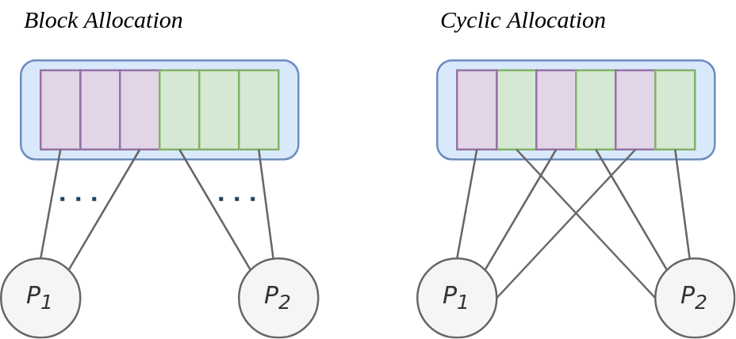

\newpage
# Computazioni Sincrone
Le computazioni sincrone sono delle computazioni *data parallel* che consistono
nella regolare sincronizzazione di tutte le UC del programma. Possiamo
identificare essenzialmente due tipologie di computazione sincrona:

* Globalmente sincrona
* Localmente sincrona

## Computazioni Globalmente Sincrone
Nella loro forma piu' semplice le UC sono assegnate a computare parallelamente
dei dati (spesso indipendenti), fino ad un punto prestabilito del programma.
Tale punto e' detto *barrier*, e una volta raggiunto, ogni UC dovra' aspettare
fino all'arrivo dell'ultima UC alla barrier (quella piu' lenta). In questo modo
si sincronizzano tutte le UC allo stesso punto. A seguito di questa operazione,
spesso le UC si scambiano anche dati in modo da poter far continuare la
computazione globale. Infine, il ciclo si ripete da capo.
Siccome i dati in cui operano le UC sono indipendenti, questa tipologia di
computazione e' detta anche *data parallel*.
Possiamo individuare diverse ragioni per cui questo tipo di computazioni e'
particolarmente conveniente:

* Facilita' di implementazione (essenzialmente e' un singolo programma)
* Possibilita' di scalare facilmente a problemi di dimensioni maggiori
* Molti problemi numerici/non numerici possono essere riformulati in una forma
  di computazione *data parallel*

> Il paradigma *data parallel* puo' essere visto anche come la parallelizzazione
  dei loops

Se noi prendiamo in considerazione un programma SPMD che implementa il paradigma
data parallel, notiamo che ogni UC dovra' avere accesso a tutti i dati
dell'applicazione. In `MPI`, la primitiva `AllGather` serve proprio a
sincronizzare i risultati derivanti dalle altre UC. Per spiegare questa
primitiva, prendiamo per esempio un caso in cui $n$ processi effettuano delle
computazioni su un array. Ogni processo effettua dei calcoli sulla propria
porzione dell'array, e successivamente aspetta il risultato di tutte le altre
UC. La primitiva `AllGather` fa proprio questo: inserisce il risultato della
computazione dell'UC corrente nell'array, e colleziona il risultato di tutte le
altre nelle loro rispettive porzioni di array.

> Lo stochastic gradient descend distribuito utilizza questa primitiva per
  condividere con tutti i processi i gradienti ottenuti, in modo che ogni
  processo possa ripartire dall'average gradient ottenuto

La grana computazionale di solito non e' particolarmente fine in questi
problemi, sopratutto nel caso in cui i dati su cui bisogna operare sono tanti.
In altri termini, il numero delle unita' computazionali e' tipicamente piu'
basso del numero di dati su cui tali unita' devono andare ad operare. In genere
ci sono due strategie di partizionamento dei dati:

* **Block allocation**: consiste nell'allocamento di sezioni di dati consecutive
  alle unita' computazionali in ordine crescente
* **Cyclic allocation**: consiste nell'allocare ciclicamente diverse porzioni di
  dati alle diverse UC



E' stato visto empiricamente che piu' la grana computazionale diminuisce piu' il
tempo di comunicazione aumenta e il tempo di comunicazione diminuisce. In questo
caso non si puo' raggiungere oltre un certo upper bound, per cui le computazioni
globally synchronous non hanno una scalabilita' molto grande.

**TODO: Aggiungere esempi**

### Considerazioni sull'operazione di barrier
Ci sono essenzialmente due modi per poter sospendere l'esecuzione di una singola
UC nella barrier:

* Tramite primitiva di sistema operativo (l'*SO* sospende il processo mettendolo
  nella coda di I/O)
* Tramite attesa attiva (ad esempio tramite *spinlock*)

In `MPI` abbiamo una primitiva che e' `MPI_Barrier()` con solo parametro
`MPI_COMMUNICATOR`, che indica il gruppo di UC su cui fare l'operazione.
Un'implementazione *"banale"* consiste nel designare una UC a tenere un
**contatore**. Ad ogni messaggio arrivato, questa UC va ad aumentare il
contatore, fino a quando questo non sara' pari al numero di processi che
partecipano alla barrier. Una volta raggiunto, tale UC mandera' un messaggio a
tutti gli altri processi in modo che possano ripartire insieme.

> Una buona implementazione della barrier deve tenere conto del fatto che tale
  operazione puo' essere esegita piu' volte, soprattutto all'interno di un
  costrutto iterativo.

Le barrier del tipo descritto (basate su contatori) possiamo essenzialmente
dividerla in due fasi principali:

* Una UC entra nella fase di arrivo e non la lascia fino a quando tutte le altre
  altre UC siano arrivate in questa fase
* Successivamente, le UC lasciano la fase di arrivo venendo rilasciate

Vediamo ora un'implementazione possibile della tipologia di barrier descritta in
*pseudo C*. Iniziamo con il codice del **Master**, cioe' l'UC designata di
tenere conto degli elementi presenti nella fase di arrivo.

```c
for (i = 0; i < n; i++)
    recv(P_any);
for (i = 0; i < n; i++)
    send(P_i)
```

Invece, il codice delle singole UC che prendono parte alla barrier e' il
seguente

```c
send(P_master)
recv(P_master)
```

Questa implementazione a contatore, non e' la piu' efficiente siccome il
*master* deve ricevere e mandare i messaggi in una maniera sequenziale
(lineare). Con un numero molto grande di UC, potrebbe avere delle performances
poco soddisfacenti.
Un'alternativa a questa barrier consiste quindi nell'utilizzare una struttura
ad albero al posto di una struttura lineare di blocco/rilascio. L'idea e' quella
di mandare messaggi alle UC adiacenti come in figura.

**TODO (img): Aggiungere Tree Barrier**

Un'altra implementazione invece e' quella chiamata *Butterfly Barrier*, che
sfrutta gli stessi principi della rete di interconnessione Butterfly discussa in
precedenza, ma al livello software. Tramite questo processo e' possibile far
conoscere ad ogni UC che una determinata UC e' entrata nella barrier.

**TODO (img): Aggiungere Butterfly Barrier**

In sostanza il ruolo che era assegnato ad una sola UC di accentrare tutte le
sincronizzazioni e' invece distribuito su tutti le UC.

## Computazioni Localmente Sincrone
In questo tipo di computazioni, le singole UC necessitano di sincronizzarsi
solamente con un set di processi logicamente "vicini" e non con tutte le UC che
sono coinvolte nella computazione. Sostanzialmente lo *"schema di vicinato"*
definisce uno *"stencil"*, per cui questo tipo di computazioni e' anche chiamato
*stencil computations*.

**TODO: Aggiungere alcuni esempi**


